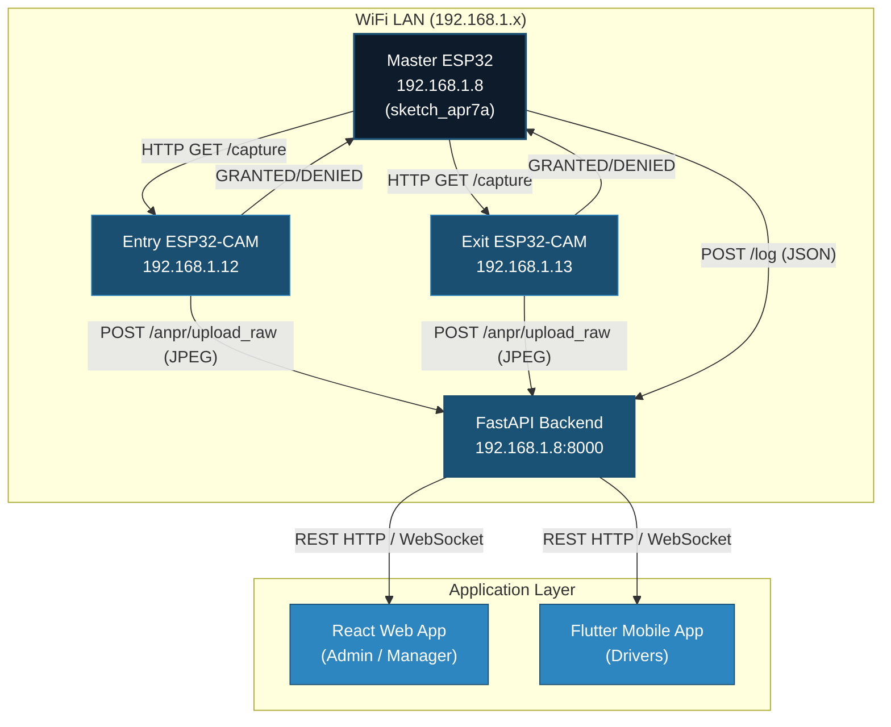
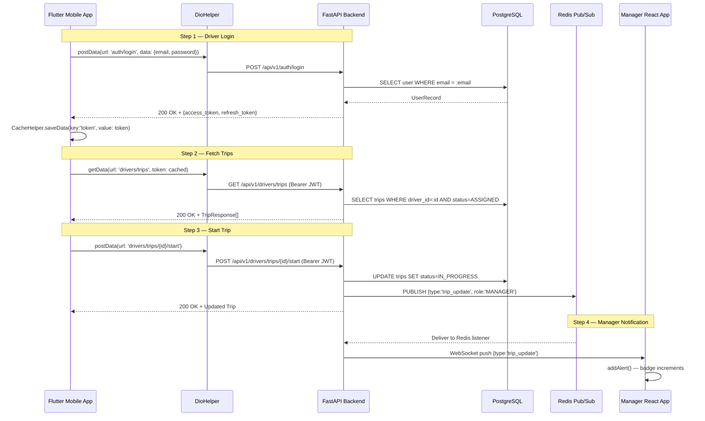

# Chapter 6: Communication Protocols

**Smart Bus Garage Management System**
MTI University — Faculty of Computer Science & Engineering
Academic Year 2025–2026

---

## List of Abbreviations

| Abbreviation | Full Term |
|:---|:---|
| ANPR | Automatic Number Plate Recognition |
| API | Application Programming Interface |
| CORS | Cross-Origin Resource Sharing |
| GPIO | General-Purpose Input/Output |
| HTTP | Hypertext Transfer Protocol |
| I2C | Inter-Integrated Circuit |
| IoT | Internet of Things |
| JSON | JavaScript Object Notation |
| JWT | JSON Web Token |
| LEDC | LED Control (ESP32 PWM peripheral) |
| NVS | Non-Volatile Storage |
| PWM | Pulse-Width Modulation |
| RBAC | Role-Based Access Control |
| REST | Representational State Transfer |
| TLS | Transport Layer Security |
| UART | Universal Asynchronous Receiver-Transmitter |
| WS / WSS | WebSocket / WebSocket Secure |

---

## 6.1 Introduction

Communication protocols form the backbone of the Smart Bus Garage Management System, binding three distinct tiers: the physical hardware layer (ESP32 microcontrollers), the backend processing layer (FastAPI server), and the presentation layer. A critical architectural distinction governs the presentation layer: it is **dual-platform**. The **React web application** serves Administrators and Managers for dashboards and gate monitoring, while the **Flutter mobile application** serves Drivers exclusively for trip management and notifications. Both clients communicate with the same FastAPI backend but consume different API subsets and receive different WebSocket event streams.

This chapter documents every protocol active in the system — from GPIO pulse signalling on the ESP32 to JWT-authenticated WebSocket frames delivered to a manager's browser.

---

## 6.2 Network Architecture

### 6.2.1 Physical Network Layout

All hardware devices and the application server operate on a shared IEEE 802.11 WiFi LAN (`192.168.1.x`). Fixed IP addresses ensure reliable inter-device communication:

| Node | IP Address | Role |
|:---|:---|:---|
| FastAPI Backend Server | 192.168.1.8:8000 | Central API, WebSocket, OCR pipeline |
| Master ESP32 | DHCP / fixed | Sensor controller, gate actuator, HTTP client |
| Entry ESP32-CAM | 192.168.1.12 | JPEG capture at entry gate |
| Exit ESP32-CAM | 192.168.1.13 | JPEG capture at exit gate |
| React Web App | Browser client | Admin/Manager dashboards |
| Flutter Mobile App | Mobile device | Driver trip management |

### 6.2.2 Network Topology Diagram



**Figure 6.1** — System network topology showing hardware, backend, and dual-client communication paths.

---

## 6.3 Hardware-to-Server Communication

The three ESP32 devices communicate with the FastAPI backend over HTTP/1.1 on the WiFi LAN. All requests include the `X-Hardware-API-Key` header for authentication.

### 6.3.1 WiFi Initialisation and Authentication

Credentials are centralised in `hardware/hardware_config.h`, shared by all three firmware sketches:

```cpp
#define WIFI_SSID        "WE_4F038C"
#define WIFI_PASSWORD    "d0288c90"
#define BACKEND_BASE     "http://192.168.1.8:8000/api/v1/hardware"
#define ENTRY_CAM_IP     "192.168.1.12"
#define EXIT_CAM_IP      "192.168.1.13"
```

The backend verifies the API key using `secrets.compare_digest()` for constant-time comparison, preventing timing-based side-channel attacks:

```python
# app/api/v1/hardware.py
async def verify_hardware_api_key(x_hardware_api_key: str = Header(...)):
    if not secrets.compare_digest(x_hardware_api_key, settings.HARDWARE_API_KEY):
        raise HTTPException(status_code=403)
```

### 6.3.2 Camera Image Upload (ANPR Pipeline)

When the Master ESP32 detects a vehicle, it triggers the appropriate camera via HTTP GET. The camera captures a JPEG frame and POSTs it directly to the backend:

```
POST http://192.168.1.8:8000/api/v1/hardware/anpr/upload_raw?gate_id=1
Content-Type: image/jpeg
X-Hardware-API-Key: <key>
<raw JPEG bytes — 15–40 KB at VGA 640×480>
```

The backend decodes the image with OpenCV, runs EasyOCR, normalises the plate string (`re.sub('[^A-Z0-9]', '', text.upper())`), and returns `GRANTED` or `DENIED` as plain text. A 15-second HTTP timeout prevents the firmware from blocking on slow OCR.

### 6.3.3 Device Diagnostic Logging

All devices send diagnostic logs to a centralised endpoint:

```
POST /api/v1/hardware/log
{"device": "ESP32_MAIN", "msg": "WiFi connected"}
```

The backend returns HTTP 204 No Content, enabling fire-and-forget logging.

### 6.3.4 Master-to-Camera Trigger

The Master does not capture images itself — it delegates via HTTP GET:

```cpp
HTTPClient camHttp;
camHttp.begin("http://" ENTRY_CAM_IP "/capture");
camHttp.setTimeout(15000);
int camCode = camHttp.GET();
String aiResp = camHttp.getString();
bool aiOk = (aiResp.indexOf("GRANTED") >= 0);
```

The camera runs a lightweight `WebServer` on port 80, handles `/capture`, posts the JPEG to the backend, and relays the GRANTED/DENIED decision back to the Master.

---

## 6.4 Internal Hardware Protocols

### 6.4.1 GPIO — Ultrasonic Distance Sensing

Two HC-SR04 sensors use a trigger-echo protocol. The trigger pin is driven HIGH for 10 µs; the echo duration is proportional to distance:

| Signal | Entry Gate Pin | Exit Gate Pin |
|:---|:---|:---|
| Trigger (OUT) | GPIO 5 | GPIO 19 |
| Echo (IN) | GPIO 18 | GPIO 23 |

```cpp
long readDistanceCM(int trigPin, int echoPin) {
    digitalWrite(trigPin, LOW);   delayMicroseconds(2);
    digitalWrite(trigPin, HIGH);  delayMicroseconds(10);
    digitalWrite(trigPin, LOW);
    long duration = pulseIn(echoPin, HIGH, 30000);
    return (duration == 0) ? 999 : (long)(duration * 0.034 / 2.0);
}
```

A hysteresis band (trigger < 10 cm, clear > 15 cm) prevents false re-triggers from stationary vehicles.

### 6.4.2 LEDC/PWM — Servo Gate Control

The ESP32's LEDC peripheral drives two servo motors at 50 Hz with 16-bit resolution:

| Actuator | GPIO Pin | Function |
|:---|:---|:---|
| Entry Gate Servo | GPIO 13 | 0° = closed, 90° = open |
| Exit Gate Servo | GPIO 12 | 0° = closed, 90° = open |

A non-blocking `millis()`-based timer holds the gate open for 4,000 ms without halting the firmware loop.

### 6.4.3 I2C — LCD Display

A 16×2 LCD (I2C address `0x27`) displays real-time occupancy. The I2C bus uses SDA (GPIO 21) and SCL (GPIO 22):

```cpp
Wire.begin(21, 22);
lcd.init();
lcd.backlight();
lcd.print("Free Slots: " + String(MAX_CARS - carCount));
```

### 6.4.4 UART — Serial Diagnostics

All devices use UART0 at 115,200 baud (`Serial.begin(115200)`) for debug output during development and commissioning.

### 6.4.5 NVS — State Persistence

The `Preferences` library persists `carCount` across power cycles using the ESP32's internal NVS flash:

```cpp
prefs.begin("garage", false);
carCount = prefs.getInt("carCount", 0);  // Restore on boot
prefs.putInt("carCount", carCount);       // Save on change
```

### 6.4.6 GPIO — Status LEDs

| LED | GPIO Pin | Behaviour |
|:---|:---|:---|
| Entry Allowed (green) | GPIO 25 | HIGH when `carCount < MAX_CARS` |
| Garage Full (red) | GPIO 26 | HIGH when `carCount = MAX_CARS` |

---

## 6.5 Server-to-Application Communication (REST HTTP)

The FastAPI backend exposes a versioned REST API at `/api/v1/`. Five role-scoped routers serve different clients:

| Router | Target Client | Auth |
|:---|:---|:---|
| `/api/v1/auth` | All | Public (login), then JWT |
| `/api/v1/admin/*` | React Web App | ADMIN role |
| `/api/v1/manager` | React Web App | MANAGER role |
| `/api/v1/hardware` | ESP32 devices | X-Hardware-API-Key |
| `/api/v1/drivers` | Flutter Mobile App | DRIVER role |

### 6.5.1 React Web Application — Axios Client

The React SPA uses Axios with interceptors for automatic JWT injection and session expiry handling:

```javascript
// frontend/src/api/axios.js
const api = axios.create({
    baseURL: import.meta.env.VITE_API_URL || '/api/v1',
    headers: { 'Content-Type': 'application/json' },
});

api.interceptors.request.use(config => {
    const token = localStorage.getItem('token');
    if (token) config.headers.Authorization = `Bearer ${token}`;
    return config;
});

api.interceptors.response.use(
    response => response,
    error => {
        if (error.response?.status === 401) {
            localStorage.removeItem('token');
            window.location.href = '/login?session_expired=true';
        }
        return Promise.reject(error);
    }
);
```

### 6.5.2 Flutter Mobile Application — Dio Client

The Flutter app (`garago-app`) uses Dio v5.7 for HTTP communication, centralised in `DioHelper`:

```dart
class DioHelper {
  static late Dio dio;
  static void init() {
    dio = Dio(BaseOptions(
      baseUrl: AppConstants.baseUrl,
      connectTimeout: const Duration(seconds: 15),
      receiveTimeout: const Duration(seconds: 15),
      headers: {'Content-Type': 'application/json'},
    ));
  }
  static Future<Response> postData({
    required String url, required Map<String, dynamic> data, String? token,
  }) async {
    if (token != null) dio.options.headers['Authorization'] = 'Bearer $token';
    return await dio.post(url, data: data);
  }
}
```

JWT tokens are persisted via `SharedPreferences` through `CacheHelper`. The app uses the Flutter BLoC pattern (v8.1.6) with nine cubits for state management. Key driver endpoints include:

| Method | Endpoint | Purpose |
|:---|:---|:---|
| POST | `/api/v1/auth/login` | Driver login, returns JWT |
| GET | `/api/v1/drivers/trips` | Active trip assignments |
| POST | `/api/v1/drivers/trips/{id}/start` | Mark trip as started |
| GET | `/api/v1/drivers/profile` | Driver profile and stats |

---

## 6.6 Real-Time WebSocket Communication

### 6.6.1 Architecture

The backend manages WebSocket connections through `ConnectionManager` (`app/core/sockets.py`), maintaining three role-partitioned groups:

```python
class ConnectionManager:
    def __init__(self):
        self.active_connections: Dict[str, Set[WebSocket]] = {
            "ADMIN": set(), "MANAGER": set(), "DRIVER": set(),
        }
```

Clients connect to `/ws?token=<JWT>`. The server validates the JWT, determines the user's role, and registers the connection. Close code 4401 triggers client-side token refresh; code 4003 forces re-authentication.

### 6.6.2 Redis Pub/Sub Fanout

Redis Pub/Sub decouples event producers from WebSocket delivery. Route handlers publish to Redis channels (`broadcast`, `alerts`); a background supervisor distributes messages to the appropriate role group. The supervisor auto-reconnects with 5-second backoff on failure.

### 6.6.3 React WebSocket Client

The `WebSocketContext` provider maintains a persistent connection with heartbeats and automatic reconnection:

```javascript
const protocol = window.location.protocol === 'https:' ? 'wss:' : 'ws:';
const wsUrl = `${protocol}//${host}:8000/ws?token=${activeToken}`;
const ws = new WebSocket(wsUrl);
```

- **Heartbeat**: JSON `{"type": "ping"}` every 30 seconds; server responds with `{"type": "pong"}`
- **Token refresh**: Pre-emptive refresh when JWT expires within 60 seconds
- **Reconnection**: 3-second delay on non-fatal disconnects
- **Event routing**: Incoming events feed the Zustand `alertStore` for notification badges and toasts

### 6.6.4 Flutter WebSocket Client (Planned)

The backend DRIVER group is fully provisioned. The planned implementation uses `web_socket_channel`:

```dart
final channel = WebSocketChannel.connect(
  Uri.parse('wss://<backend>/ws?token=$token'),
);
channel.stream.listen((message) {
    final event = jsonDecode(message);
    if (event['type'] == 'trip_update') dashboardCubit.handleTripUpdate(event);
});
```

Until implemented, `MessagesCubit` polls `GET /api/v1/drivers/messages` for notifications.

### 6.6.5 Event Types and Role Routing

| Event Type | Trigger | Target Role(s) |
|:---|:---|:---|
| `gate_auth / GRANTED` | ANPR confirms plate match | MANAGER, ADMIN |
| `gate_auth / UNAUTHORIZED` | Plate not found or DENIED | MANAGER, ADMIN |
| `iot_alert / CRITICAL` | IoT threshold breached | MANAGER, ADMIN |
| `speed_alert / HIGH` | Vehicle speed > 80 km/h | MANAGER |
| `crowding_alert / HIGH` | Crowding score > 90% | MANAGER |
| `notification` | Trip update, approval | Role-specific |

### 6.6.6 Sequence Diagram — Driver Trip Start



**Figure 6.2** — Driver trip start workflow from Flutter mobile app through FastAPI to WebSocket notification.

---

## 6.7 Data Serialisation and Security

### 6.7.1 JSON and Content Types

All non-binary data is encoded as JSON. Three content types are used:

| Content-Type | Used For |
|:---|:---|
| `application/json` | REST bodies, WebSocket frames, hardware logs |
| `image/jpeg` | Raw JPEG from ESP32-CAM to `/anpr/upload_raw` |
| `multipart/form-data` | OAuth2-compatible login form |

Pydantic v2 validates all request/response schemas, rejecting invalid payloads with HTTP 422.

### 6.7.2 JWT Authentication (RFC 7519)

Tokens are HS256-signed with configurable expiry:

| Parameter | Value |
|:---|:---|
| Algorithm | HS256 |
| Access token TTL | 60 minutes |
| Refresh token TTL | 7 days |
| Blacklist store | Redis (`blacklist:{token}`) |

The React client stores JWTs in `localStorage`; the Flutter client uses `SharedPreferences` via `CacheHelper`.

### 6.7.3 CORS

The FastAPI CORS middleware permits configured origins:

```python
BACKEND_CORS_ORIGINS: List[str] = [
    "http://localhost:5173",  # Vite dev
    "http://localhost:3000",  # Node dev
]
```

Flutter mobile requests are not subject to CORS restrictions.

### 6.7.4 Rate Limiting

Per-IP rate limits protect against abuse:

| Endpoint | Limit | Rationale |
|:---|:---|:---|
| `POST /auth/login` | 5/min | Brute-force prevention |
| Hardware GPS/log | 120/min | High-frequency polling |
| Hardware IoT/ANPR | 60/min | Sensor update frequency |
| WebSocket messages | 10/sec | Per-connection frame rate |

### 6.7.5 RBAC

Three role tiers enforce access control via FastAPI dependency injection. The ADMIN role accesses all routes, MANAGER accesses fleet and maintenance routes, and DRIVER is restricted to personal trip and break endpoints. React `ProtectedRoute` components mirror this on the frontend.

### 6.7.6 TLS / HTTPS

In production (Render platform), TLS terminates at the load balancer. The React client auto-selects `wss:` or `ws:` based on page protocol. ESP32 firmware uses plaintext HTTP on the secured LAN — implementing ESP32-side TLS is documented as a future enhancement.

---

## 6.8 Summary of Protocols

| Protocol | Layer | Used Between | Key Parameters |
|:---|:---|:---|:---|
| GPIO Pulse | Hardware | HC-SR04 ↔ ESP32 | 10 µs trigger, 30 ms timeout |
| LEDC PWM | Hardware | ESP32 ↔ Servos | 50 Hz, 16-bit, GPIO 12/13 |
| I2C | Hardware | ESP32 ↔ LCD | 100 kHz, SDA=21, SCL=22 |
| UART | Hardware | ESP32 ↔ Debug | 115,200 baud |
| NVS Flash | Hardware | ESP32 internal | Preferences, namespace "garage" |
| HTTP/1.1 | Device→Server | ESP32 → FastAPI | JSON/JPEG, API key, 15 s timeout |
| HTTP/1.1 | Inter-Device | Master → CAM | GET /capture, plain-text response |
| HTTP REST (Axios) | Client→Server | React → FastAPI | JSON, JWT Bearer |
| HTTP REST (Dio) | Client→Server | Flutter → FastAPI | JSON, JWT Bearer |
| WebSocket (RFC 6455) | Bidirectional | React ↔ FastAPI | /ws?token=JWT, ping/pong |
| Redis Pub/Sub | Internal | FastAPI internal | Channels: broadcast, alerts |
| JWT (RFC 7519) | Security | All clients | HS256, 60-min/7-day tokens |

**Table 6.1** — Consolidated communication protocols reference.

---

## References

[1] R. Fielding, M. Nottingham, and J. Reschke, "HTTP Semantics," RFC 9110, Internet Engineering Task Force, June 2022.

[2] I. Fette and A. Melnikov, "The WebSocket Protocol," RFC 6455, Internet Engineering Task Force, Dec. 2011.

[3] M. Jones, J. Bradley, and N. Sakimura, "JSON Web Token (JWT)," RFC 7519, Internet Engineering Task Force, May 2015.

[4] Espressif Systems, *ESP32 Technical Reference Manual*, Version 5.3, Espressif Systems Ltd., 2024. Available: https://www.espressif.com/

[5] Espressif Systems, *ESP-IDF Programming Guide — LEDC*, 2024. Available: https://docs.espressif.com/projects/esp-idf/en/stable/esp32/api-reference/peripherals/ledc.html

[6] NXP Semiconductors, *I2C-Bus Specification and User Manual*, Rev. 7.0, 2021. Available: https://www.nxp.com/docs/en/user-guide/UM10204.pdf

[7] S. Ramírez, *FastAPI Documentation*, 2024. Available: https://fastapi.tiangolo.com

[8] Google LLC, *Flutter Documentation*, 2024. Available: https://flutter.dev/docs

[9] W. Muth, *Dio — HTTP networking package for Dart/Flutter*, pub.dev, 2024. Available: https://pub.dev/packages/dio

[10] Redis Ltd., *Redis Pub/Sub Documentation*, 2024. Available: https://redis.io/docs/manual/pubsub/

[11] A. van Kesteren, *Fetch Living Standard — CORS Protocol*, WHATWG, 2024. Available: https://fetch.spec.whatwg.org/

[12] Ecma International, *The JSON Data Interchange Standard — ECMA-404*, 2nd ed., Dec. 2017.
