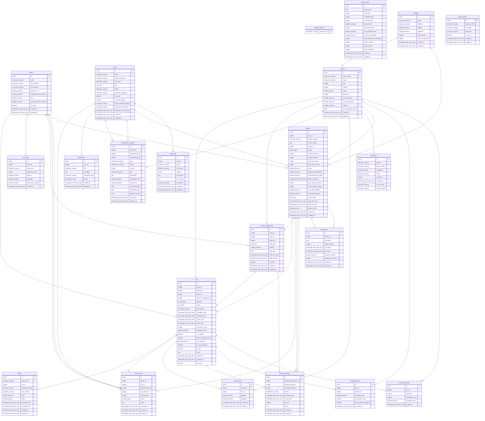
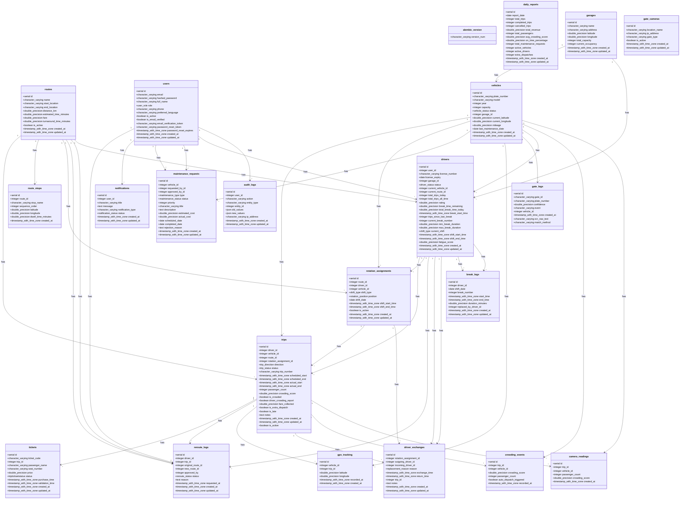

```mermaid
erDiagram
    alembic_version {
        character_varying version_num PK
    }
    audit_logs {
        serial id PK
        integer user_id
        character_varying action
        character_varying entity_type
        integer entity_id
        json old_values
        json new_values
        character_varying ip_address
        timestamp_with_time_zone created_at
        timestamp_with_time_zone updated_at
    }
    break_logs {
        serial id PK
        integer driver_id
        date shift_date
        integer break_number
        timestamp_with_time_zone start_time
        timestamp_with_time_zone end_time
        double_precision duration_minutes
        integer replaced_by_driver_id
        timestamp_with_time_zone created_at
        timestamp_with_time_zone updated_at
    }
    camera_readings {
        serial id PK
        integer trip_id
        integer vehicle_id
        integer passenger_count
        double_precision crowding_score
        timestamp_with_time_zone created_at
    }
    crowding_events {
        serial id PK
        integer trip_id
        integer vehicle_id
        double_precision crowding_score
        integer passenger_count
        boolean auto_dispatch_triggered
        timestamp_with_time_zone recorded_at
    }
    daily_reports {
        serial id PK
        date report_date
        integer total_trips
        integer completed_trips
        integer cancelled_trips
        double_precision total_revenue
        integer total_passengers
        double_precision avg_crowding_score
        double_precision on_time_percentage
        integer total_maintenance_requests
        integer active_vehicles
        integer active_drivers
        integer extra_dispatches
        timestamp_with_time_zone created_at
        timestamp_with_time_zone updated_at
    }
    driver_exchanges {
        serial id PK
        integer rotation_assignment_id
        integer outgoing_driver_id
        integer incoming_driver_id
        replacement_reason reason
        timestamp_with_time_zone exchange_time
        timestamp_with_time_zone return_time
        integer trip_id
        text notes
        timestamp_with_time_zone created_at
        timestamp_with_time_zone updated_at
    }
    drivers {
        serial id PK
        integer user_id
        character_varying license_number
        date license_expiry
        integer garage_id
        driver_status status
        integer current_vehicle_id
        integer current_route_id
        integer total_trips_today
        integer total_trips_all_time
        double_precision rating
        double_precision break_time_remaining
        double_precision total_break_time_today
        timestamp_with_time_zone break_start_time
        integer trips_since_last_break
        integer current_break_number
        double_precision min_break_duration
        double_precision max_break_duration
        shift_type current_shift
        timestamp_with_time_zone shift_start_time
        timestamp_with_time_zone shift_end_time
        double_precision fatigue_score
        timestamp_with_time_zone created_at
        timestamp_with_time_zone updated_at
    }
    garages {
        serial id PK
        character_varying name
        character_varying address
        double_precision latitude
        double_precision longitude
        integer total_capacity
        integer current_occupancy
        timestamp_with_time_zone created_at
        timestamp_with_time_zone updated_at
    }
    gate_cameras {
        serial id PK
        character_varying location_name
        character_varying ip_address
        character_varying gate_type
        boolean is_active
        timestamp_with_time_zone created_at
        timestamp_with_time_zone updated_at
    }
    gate_logs {
        serial id PK
        character_varying gate_id
        character_varying plate_number
        double_precision confidence
        character_varying event
        integer vehicle_id
        timestamp_with_time_zone created_at
        character_varying ocr_raw_text
        character_varying match_method
    }
    gps_tracking {
        serial id PK
        integer vehicle_id
        integer trip_id
        double_precision latitude
        double_precision longitude
        timestamp_with_time_zone recorded_at
        timestamp_with_time_zone created_at
    }
    maintenance_requests {
        serial id PK
        integer vehicle_id
        integer requested_by_id
        integer approved_by_id
        maintenance_type type
        maintenance_status status
        integer priority
        character_varying title
        text description
        double_precision estimated_cost
        double_precision actual_cost
        date scheduled_date
        date completed_date
        text rejection_reason
        timestamp_with_time_zone created_at
        timestamp_with_time_zone updated_at
    }
    notifications {
        serial id PK
        integer user_id
        character_varying title
        text message
        character_varying notification_type
        notification_status status
        timestamp_with_time_zone created_at
        timestamp_with_time_zone updated_at
    }
    reroute_logs {
        serial id PK
        integer driver_id
        integer trip_id
        integer original_route_id
        integer new_route_id
        integer approved_by
        reroute_status status
        text reason
        timestamp_with_time_zone requested_at
        timestamp_with_time_zone created_at
        timestamp_with_time_zone updated_at
    }
    rotation_assignments {
        serial id PK
        integer route_id
        integer driver_id
        integer vehicle_id
        shift_type shift_type
        rotation_position position
        date shift_date
        timestamp_with_time_zone shift_start_time
        timestamp_with_time_zone shift_end_time
        boolean is_active
        timestamp_with_time_zone created_at
        timestamp_with_time_zone updated_at
    }
    route_stops {
        serial id PK
        integer route_id
        character_varying stop_name
        integer sequence_order
        double_precision latitude
        double_precision longitude
        double_precision dwell_time_minutes
        timestamp_with_time_zone created_at
    }
    routes {
        serial id PK
        character_varying name
        character_varying start_location
        character_varying end_location
        double_precision distance_km
        double_precision estimated_time_minutes
        double_precision fare
        double_precision turnaround_time_minutes
        boolean is_active
        timestamp_with_time_zone created_at
        timestamp_with_time_zone updated_at
    }
    tickets {
        serial id PK
        character_varying ticket_code
        integer trip_id
        character_varying passenger_name
        character_varying seat_number
        double_precision price
        tripticksetstatus status
        timestamp_with_time_zone purchase_time
        timestamp_with_time_zone validation_time
        timestamp_with_time_zone created_at
        timestamp_with_time_zone updated_at
    }
    trips {
        serial id PK
        integer driver_id
        integer vehicle_id
        integer route_id
        integer rotation_assignment_id
        trip_direction direction
        trip_status status
        character_varying trip_number
        timestamp_with_time_zone scheduled_start
        timestamp_with_time_zone scheduled_end
        timestamp_with_time_zone actual_start
        timestamp_with_time_zone actual_end
        integer passenger_count
        double_precision crowding_score
        boolean is_crowded
        boolean driver_crowding_report
        double_precision fare_collected
        boolean is_extra_dispatch
        boolean is_late
        text notes
        timestamp_with_time_zone created_at
        timestamp_with_time_zone updated_at
        boolean is_active
    }
    users {
        serial id PK
        character_varying email
        character_varying hashed_password
        character_varying full_name
        user_role role
        character_varying phone
        character_varying preferred_language
        boolean is_active
        boolean is_email_verified
        character_varying email_verification_token
        character_varying password_reset_token
        timestamp_with_time_zone password_reset_expires
        timestamp_with_time_zone created_at
        timestamp_with_time_zone updated_at
    }
    vehicles {
        serial id PK
        character_varying plate_number
        character_varying model
        integer year
        integer capacity
        vehicle_status status
        integer garage_id
        double_precision current_latitude
        double_precision current_longitude
        double_precision mileage
        date last_maintenance_date
        timestamp_with_time_zone created_at
        timestamp_with_time_zone updated_at
    }
    users ||--o{ audit_logs : ""
    drivers ||--o{ break_logs : ""
    drivers ||--o{ break_logs : ""
    trips ||--o{ camera_readings : ""
    vehicles ||--o{ camera_readings : ""
    trips ||--o{ crowding_events : ""
    vehicles ||--o{ crowding_events : ""
    drivers ||--o{ driver_exchanges : ""
    drivers ||--o{ driver_exchanges : ""
    rotation_assignments ||--o{ driver_exchanges : ""
    trips ||--o{ driver_exchanges : ""
    routes ||--o{ drivers : ""
    vehicles ||--o{ drivers : ""
    garages ||--o{ drivers : ""
    users ||--o{ drivers : ""
    vehicles ||--o{ gate_logs : ""
    trips ||--o{ gps_tracking : ""
    vehicles ||--o{ gps_tracking : ""
    users ||--o{ maintenance_requests : ""
    users ||--o{ maintenance_requests : ""
    vehicles ||--o{ maintenance_requests : ""
    users ||--o{ notifications : ""
    users ||--o{ reroute_logs : ""
    drivers ||--o{ reroute_logs : ""
    routes ||--o{ reroute_logs : ""
    routes ||--o{ reroute_logs : ""
    trips ||--o{ reroute_logs : ""
    drivers ||--o{ rotation_assignments : ""
    routes ||--o{ rotation_assignments : ""
    vehicles ||--o{ rotation_assignments : ""
    routes ||--o{ route_stops : ""
    trips ||--o{ tickets : ""
    drivers ||--o{ trips : ""
    rotation_assignments ||--o{ trips : ""
    routes ||--o{ trips : ""
    vehicles ||--o{ trips : ""
    garages ||--o{ vehicles : ""
```

```mermaid
classDiagram
    class alembic_version {
        +character_varying version_num
    }
    class audit_logs {
        +serial id
        +integer user_id
        +character_varying action
        +character_varying entity_type
        +integer entity_id
        +json old_values
        +json new_values
        +character_varying ip_address
        +timestamp_with_time_zone created_at
        +timestamp_with_time_zone updated_at
    }
    class break_logs {
        +serial id
        +integer driver_id
        +date shift_date
        +integer break_number
        +timestamp_with_time_zone start_time
        +timestamp_with_time_zone end_time
        +double_precision duration_minutes
        +integer replaced_by_driver_id
        +timestamp_with_time_zone created_at
        +timestamp_with_time_zone updated_at
    }
    class camera_readings {
        +serial id
        +integer trip_id
        +integer vehicle_id
        +integer passenger_count
        +double_precision crowding_score
        +timestamp_with_time_zone created_at
    }
    class crowding_events {
        +serial id
        +integer trip_id
        +integer vehicle_id
        +double_precision crowding_score
        +integer passenger_count
        +boolean auto_dispatch_triggered
        +timestamp_with_time_zone recorded_at
    }
    class daily_reports {
        +serial id
        +date report_date
        +integer total_trips
        +integer completed_trips
        +integer cancelled_trips
        +double_precision total_revenue
        +integer total_passengers
        +double_precision avg_crowding_score
        +double_precision on_time_percentage
        +integer total_maintenance_requests
        +integer active_vehicles
        +integer active_drivers
        +integer extra_dispatches
        +timestamp_with_time_zone created_at
        +timestamp_with_time_zone updated_at
    }
    class driver_exchanges {
        +serial id
        +integer rotation_assignment_id
        +integer outgoing_driver_id
        +integer incoming_driver_id
        +replacement_reason reason
        +timestamp_with_time_zone exchange_time
        +timestamp_with_time_zone return_time
        +integer trip_id
        +text notes
        +timestamp_with_time_zone created_at
        +timestamp_with_time_zone updated_at
    }
    class drivers {
        +serial id
        +integer user_id
        +character_varying license_number
        +date license_expiry
        +integer garage_id
        +driver_status status
        +integer current_vehicle_id
        +integer current_route_id
        +integer total_trips_today
        +integer total_trips_all_time
        +double_precision rating
        +double_precision break_time_remaining
        +double_precision total_break_time_today
        +timestamp_with_time_zone break_start_time
        +integer trips_since_last_break
        +integer current_break_number
        +double_precision min_break_duration
        +double_precision max_break_duration
        +shift_type current_shift
        +timestamp_with_time_zone shift_start_time
        +timestamp_with_time_zone shift_end_time
        +double_precision fatigue_score
        +timestamp_with_time_zone created_at
        +timestamp_with_time_zone updated_at
    }
    class garages {
        +serial id
        +character_varying name
        +character_varying address
        +double_precision latitude
        +double_precision longitude
        +integer total_capacity
        +integer current_occupancy
        +timestamp_with_time_zone created_at
        +timestamp_with_time_zone updated_at
    }
    class gate_cameras {
        +serial id
        +character_varying location_name
        +character_varying ip_address
        +character_varying gate_type
        +boolean is_active
        +timestamp_with_time_zone created_at
        +timestamp_with_time_zone updated_at
    }
    class gate_logs {
        +serial id
        +character_varying gate_id
        +character_varying plate_number
        +double_precision confidence
        +character_varying event
        +integer vehicle_id
        +timestamp_with_time_zone created_at
        +character_varying ocr_raw_text
        +character_varying match_method
    }
    class gps_tracking {
        +serial id
        +integer vehicle_id
        +integer trip_id
        +double_precision latitude
        +double_precision longitude
        +timestamp_with_time_zone recorded_at
        +timestamp_with_time_zone created_at
    }
    class maintenance_requests {
        +serial id
        +integer vehicle_id
        +integer requested_by_id
        +integer approved_by_id
        +maintenance_type type
        +maintenance_status status
        +integer priority
        +character_varying title
        +text description
        +double_precision estimated_cost
        +double_precision actual_cost
        +date scheduled_date
        +date completed_date
        +text rejection_reason
        +timestamp_with_time_zone created_at
        +timestamp_with_time_zone updated_at
    }
    class notifications {
        +serial id
        +integer user_id
        +character_varying title
        +text message
        +character_varying notification_type
        +notification_status status
        +timestamp_with_time_zone created_at
        +timestamp_with_time_zone updated_at
    }
    class reroute_logs {
        +serial id
        +integer driver_id
        +integer trip_id
        +integer original_route_id
        +integer new_route_id
        +integer approved_by
        +reroute_status status
        +text reason
        +timestamp_with_time_zone requested_at
        +timestamp_with_time_zone created_at
        +timestamp_with_time_zone updated_at
    }
    class rotation_assignments {
        +serial id
        +integer route_id
        +integer driver_id
        +integer vehicle_id
        +shift_type shift_type
        +rotation_position position
        +date shift_date
        +timestamp_with_time_zone shift_start_time
        +timestamp_with_time_zone shift_end_time
        +boolean is_active
        +timestamp_with_time_zone created_at
        +timestamp_with_time_zone updated_at
    }
    class route_stops {
        +serial id
        +integer route_id
        +character_varying stop_name
        +integer sequence_order
        +double_precision latitude
        +double_precision longitude
        +double_precision dwell_time_minutes
        +timestamp_with_time_zone created_at
    }
    class routes {
        +serial id
        +character_varying name
        +character_varying start_location
        +character_varying end_location
        +double_precision distance_km
        +double_precision estimated_time_minutes
        +double_precision fare
        +double_precision turnaround_time_minutes
        +boolean is_active
        +timestamp_with_time_zone created_at
        +timestamp_with_time_zone updated_at
    }
    class tickets {
        +serial id
        +character_varying ticket_code
        +integer trip_id
        +character_varying passenger_name
        +character_varying seat_number
        +double_precision price
        +tripticksetstatus status
        +timestamp_with_time_zone purchase_time
        +timestamp_with_time_zone validation_time
        +timestamp_with_time_zone created_at
        +timestamp_with_time_zone updated_at
    }
    class trips {
        +serial id
        +integer driver_id
        +integer vehicle_id
        +integer route_id
        +integer rotation_assignment_id
        +trip_direction direction
        +trip_status status
        +character_varying trip_number
        +timestamp_with_time_zone scheduled_start
        +timestamp_with_time_zone scheduled_end
        +timestamp_with_time_zone actual_start
        +timestamp_with_time_zone actual_end
        +integer passenger_count
        +double_precision crowding_score
        +boolean is_crowded
        +boolean driver_crowding_report
        +double_precision fare_collected
        +boolean is_extra_dispatch
        +boolean is_late
        +text notes
        +timestamp_with_time_zone created_at
        +timestamp_with_time_zone updated_at
        +boolean is_active
    }
    class users {
        +serial id
        +character_varying email
        +character_varying hashed_password
        +character_varying full_name
        +user_role role
        +character_varying phone
        +character_varying preferred_language
        +boolean is_active
        +boolean is_email_verified
        +character_varying email_verification_token
        +character_varying password_reset_token
        +timestamp_with_time_zone password_reset_expires
        +timestamp_with_time_zone created_at
        +timestamp_with_time_zone updated_at
    }
    class vehicles {
        +serial id
        +character_varying plate_number
        +character_varying model
        +integer year
        +integer capacity
        +vehicle_status status
        +integer garage_id
        +double_precision current_latitude
        +double_precision current_longitude
        +double_precision mileage
        +date last_maintenance_date
        +timestamp_with_time_zone created_at
        +timestamp_with_time_zone updated_at
    }
    users "1" --> "*" audit_logs : has
    drivers "1" --> "*" break_logs : has
    drivers "1" --> "*" break_logs : has
    trips "1" --> "*" camera_readings : has
    vehicles "1" --> "*" camera_readings : has
    trips "1" --> "*" crowding_events : has
    vehicles "1" --> "*" crowding_events : has
    drivers "1" --> "*" driver_exchanges : has
    drivers "1" --> "*" driver_exchanges : has
    rotation_assignments "1" --> "*" driver_exchanges : has
    trips "1" --> "*" driver_exchanges : has
    routes "1" --> "*" drivers : has
    vehicles "1" --> "*" drivers : has
    garages "1" --> "*" drivers : has
    users "1" --> "*" drivers : has
    vehicles "1" --> "*" gate_logs : has
    trips "1" --> "*" gps_tracking : has
    vehicles "1" --> "*" gps_tracking : has
    users "1" --> "*" maintenance_requests : has
    users "1" --> "*" maintenance_requests : has
    vehicles "1" --> "*" maintenance_requests : has
    users "1" --> "*" notifications : has
    users "1" --> "*" reroute_logs : has
    drivers "1" --> "*" reroute_logs : has
    routes "1" --> "*" reroute_logs : has
    routes "1" --> "*" reroute_logs : has
    trips "1" --> "*" reroute_logs : has
    drivers "1" --> "*" rotation_assignments : has
    routes "1" --> "*" rotation_assignments : has
    vehicles "1" --> "*" rotation_assignments : has
    routes "1" --> "*" route_stops : has
    trips "1" --> "*" tickets : has
    drivers "1" --> "*" trips : has
    rotation_assignments "1" --> "*" trips : has
    routes "1" --> "*" trips : has
    vehicles "1" --> "*" trips : has
    garages "1" --> "*" vehicles : has
```
