###### **Public Transport Station Management System**

Computer Science

Graduation Project Documentation

###### **Submitted by**

###### 

Mostafa Khaled Mostafa Abdelfattah

Omar Mohamed Magdy Abdelghany

Hania Mohamed Mostafa Mohamed

Omar Essam Fathy Saber

Mohamed Ashraf Abdelaziz Mohamed

Roaa Ashraf Farid Ahmed

Mostafa Mahmoud Ahmed Mohamed

###### **Supervised by**

Dr. Abdelmonem Foda

T.A. Zahra Soliman 

T.A. Abdelrahman Essam

**202****6**

# Acknowledgment

We are grateful to Prof. Dr. Olfat Kamel, President of the Modern University for Technology and Information (M.T.I), for supplying us with all of our educational needs. We are grateful to our parents for motivating and supporting us throughout our project.

It is our pleasure to thank everyone who made this thesis possible. Prof. Dr. Mohamed Taher El-Mayah, Dean of the Faculty of Computer Science and Artificial Intelligence, thank you for your concern, support, encouragement, and advice during our studies. We also extend our gratitude to Prof. Dr. Mohamed Mohamed Elgazzar, Vice Dean for Academic Affairs, for his unlimited help, support, encouragement, and guidance.

It is also our responsibility to express our gratitude to Prof. Dr. Abdelmonem Fouda and Teaching Assistant Abdelrahman Essam for their advice and support, and who bore the brunt of the responsibility and stress for completing this project successfully.

Special thanks to Prof. Dr. Hanafy Ismail, head of the Computer Science Department, and the department staff, Prof. Dr. Alaa Abd El-Rehim and Dr. Tarek, for their efforts throughout our education.

Special thanks to Prof. Dr. Hafez Abd El-Wahab, head of the Information System Department, and the department staff, Prof. Dr. Mohamed El-Sheshtawy, for their efforts throughout our education.

Special thanks to Prof. Dr. Hesham El-Deeb, head of the Artificial Intelligence Department, as well as the department staff, Prof. Dr. Hadeer Mahmoud, Prof. Dr. Asmaa El-Khouly, and Dr. Ahmed Saeed, for their efforts throughout our education.

Special thanks to Prof. Dr. Eman Taha, head of the Basic Science Department, as well as the department staff, Prof. Dr. Rasha Saeed, Dr. Rania Ahmed, and Prof. Dr. El-Sayed Bakker, for their efforts in teaching us the basics of computer science throughout our years of education.

Special thanks to Prof. Dr. Mohamed Anwar Assal (Information Technology Department) for his advice, support, and efforts throughout our academic journey.

# Abstract

Public bus depot operations in large urban areas remain heavily dependent on manual processes: gate personnel log vehicle movements by hand, scheduling officers assign drivers through informal rosters, and capacity decisions are made without real-time demand data. These shortcomings produce unreliable service, inequitable driver workloads, and inefficient fleet utilization.

This report presents the Smart Bus Garage Management System (SBGMS), a full-stack, IoT-augmented platform developed as a graduation project at the Modern University for Technology and Information (MTI). The system automates depot gate access through an Automatic Number Plate Recognition (ANPR) subsystem, enforces equitable driver scheduling via the Ping-Pong rotation algorithm, and adjusts bus capacity in response to real-time passenger load through the Third-Bus mechanism. The back-end is built on FastAPI and PostgreSQL. Fleet supervisors interact through a React.js web dashboard; drivers use a Flutter mobile client. Edge hardware nodes running on the ESP-IDF framework handle physical gate control and plate capture.

The document follows an eight-chapter structure covering project motivation, planning, background review, system analysis, architectural design, implementation, testing, and conclusions.

Keywords: Smart Garage, Bus Fleet Management, ANPR, IoT, FastAPI, Driver Rotation, Real-Time Systems.

# Table of Contents

# 

# 

# 

# 

# List of Abbreviations

| Abbreviation | Full Form |
| --- | --- |
| ANPR | Automatic Number Plate Recognition |
| API | Application Programming Interface |
| ASGI | Asynchronous Server Gateway Interface |
| BLoC | Business Logic Component |
| DAG | Directed Acyclic Graph |
| DFD | Data Flow Diagram |
| ERD | Entity-Relationship Diagram |
| ESP-IDF | Espressif IoT Development Framework |
| GPIO | General Purpose Input/Output |
| HTTP | Hypertext Transfer Protocol |
| IoT | Internet of Things |
| JWT | JSON Web Token |
| MTI | Modern University for Technology and Information |
| OCR | Optical Character Recognition |
| ORM | Object Relational Mapping |
| PDM | Precedence Diagramming Method |
| PSRAM | Pseudo Static Random Access Memory |
| PWM | Pulse Width Modulation |
| REST | Representational State Transfer |
| RTOS | Real-Time Operating System |
| SBGMS | Smart Bus Garage Management System |
| SDLC | Software Development Life Cycle |
| UI/UX | User Interface / User Experience |
| UML | Unified Modelling Language |
| UART | Universal Asynchronous Receiver-Transmitter |
| WebSocket | Full-Duplex Communication Protocol over TCP |
| YOLO | You Only Look Once |

# List of Figures

Figure 2-1 Network Diagram	24

Figure 2-2 Gantt Chart	25

Figure 3-1 ESP32 Development Board (left) and ESP32-CAM Module with OV2640 Camera Sensor (right)	32

Figure 3-2 HC-SR04 Ultrasonic Distance Sensor Module	33

Figure 3-3 Servo Motor	34

Figure 4-1 System Block Diagram	43

Figure 4-2 Use Case Diagram	48

Figure 4-3 Admin Activity Diagram	49

Figure 4-4 Driver Activity Diagram	49

Figure 4-5 Manager Activity Diagram	49

Figure 4-6 Driver Sequence Diagram	50

Figure 4-7 Admin Sequence Diagram	51

Figure 4-8 Manager Sequence Diagram	52

Figure 4-9 Class Diagram	53

Figure 4-10 Admin Dashboard Screen	55

Figure 4-11 Admin Reports Screen	55

Figure 4-12 Admin Drivers Management Screen	56

Figure 4-13 Admin Vehicles Management Screen	56

Figure 4-14 Admin Routes Screen	57

Figure 4-15 Admin Schedule Screen	57

Figure 4-16 Admin Maintenance Screen	58

Figure 4-17 Manager Live Operations Dashboard	59

Figure 4-18 Manager Fleet & gate monitoring Screen	59

Figure 4-19 Manager Reroute Requests Screen	60

Figure 4-20 Manager Notifications Screen	60

Figure 4-21 Mobile App Driver Login Screen	61

Figure 4-22 Mobile App Driver Home Dashboard	61

Figure 4-23 Mobile App Trip History Screen	61

Figure 4-24 Mobile App New Maintenance Request Screen	61

Figure 4-25 Mobile App Urgent Dispatch Notification Screen	61

Figure 5-1: PostgreSQL Database Entity-Relationship Diagram	71

Figure 5-2: Gate Node HTTP Communication Flow	76

Figure 6-1 Hardware Circuit Diagram	100

Figure 6-2 Wokwi Simulation	101

# 

# 

# 

# 

# List of Table

Table 1-1 Selected Software and Hardware Tools for the Smart Bus Garage Management System	19

Table 2-1 Project Team Composition and Role Assignments	23

Table 2-2 Project Task Breakdown with Durations and Assigned Resources	25

Table 3-1 Summary of Related Work	34

Table 4-1 Functional Requirements	49

Table 4-2 Non-functional Requirements	50

Table 4-3 Scenario 1 - ANPR Gate Authorisation	55

Table 4-4 Scenario 2 - Driver Starting a Trip	56

Table 4-5 Scenario 3 - Third-Bus Capacity Dispatch	56

Table 4-6 Scenario 3 - Third-Bus Capacity Dispatch	57

Table 5-1 System Architecture Layers	76

Table 5-2 API Router Modules and Endpoint Groups	77

Table 5-3 WebSocket Role-Targeted Event Routing	78

Table 5-4 Core Database Tables and Key Columns	81

Table 5-5 ESP32 GPIO Pin Assignment	86

Table 7-1 End-to-End Scenario Test Results	127

Table 7-2 Hardware-in-the-Loop Gate Controller Test Results (HC-01 to HC-06)	129

Table 7-3 ANPR Pipeline Accuracy by Plate Condition (n = 40)	130

Table 7-4 Back-End Load Test Results (Locust, 200 Concurrent Users, 5 Minutes)	131

Table 7-5 Selected Functional Requirements Traceability	132

Table 7-6 Selected Non-Functional Requirements Traceability	133

# 

. Chapter 1

# Introduction

## 1.1 Overview and Motivation

A bus depot is the administrative and operational centre from which an entire public bus fleet is managed daily. It is the facility where buses are stored overnight, assigned to routes, handed over to drivers, and returned after service. Beyond vehicle movements, the depot coordinates maintenance schedules, driver attendance, shift handovers, and trip records. The efficiency of these operations has a direct and measurable impact on the reliability of the transit network that serves the wider public.

In rapidly urbanising cities such as Cairo, public bus networks have expanded considerably over the past two decades to meet growing passenger demand. However, the management practices inside many bus depots have not kept pace with this growth. Vehicle entry and exit are still recorded by hand, driver assignments are managed through paper-based rosters, and decisions about deploying additional capacity are made by supervisors based on experience rather than live data. These manual practices introduce delays, recording errors, and a general lack of visibility into real-time fleet status.

The motivation for modernizing these facilities is both socioeconomic and technical. From a socioeconomic standpoint, poor depot management leads to unreliable bus services, which disproportionately affects commuters who have no alternative means of transport. Delays and overcrowding reduce passenger confidence and increase journey times for large segments of the population. From a technical standpoint, the widespread availability of low-cost IoT hardware, well-supported computer vision libraries, and cloud-native back-end frameworks now makes it practical to build intelligent, automated depot management systems at a cost that was not achievable even a few years ago.

The Smart Bus Garage Management System (SBGMS) is designed to address this gap. It is a full-stack, IoT-integrated platform that automates the three most critical operational workflows of a modern bus depot: gate access control through automatic plate recognition, driver assignment through an algorithmic rotation system, and capacity management through real-time demand monitoring.   The system connects edge hardware at the physical gate to a cloud back-end and two client applications, forming an integrated solution that covers the full operational cycle of a bus depot from vehicle entry to trip completion.

## 1.2 Problem Definition

The operational environment that SBGMS targets is affected by three distinct and interrelated problems. Each one independently reduces service quality, but together they create a compounding effect that is difficult to address through any single intervention. Understanding these problems in detail is essential to appreciating the design decisions made throughout the system.

### 1.2.1 Manual Gate Operations

At most conventional bus depots, gate personnel are responsible for recording every bus arrival and departure by hand. This involves writing down the vehicle registration number, the time of entry or exit, and the name of the driver. While this process may function adequately under low traffic conditions, it breaks down quickly during peak hours when multiple buses are entering or leaving within short intervals.

The practical consequences of manual gate logging are significant. Transcription errors occur regularly, particularly when registration numbers are similar or when gate staff are under pressure. Records can be altered intentionally to cover unauthorized vehicle movements or to adjust driver shift times. Most critically, because records are typically compiled at the end of a shift rather than in real time, supervisors have no access to current fleet state during operational hours. They cannot tell immediately which buses are in service, which have returned, or which are overdue, making it impossible to respond promptly to operational problems.

### 1.2.2 Unstructured Driver Scheduling and Bus Bunching

One of the most well-known reliability problems in public bus networks is **bus bunching**, which occurs when two or more buses on the same route end up travelling close together rather than maintaining a regular gap. The mechanism behind bunching is a self-reinforcing feedback loop. If a bus is delayed for any reason, more passengers accumulate at each stop by the time it arrives. Boarding those extra passengers takes longer, which delays the bus further. Meanwhile, the following bus arrives at those same stops to find fewer passengers than expected, so it spends less time at each stop and moves faster. Over time, the two buses draw closer together until they are effectively running as a convoy, leaving a large gap in service behind them.

Irregular departure times from the depot are one of the primary triggers for this pattern. When drivers depart late or at uneven intervals, the service is already unbalanced before it reaches the first stop. Manual scheduling makes this worse, because there is no systematic mechanism to ensure that assignment and dispatch happen at consistent intervals. Scheduling officers often rely on informal arrangements, which can lead to certain drivers receiving favourable assignments and others being consistently under-assigned, creating both a fairness problem and an operational one.

### 1.2.3 Static Capacity Allocation

Bus deployment schedules in most depots are fixed in advance based on historical passenger data. A certain number of buses are assigned to each route for each period, and those numbers do not change from day to day unless a supervisor manually intervenes. This approach works reasonably well under stable, predictable conditions, but it fails in the many situations where actual demand differs from the historical average.

During unexpected demand surges, such as those caused by a public event, a school holiday pattern, or disruption to another transit line, buses on affected routes quickly become overcrowded. Passengers are left waiting at stops for extended periods, and some may not be able to board at all. Conversely, during off-peak periods, full-size buses run with only a handful of passengers, consuming fuel and driver time with minimal benefit. Without a mechanism that monitors live passenger load and triggers additional deployments automatically, this imbalance persists throughout the operating day.

## 1.3 Proposed Solution

The SBGMS addresses each of the three problem domains identified in Section 1.2 through three integrated technical mechanisms. These mechanisms are described here at a conceptual level. Detailed architecture, design decisions, and implementation specifics are covered in Chapters 4 through 6.

### 

### 

### 

### 1.3.1 Automated ANPR Gate Access Control

To eliminate manual gate logging, each depot gate is fitted with a dedicated edge hardware node that includes an embedded camera. When a bus enters the camera's field of view, the node captures an image of the front of the vehicle and passes it through a computer vision pipeline. The pipeline first detects the location of the license plate within the image, then extracts the characters from the plate using optical recognition.   The resulting plate number is sent to the back-end server, where it is checked against the registered fleet database.

If the plate number matches a known vehicle, the gate controller receives an authorization signal and opens the barrier. The entire process takes place within a fraction of a second, with no action required from the driver or from any depot staff member. Every gate event, whether an entry or an exit, is stored in the database with a precise timestamp and a confidence score from the vision pipeline.  This creates a complete, accurate, and tamper-resistant record of all vehicle movements throughout the day, always giving supervisors real-time visibility into fleet status.

### 1.3.2 The Ping-Pong Driver Rotation Algorithm

To replace informal driver scheduling with a fair and systematic process, the SBGMS uses the Ping-Pong rotation algorithm. The algorithm assigns three drivers to every route per operational shift, designated D1, D2, and D3. Rather than operating a single sequential queue, it divides each shift into defined time windows and rotates the active driver according to a fixed handover schedule. During the first hour, D1 and D2 serve the route while D3 rests. At the one-hour mark, D3 replaces D1, who moves to a supervised break. At the three-hour mark, D1 returns and D2 begins their rest period. At the five-hour mark, D2 returns and D3 concludes their active window. This alternating handover pattern — where each driver cycles between driving and resting — is the origin of the Ping-Pong name.

The algorithm runs as a background task in the back-end, periodically checking each active shift and triggering the appropriate driver swap when a time-window boundary is crossed. Every handover is recorded as a DriverExchange audit entry with the outgoing driver, the incoming driver, the reason, and the precise exchange timestamp. No supervisor intervention is required under normal conditions, and the audit trail provides complete visibility into every rotation event across the operational day.

### 1.3.3 Third-Bus Dynamic Capacity Scaling

To respond to real-time demand variations, the SBGMS includes a dynamic capacity mechanism called the Third-Bus logic. Drivers report passenger load levels through their mobile application during active trips. These reports are received by the back-end and compared against configurable threshold values for each route. When the reported load on a route exceeds its threshold, the system automatically selects the next available bus from the depot, assigns a driver to it using the Ping-Pong algorithm, and makes the new assignment available to that driver via the mobile application.

The name Third-Bus reflects the most common scenario in which this mechanism is triggered: a route normally served by two buses experiences a demand surge, and a third bus is deployed to restore an acceptable level of service. Because the entire process is automated, the response time between a high-load report and a dispatch notification is measured in seconds rather than the several minutes that a manual process would require. Supervisors retain full control through the administrative dashboard, where they can adjust thresholds, override assignments, and monitor the status of all active and deployed buses.

## 

## 

## 

## 

## 

## 1.4 Selected Software and Hardware Tools

The technology stack for the SBGMS was chosen through a structured evaluation process. Each candidate tool was assessed against four criteria: performance under concurrent real-time workloads, maturity and reliability of the technology, fitness for its specific role within the system architecture, and compatibility with the other tools in the stack. The goal was to select tools that are well-supported, widely used in professional environments, and collectively capable of handling the demands of a live depot management system. Table 1-1 below lists all selected tools alongside their usage and the SDLC stage in which each is primarily applied.

| No | Software Tool | Usage | SDLC Stage |
| --- | --- | --- | --- |
| 1 | FastAPI 0.111 | Asynchronous REST API server, WebSocket endpoints, JWT/API-key security, dependency injection | Implementation |
| 2 | PostgreSQL 16 | Relational database for buses, drivers, trips, and gate event records | Design, Implementation |
| 3 | React.js 18 | Administrative web dashboard with real-time fleet monitoring and analytics | Design, Implementation |
| 4 | Flutter 3 | Cross-platform mobile client for driver trip notifications and attendance | Design, Implementation |
| 5 | ESP-IDF (C++) | Edge firmware framework for IoT gate controller and camera nodes | Implementation |
| 6 | EasyOCR | ANPR pipeline: licence plate character recognition with 0.60 confidence threshold for gate decisions | Implementation |
| 7 | YOLOv8 | Bus interior passenger counting camera: real-time headcount for Third-Bus crowding score computation | Implementation |
| 8 | APScheduler | Cron-based scheduler for Ping-Pong driver rotation tasks | Implementation |
| 9 | Figma | UI/UX prototyping for web dashboard and mobile application | Design |
| 10 | Draw.io | Architecture diagrams, DFD, context diagrams, ERD | Analysis, Design |
| 11 | GitHub | Version control, branching, and team collaboration | Analysis, Implementation |
| 12 | Microsoft Project | Gantt charts, task scheduling, and resource allocation | Planning |

Table 1-1 Selected Software and Hardware Tools for the Smart Bus Garage Management System

The selected stack covers five distinct system layers. At the edge, the ESP-IDF framework [12] provides a stable and deterministic environment for the IoT hardware nodes that handle physical gate control and camera operation. The computer vision layer uses EasyOCR for the ANPR license plate recognition pipeline and YOLOv8 for the bus interior passenger counting camera that feeds the Third-Bus crowding score. The back-end application layer uses FastAPI  for API and WebSocket services, supported by APScheduler [13] for the driver rotation task. PostgreSQL  forms the data layer, providing relational storage for all persistent system state. At the client layer, React.js  serves the administrative web dashboard and Flutter  powers the mobile application used by drivers.

Supporting tools are used throughout the project lifecycle. Figma is used by the UI designers to create prototypes for both the web and mobile interfaces before development begins. Draw.io is used to produce architecture diagrams, data flow diagrams, and entity-relationship diagrams during the analysis and design phases. GitHub provides version control and enables parallel development across the team without conflicts. Microsoft Project was used during the planning phase to build the task schedule and Gantt chart presented in Chapter 2. Together, these tools form a complete and coherent development environment that covers every stage from initial planning through to final delivery.

# 

# Chapter 2 Planning

Careful project planning is essential for any software engineering project that involves multiple team members, multiple technology layers, and a fixed delivery deadline. For a system like SBGMS, which integrates IoT hardware, a cloud back-end, a web dashboard, and a mobile application, the risks of poor coordination are particularly high. Without clear task boundaries, explicit dependency relationships, and defined individual responsibilities, work can overlap, critical tasks can be delayed, and the integration phases can fail due to misaligned assumptions between sub-teams.

This chapter documents the planning artefacts that were developed at the start of the project and used to guide development throughout the 2025/2026 academic year. Section 2.1 defines the team structure and individual role assignments and presents the full task breakdown with assigned personnel and scheduled dates. Section 2.2 presents the project timeline in two complementary formats: a Network Diagram that makes task dependencies explicit, and a Gantt Chart that shows the distribution of work across the calendar.

## 2.1 Task Management and Team Members

The SBGMS development team consists of seven members. Each member was assigned a primary role based on their academic background and technical skills. The roles cover all major layers of the system: hardware engineering, back-end development, front-end development, mobile development, UI design, and system analysis. This distribution ensures that each part of the system has at least one dedicated contributor who is responsible for its quality and progress. Table 2-1 below presents the full team composition along with each member's primary role and key responsibilities.

| No. | Full Name | Primary Role | Key Responsibilities |
| --- | --- | --- | --- |
| 1 | Omar Mohamed Magdy Abdelghany | Back-End Developer, Hardware, Documentation and Tester | Back-end implementation, hardware integration, system testing, documentation |
| 2 | Omar Essam Fathy Saber | Back-End Developer, Hardware, Documentation and Tester | Back-end implementation, hardware and mobile integration, system and hardware testing |
| 3 | Hania Mohamed Mostafa Mohamed | Front-End Developer and Analyst | System analysis, front-end implementation, system integration, hardware testing, presentation |
| 4 | Roaa Ashraf Farid Ahmed | Front-End Developer, Analyst and Tester | System analysis, front-end implementation, system and hardware testing, documentation |
| 5 | Mohamed Ashraf Abdelaziz Mohamed | UI Designer and Hardware Engineer | Figma web UI design, hardware study, hardware and mobile integration |
| 6 | Mostafa Mahmoud Ahmed Mohamed | Mobile Developer and Tester | Figma mobile UI design, mobile app implementation, mobile integration and testing |
| 7 | Mostafa Khaled Mostafa Abdelfattah | Hardware Engineer | Hardware study, prototype assembly, edge node firmware |

Table 2-1 Project Team Composition and Role Assignments

While each team member holds a clearly defined primary role, the nature of an integrated system means that collaboration across roles is necessary at several points in the project. Tasks such as system integration, testing, and documentation require input from multiple team members simultaneously, regardless of their primary specialization. For this reason, a few tasks in the project plan are assigned to all members or to cross-functional groups, as shown in the task breakdown in Section 2.1.1 below.

### 2.1.1 Task Breakdown and Responsibility Matrix

The project was broken down into 27 discrete tasks that together cover the full software development lifecycle, from initial research and problem definition through to the final system demonstration. Each task has a defined duration, a scheduled start and finish date, and one or more assigned team members. This level of detail provides a clear baseline for tracking progress and identifying delays early. TablDe 2-2 presents the complete task list.

| No. | Task Name | Duration | Start | Finish | Assigned To |
| --- | --- | --- | --- | --- | --- |
| 1 | Problem Definition and Literature Review | 30 days | 01 Oct 2025 | 11 Nov 2025 | All Members |
| 2 | System Analysis | 30 days | 12 Nov 2025 | 23 Dec 2025 | All Members |
| 3 | Collect Data | 15 days | 24 Dec 2025 | 13 Jan 2026 | All Members |
| 4 | System Software and Simulation | 15 days | 14 Jan 2026 | 03 Feb 2026 | All Members |
| 5 | Identify App Architecture | 8 days | 04 Feb 2026 | 13 Feb 2026 | All Members |
| 6 | Figma UI Design (Website) | 8 days | 14 Feb 2026 | 25 Feb 2026 | Mohamed Ashraf |
| 7 | Figma UI Design (Mobile App) | 2 days | 14 Feb 2026 | 25 Feb 2026 | Mostafa Mahmoud |
| 8 | Signal Flow Diagram | 2 days | 26 Feb 2026 | 03 Mar 2026 | Roaa Ashraf, Hania Mohamed |
| 9 | Hardware Study | 5 days | 06 Mar 2026 | 12 Mar 2026 | Mostafa Khaled, Mohamed Ashraf |
| 10 | Draw Prototype of Circuit Diagram | 2 days | 13 Mar 2026 | 16 Mar 2026 | Mostafa Khaled, Hania Mohamed |
| 11 | Study the Required Code | 6 days | 17 Mar 2026 | 24 Mar 2026 | All Members |
| 12 | System Design and Development | 10 days | 24 Mar 2026 | 06 Apr 2026 | All Members |
| 13 | UML Diagrams | 5 days | 07 Apr 2026 | 13 Apr 2026 | Roaa Ashraf, Hania Mohamed |
| 14 | Database Schema | 1 day | 14 Apr 2026 | 14 Apr 2026 | All Members |
| 15 | Front-End Implementation | 15 days | 15 Apr 2026 | 05 May 2026 | Roaa Ashraf, Hania Mohamed |
| 16 | Back-End Implementation | 15 days | 05 May 2026 | 26 May 2026 | Omar Magdy, Omar Essam |
| 17 | System Integration (Front-End and Back-End) | 10 days | 27 May 2026 | 09 Jun 2026 | Hania, Omar Essam, Omar Magdy, Roaa |
| 18 | Hardware Implementation | 10 days | 27 May 2026 | 09 Jun 2026 | Mohamed Ashraf, Omar Essam, Omar Magdy |
| 19 | Hardware Integration | 5 days | 10 Jun 2026 | 16 Jun 2026 | Mohamed Ashraf, Omar Essam, Omar Magdy, Roaa |
| 20 | Mobile App Implementation | 4 days | 11 Jun 2026 | 16 Jun 2026 | Mostafa Mahmoud |
| 21 | Mobile Integration | 3 days | 17 Jun 2026 | 20 Jun 2026 | Mostafa Mahmoud, Omar Essam, Omar Magdy |
| 22 | System Testing | 3 days | 21 Jun 2026 | 24 Jun 2026 | Hania, Omar Essam, Omar Magdy, Roaa |
| 23 | Hardware Testing | 2 days | 21 Jun 2026 | 23 Jun 2026 | Hania, Omar Essam, Roaa |
| 24 | Mobile Testing | 2 days | 21 Jun 2026 | 23 Jun 2026 | Mostafa Mahmoud |
| 25 | Documentation | 5 days | 24 Jun 2026 | 30 Jun 2026 | Roaa Ashraf, Omar Magdy |
| 26 | Presentation | 3 days | 28 Jun 2026 | 01 Jul 2026 | Hania Mohamed, Omar Essam |
| 27 | System Demo | 1 day | 02 Jul 2026 | 02 Jul 2026 | All Members |

Table 2-2 Project Task Breakdown with Durations and Assigned Resources

The task sequence follows a disciplined lifecycle structure. The first phase, running from October to December 2025, focuses on problem definition, literature review, system analysis, and data collection. These tasks are assigned to all team members to ensure a shared understanding of the project scope before any design or development begins. The second phase, from January to March 2026, covers system simulation, architecture planning, UI prototyping in Figma, hardware study, and early design work. The third phase, from April to June 2026, contains the main implementation tasks: front-end development, back-end development, hardware implementation, and mobile app development. These run in parallel where dependencies allow, with all workstreams converging in June 2026 for integration, testing, documentation, and presentation. The project concludes with the system demonstration in July 2026.

## 2.2 Project Timelines

Two scheduling representations are used to communicate the project timeline. Each one serves a different purpose, and together they provide a complete picture of how the project is structured in time.

The Network Diagram focuses on logical relationships between tasks, showing which tasks must be completed before others can begin. The Gantt Chart focuses on calendar time, showing when each task is scheduled to be active and how the workload is distributed across the project duration.

### 2.2.1 Network Diagram

A project network diagram is built using the Precedence Diagramming Method (PDM) , in which each task is represented as a node and the dependency between two tasks is represented as a directed arrow from predecessor to successor. The resulting structure is a directed acyclic graph (DAG), meaning that dependencies flow in one direction only and there are no circular relationships. This type of diagram is the standard tool for identifying the critical path of a project: the longest chain of dependent tasks from start to finish, which sets the minimum time in which the project can be completed.

For the SBGMS project, the critical path runs through the following sequence: Task 1 (Problem Definition) leads into Task 2 (System Analysis), which leads into Task 4 (System Software and Simulation), then Task 5 (Identify App Architecture), followed by Tasks 9, 16, 17, 19, 21, 22, 25, 26, and finally Task 27 (System Demo). Task 5 is the most significant convergence node in the diagram, as eight subsequent tasks depend on it directly. Any delay to Task 5 would push back a large portion of the project simultaneously. Figure 2-1 below shows the full network diagram for all 27 tasks.

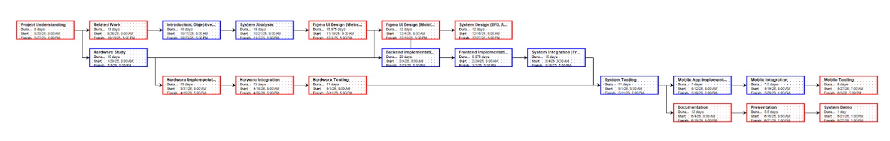

### 2.2.2 Gantt Chart

A Gantt Chart displays each task as a horizontal bar on a calendar timeline, with the bar spanning from the task's scheduled start date to its scheduled finish date. This format makes it straightforward to see how tasks overlap, where parallel streams of work exist, and how workload is distributed across the team at any given point in the project. It is particularly useful for communicating the schedule to stakeholders who may not be familiar with the technical details of the project.

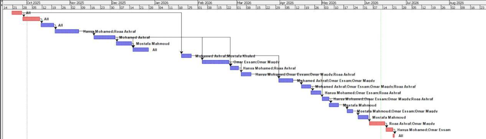

The SBGMS Gantt chart covers the period from October 2025 to July 2026. In the early months of the project, from October through January, the chart shows a single active workstream focused on analysis and research, with all team members working on the same set of foundational tasks. From February onwards, the chart begins to show parallel activity as the team splits into specialised sub-groups working on Figma design, hardware study, and architecture planning simultaneously. The period of highest concurrency falls in May and June 2026, when front-end implementation, back-end implementation, hardware work, and mobile development are all active at the same time. This is also the period of greatest schedule risk, as a delay in any one of these parallel streams could affect the integration phase that follows. Figure 2.2 below shows the full Gantt chart for all 27 tasks.

# 

# 

# Chapter 3

# Background and Literature Review

## 3.1 Introduction

This chapter reviews the body of existing research and technical knowledge that forms the foundation of the Smart Bus Garage Management System. The review is organized into two parts. Section 3.2 examines related work: prior systems and published research that addressed similar problems in fleet management, IoT-based transportation, and automated vehicle identification. Section 3.3 provides the technical background necessary to understand the core technologies used in the SBGMS, covering IoT in transportation, automatic number plate recognition, scheduling algorithms, real-time web communication, and computer vision.

The purpose of reviewing related work is to identify what has been done before, what problems those earlier systems left unresolved, and how the SBGMS builds on or differs from them. This prevents duplication of known approaches and provides a clear justification for the design decisions made in later chapters. The technical background section ensures that the system's components can be evaluated with reference to established principles and published benchmarks.

## 3.2 Related Work

Table 3-1 below provides a structured summary of the key studies reviewed in this chapter. Each entry is categorized by topic, identified by its reference number, and evaluated against the features most relevant to the SBGMS. Following the table, each study is discussed individually to highlight the specific contribution it makes and the gap it leaves that the SBGMS addresses.

| Title | Authors (Year) | Pros (Advantages) | Cons (Disadvantages) | Methodology | What We Did Better |
| --- | --- | --- | --- | --- | --- |
| Headway-Based Approach to Eliminate Bus Bunching | Daganzo (2009) | Foundational analytical model of bus bunching as a feedback instability. Proves headway regularity prevents bunching. | On-route holding focus only. No depot-level departure control or scheduling mechanism. | Mathematical modelling of headway-based holding strategies at stops. | We address the upstream cause at depot level: the Ping-Pong algorithm ensures regular, algorithmically assigned departures before buses reach the route. |
| IoT-Based Smart Parking System | Badrinarayanan et al. (2016) | Demonstrates IoT-based vehicle space monitoring with real-time status updates. Low infrastructure cost. | RFID-based identification requires pre-fitted tags on every vehicle. No scheduling logic. | IoT modules at parking bays with RFID readers at entry gates. | We use computer vision (ANPR) instead of RFID, requiring no vehicle modification and supporting any registered plate. |
| IoT-Based Smart Local Bus Transport Management System [19] | Gaikwad et al. (2018) | First system to include a depot-side application alongside a passenger-facing app. | Depot module is passive tracking only. No gate automation or driver assignment. | Onboard IoT nodes connected to cloud with dual-interface output. | We extend the depot concept with physical gate actuation, ANPR identification, and the Ping-Pong scheduling algorithm. |
| Enhancement of Parking Management in Cairo [18] | Elias et al. (2020) | Real-world Cairo context. Identifies the absence of real-time data sharing as the core operational problem. | Smartphone-only solution. No IoT hardware or gate automation. | Smartphone app for locating available spaces in Cairo garages. | We address the same data-sharing gap with live ANPR gate events and real-time fleet state broadcasting via WebSocket. |
| ANPR: A Detailed Survey of Relevant Algorithms [21] | Shah et al. (2021) | Comprehensive review confirming deep learning superiority over classical methods. Recommends two-stage pipeline. | Survey only. No implementation, deployment, or hardware integration. | Systematic comparison of classical vs. deep learning ANPR methods across diverse conditions. | We apply EasyOCR directly for plate character recognition, integrated with ESP32 gate hardware. YOLOv8 is used separately for the bus interior passenger counting camera. |
| Mitigating Bus Bunching with Real-Time Crowding Info [22] | Drabicki et al. (2022) | 30 to 70 percent of passengers skip overcrowded buses when given real-time load data, reducing headway variance. | Demand-side passenger behaviour only. No supply-side capacity response mechanism. | Empirical study of real-time load information displayed at bus stops. | We add the supply-side response: the Third-Bus mechanism auto-dispatches an additional bus when load thresholds are exceeded. |
| Smart Public Transportation: Framework for Cairo [23] | El-Husseiny et al. (2022) | Identifies fleet management and real-time tracking as the top digitalisation priorities for Greater Cairo transit. | Conceptual framework only. No implementation or prototype. | Policy and technical framework analysis for public transit in Greater Cairo. | We directly implement the fleet management and real-time data priorities identified by this framework for the depot layer. |
| Mwasalat Misr Smart Mobility Deployment [24] | Ridango (2022) | First smart mobility deployment by an Egyptian public transport operator. Replaces manual system with CAD/AVL. | CAD/AVL platform only. Does not address depot gate control or driver scheduling. | CAD/AVL platform replacing legacy manual fleet management in Cairo. | We complement this deployment by covering the depot layer specifically: ANPR gate automation and Ping-Pong driver scheduling. |

Table 3-1 Summary of Related Work

The table above compares all 14 reviewed works against the SBGMS across six dimensions. The final column, 'What We Did Better', makes explicit how each prior study informed or is extended by the design decisions in the SBGMS.

### 3.2.1 Bus Bunching and Scheduling

  Daganzo (2009) — Headway-Based Approach to Eliminate Bus Bunching: This landmark paper established the analytical foundation of bus bunching as a self-reinforcing feedback instability and proved that maintaining regular departure headways is the most effective upstream preventive measure. While focused on on-route holding strategies, it established the theoretical basis that irregular depot departures are a primary upstream cause of bunching, directly motivating the Ping-Pong algorithm's emphasis on consistent, algorithmically assigned departure intervals.

### 3.2.2 Smart Parking and Vehicle Access Control

  Badrinarayanan et al. (2016) — IoT-Based Smart Parking System: This system demonstrated the viability of IoT-based vehicle space management using RFID readers at entry gates. The gate management logic is directly relevant to the SBGMS, but RFID requires pre-fitted tags on every vehicle, making it less flexible than the ANPR approach adopted here, which requires no vehicle modification whatsoever.

Elias et al. (2020) — Enhancement of Parking Management in Cairo: This Cairo-specific study identified the absence of real-time data sharing between facilities and operators as the root cause of operational inefficiency in Cairo garages. This finding directly supports the motivation for the SBGMS real-time gate event logging and WebSocket broadcasting features, which address precisely this data-sharing gap in the bus depot context. 

### 3.2.3 IoT-Based Bus Management Systems

Gaikwad et al. (2018) — IoT-Based Smart Local Bus Transport Management System: This is the earliest system in the review to acknowledge the depot as a component of the management architecture, providing a depot-side application alongside a passenger-facing mobile app. However, the depot application was limited to passive tracking with no gate automation or driver assignment. The SBGMS builds directly on this foundation by adding physical gate actuation, ANPR-based identification, and the Ping-Pong algorithm. 

### 3.2.4 Automatic Number Plate Recognition

Shah et al. (2021) — ANPR: A Detailed Survey of Relevant Algorithms: This comprehensive survey confirmed that deep learning detectors consistently outperform classical image processing methods and identified the two-stage architecture (dedicated detector followed by a separate OCR model) as the most robust design across diverse environmental conditions. The SBGMS ANPR pipeline uses EasyOCR directly for both plate region identification and character extraction, trading the additional complexity of a dedicated detector stage for a simpler single-model pipeline that is sufficient for the controlled depot entry environment. 

### 3.2.5 Crowd Management and Capacity Response

Drabicki et al. (2022) — Mitigating Bus Bunching with Real-Time Crowding Information: This empirical study showed that 30 to 70 percent of passengers would voluntarily skip an overcrowded bus when given real-time load data, naturally reducing headway variance. The finding supports the demand-side rationale for the Third-Bus mechanism: when real-time load information reaches the depot management layer, it enables an automated supply-side response, dispatching an additional bus before overcrowding causes bunching.

### 3.2.6 Smart Transportation in Egypt

El-Husseiny et al. (2022) — Smart Public Transportation: A Future Framework for Cairo: This paper identified fleet management, real-time tracking, and passenger information systems as the three highest-priority digitalisation areas for Greater Cairo transit and noted that the absence of real-time operational data was the single greatest barrier to service improvement. The SBGMS directly implements these priorities at the depot layer. 

Ridango / Mwasalat Misr (2022) — Smart Mobility Deployment in Cairo: This case study documented the first deployment of smart mobility technologies by an Egyptian public transport operator, replacing a legacy manual system with a CAD/AVL platform. It confirms that the Egyptian public transport sector is institutionally ready to adopt digital management systems. The SBGMS complements this by covering the depot layer that CAD/AVL platforms do not address: ANPR gate automation and Ping-Pong driver scheduling.

## 3.3 Technical Background

### 3.3.1 ESP32 Edge Hardware Platform

The ESP32 is a low-cost, low-power system-on-chip (SoC) developed by Espressif Systems, featuring a dual-core Xtensa LX6 or LX7 processor, integrated 2.4 GHz Wi-Fi, Bluetooth, and a rich set of peripheral interfaces including UART, SPI, I2C, and General-Purpose Input/Output (GPIO) pins. Its combination of wireless connectivity, real-time processing capability, and peripheral versatility makes it particularly well-suited to edge computing applications in IoT-based physical access control systems. 

The SBGMS gate node is built around two ESP32 variants. The ESP32 development board, which serves as the main gate controller, manages sensor input, gate decision logic, servo actuation, and communication with the back end. The ESP32-CAM module, which integrates an OV2640 camera sensor directly onto the board, handles image capture and transmits the captured frame to the plate recognition pipeline.  Hercog et al. documented the design and implementation of ESP32-based IoT devices across a range of production applications and confirmed that the platform delivers the reliability and deterministic behaviour required for always-on embedded systems.  The ESP-IDF (Espressif IoT Development Framework) provides the firmware development environment, exposing FreeRTOS-based task scheduling that ensures the gate control response loop executes within bounded, predictable time constraints. 

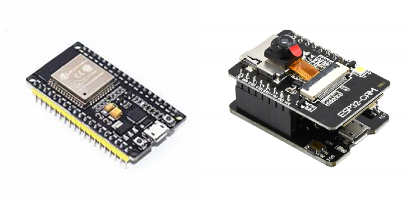

Figure 3-1 ESP32 Development Board (left) and ESP32-CAM Module with OV2640 Camera Sensor (right)

### 3.3.2 Ultrasonic Sensing for Vehicle Detection

The HC-SR04 ultrasonic distance sensor is used as the vehicle presence detector at each gate node. The sensor emits a 40 kHz ultrasonic pulse and measures the time-of-flight of the echo returning from any object within its detection range of 2 cm to 400 cm. Distance is calculated as d = (t x v) / 2, where t is the round-trip pulse travel time and v is the speed of sound in air (approximately 343 m/s at 20 degrees Celsius). In the SBGMS gate node, the ultrasonic sensor acts as the hardware trigger: when a vehicle enters the detection zone and the measured distance falls below a configured threshold, the sensor interrupt wakes the ESP32-CAM and initiates the image capture sequence. This event-driven approach eliminates the need for continuous camera polling, reducing both power consumption and the volume of frames that must be processed by the recognition pipeline.

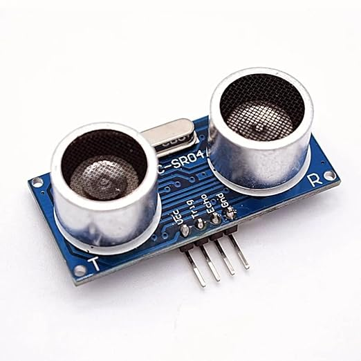

Figure 3-2 HC-SR04 Ultrasonic Distance Sensor Module

### 3.3.3 Servo Motor Actuation and PWM Control

The physical gate barrier is actuated by a servo motor controlled via Pulse Width Modulation (PWM) signals generated on an ESP32 GPIO pin. A servo motor accepts a PWM signal at a fixed frequency of 50 Hz (20 ms period), with the pulse width determining the angular position of the output shaft. A pulse width of approximately 1 ms corresponds to 0 degrees (gate closed), and a pulse width of approximately 2 ms corresponds to 90 or 180 degrees (gate open), depending on the servo model and mechanical linkage configuration [12]. The ESP-IDF LEDC (LED Control) peripheral provides hardware-backed PWM generation on the ESP32, ensuring that the duty cycle is maintained precisely without CPU intervention. Upon receiving a GRANTED response from the back-end in the HTTP response body, the master ESP32 firmware actuates the servo to the open position, holds it open for a configurable dwell period, and then returns it to the closed position.

Figure 3-3 Servo Motor

### 3.3.4 Communication Between Hardware Nodes and the Back-End

The design intent for inter-component communication is encrypted transport (HTTPS/WSS) throughout, satisfying NFR-07. The ESP-IDF provides the esp-tls component, which wraps the mbedTLS library to implement TLS 1.2 and 1.3 on the ESP32 [12]. However, in the as-built implementation documented in Chapter 6, the hardware nodes use plain HTTP for all local-network communication. This deviation is a deliberate engineering decision: the mbedTLS handshake buffers require approximately 12–16 KB of contiguous heap, which exceeds the 8 KB stack of the Arduino loopTask on the first call from setup(), causing a recursive panic at boot. Since all hardware nodes operate on a closed private LAN segment that is not exposed to the public internet, the plain HTTP channel for local communication is an acceptable operational trade-off. The synchronous request-response pattern is maintained: the camera node holds the HTTP connection open while the FastAPI server processes the ANPR request, and the authorisation decision is returned in the same HTTP response body. The API key used to authenticate hardware nodes is embedded in the firmware configuration file (hardware_config.h) and validated on every request by the back-end [12].

### 3.3.5 Internet of Things in Transportation

The Internet of Things refers to a network of physical devices embedded with sensors, processors, and communication modules that collect and exchange data over the internet without requiring direct human intervention. In transportation contexts, IoT devices are deployed on vehicles, at infrastructure points such as gates and stops, and within depot facilities to provide continuous, automated data collection that would otherwise require manual effort.  

Chang et al. demonstrated the application of ESP32-based edge computing to object detection tasks, confirming that modern microcontrollers can run recognition pipelines and transmitting results to cloud back-ends within the latency bounds required by real-time gate control applications.  The SBGMS gate node follows this architecture: the ESP32-CAM captures and forwards images, the back-end processes the ANPR pipeline, and the gate decision is returned to the node within the synchronous HTTP response body.

### 3.3.6 Automatic Number Plate Recognition

An ANPR system is a computer vision pipeline that automatically identifies vehicles by reading the alphanumeric characters on their licence plates. The pipeline typically consists of three stages: image capture, plate region detection, and character recognition. Each stage introduces potential failure modes that must be controlled to achieve acceptable system accuracy. 

In the plate detection stage, the system must locate the plate within a camera frame that may contain background clutter, other vehicles, or partial obstructions. Classical approaches used edge detection and morphological operations to isolate candidate plate regions, but these methods are sensitive to lighting variation and plate format differences. Modern deep learning detectors, particularly single-stage architectures such as the YOLO family, have substantially improved robustness to these conditions by learning feature representations directly from large, labelled datasets. 

In the character recognition stage, the cropped plate image is passed to an OCR model that identifies each character individually and assembles them into a plate string. The accuracy of this stage depends heavily on image resolution, character segmentation quality, and the diversity of fonts and formats represented in the model's training data. EasyOCR, the OCR component used in the SBGMS, supports multiple languages and character sets and has demonstrated competitive accuracy on licence plate recognition benchmarks. The SBGMS applies a minimum confidence threshold of 0.60 to EasyOCR outputs: plate reads returning a score below this boundary are classified as IGNORED and the gate remains closed, while those at or above the threshold proceed to the fleet registry lookup.

### 3.3.7 The YOLO Object Detection Architecture

You Only Look Once (YOLO) is a family of single-stage object detection models that process the entire input image in a single forward pass through a convolutional neural network, producing bounding box predictions and class probabilities simultaneously. This design contrasts with two-stage detectors, which first generate candidate regions and then classify them separately, making YOLO significantly faster and more suitable for real-time applications.

YOLOv8, released by Ultralytics in 2023, introduced an anchor-free detection head and a new C2f backbone module that improved feature extraction, particularly for small and overlapping objects. Sohan et al. reviewed YOLOv8's architecture and reported consistent improvements in mean average precision (mAP) over previous YOLO versions across standard benchmarks.  In the specific context of vehicle detection in mixed traffic environments, research published at the 2023 IEEE conference reported that YOLOv8 achieved accuracy values in the range of 0.60 to 0.80 under normal daylight conditions. In the SBGMS, YOLOv8 is deployed on the bus interior passenger counting camera, where it counts passengers in real time and divides the headcount by the vehicle's registered capacity to produce the crowding score used by the Third-Bus auto-dispatch mechanism. 

### 3.3.8 Real-Time Web Communication with WebSockets

The WebSocket protocol, standardised in RFC 6455, establishes a persistent, full-duplex communication channel between a client and a server over a single TCP connection. Unlike HTTP, which requires a new connection to be established for each request and response, a WebSocket connection remains open after the initial handshake, allowing either party to transmit data at any time without the overhead of repeated connection setup.

Pimentel et al. demonstrated, through a web application measuring real-time wind sensor data at 4 Hz, that WebSocket transmission latency was consistently lower than HTTP polling under equivalent conditions, and that the protocol was well-suited to applications requiring continuous data updates in a browser context.  For the SBGMS, WebSocket connections allow the React.js dashboard to receive live gate events, driver assignment notifications, and crowd-level updates from the back-end server as they occur, without requiring the client to repeatedly poll the server. Gomes et al. [30] further compared WebSocket and MQTT protocols using the ESP8266 microcontroller and found that WebSocket was more appropriate than MQTT in applications where low latency and direct client-to-server communication were the primary requirements, which aligns with the real-time dashboard use case of the SBGMS.

### 3.3.9 Scheduling Algorithms and Driver Rotation

Scheduling algorithms in fleet management are concerned with the assignment of drivers and vehicles to trips in a way that satisfies operational constraints, such as availability and shift limits, while optimising one or more objectives, such as workload equity, service regularity, or cost. Static scheduling approaches assign drivers to trips in advance based on fixed timetables, while dynamic approaches adjust assignments in response to real-time conditions such as driver availability changes or demand fluctuations. 

Round-robin scheduling, one of the simplest dynamic assignment algorithms, assigns tasks to agents in a repeating sequential cycle. While easy to implement, it can produce inequitable outcomes when agents enter or leave the active pool mid-cycle, because their position in the sequence determines their relative assignment frequency for the remainder of the cycle. The Ping-Pong algorithm used in the SBGMS addresses this limitation through a structured time-window rotation. Three drivers are assigned to every route per shift: D1, D2, and D3. The algorithm defines precise handover boundaries within a seven-hour window at which the active driver must hand over to the resting driver. This structured alternation guarantees that each of the three drivers accumulates equivalent active driving time over the course of a shift. The assignment of drivers to rotation positions and the execution of swap events are handled automatically by a background scheduler, removing the scheduling burden from depot supervisors entirely.

## 3.4 Summary

This chapter reviewed the existing literature and technical background underpinning the SBGMS. The related work review covered eight studies in chronological order across five domains: bus bunching and scheduling, IoT-based vehicle access control, IoT-based bus management systems, ANPR, and smart transportation in Egypt. The review confirmed that prior systems have not combined depot-level gate automation, algorithmic driver scheduling, and real-time capacity management in a single integrated platform, establishing a clear gap that the SBGMS addresses.

The technical background provided the academic foundation for each core technology used in the system. Section 3.3.1 through 3.3.4 covered the ESP32 hardware platform, ultrasonic vehicle detection, servo motor PWM control, and the hardware communication design (see Section 3.3.4 for the as-built rationale) — the four hardware-layer technologies that distinguish the SBGMS as a physical IoT system rather than a pure software platform. Sections 3.3.5 through 3.3.9 covered the IoT transportation context, the ANPR pipeline, the YOLOv8 architecture, WebSocket real-time communication, and scheduling algorithm theory. These foundations directly inform the system design decisions presented in Chapter 5 and the implementation details in Chapter 6.

# Chapter 4

# System Analysis

System analysis translates the problem domains identified in Chapter 1 into a structured, verifiable specification of system behaviour. The outputs of this phase serve as the baseline against which the implementation in Chapter 6 and the test results in Chapter 7 are evaluated. This chapter covers the functional and non-functional requirements, the system block diagram and data flow diagrams, the system scenarios describing key user journeys, the UML behavioural and structural diagrams, and the GUI free-hand sketches for all three client interfaces.

## 4.1 System Requirements

The requirements are divided into functional requirements, which define what the system must do, and non-functional requirements, which define the quality attributes the system must satisfy. All requirements are traceable to the problem domains described in Sections 1.2 and 1.3.

### 4.1.1 Functional Requirements

The functional requirements are grouped by subsystem. Each requirement is assigned a unique identifier for traceability.

| ID | Subsystem | Requirement | Related UC |
| --- | --- | --- | --- |
| FR-01 | Gate Management | The system shall detect any vehicle entering or exiting the gate zone and trigger the ANPR pipeline within two seconds of detection. | UC-13 |
| FR-02 | Gate Management | The system shall extract the licence plate number and validate it against the fleet registry. | UC-13 |
| FR-03 | Gate Management | On a valid match, the system shall send a gate-open signal and record the event with vehicle ID, gate ID, event type, timestamp, and confidence score [6]. | UC-13 |
| FR-04 | Gate Management | On an invalid plate, the system shall deny access and raise an alert on the supervisor dashboard. | UC-04 |
| FR-05 | Gate Management | The supervisor shall be able to view and filter the real-time gate event log by vehicle, gate, and time range. | UC-03 |
| FR-06 | Gate Management | The supervisor shall be able to manually override the gate state from the dashboard. | UC-04 |
| FR-07 | Driver Scheduling | The system shall assign three drivers per route per shift (positions D1, D2, and D3) and persist their rotation assignments with scheduled shift start and end times [3]. | UC-14 |
| FR-08 | Driver Scheduling | The background scheduler shall evaluate active rotation assignments on a recurring interval and execute a driver swap when a time-window boundary (hour 1, 3, or 5 since shift start) is crossed [3]. | UC-14 |
| FR-09 | Driver Scheduling | Every driver swap shall be recorded as a DriverExchange audit entry containing the outgoing driver, the incoming driver, the reason, and the precise exchange timestamp. | UC-14 |
| FR-10 | Driver Scheduling | Every assignment shall be persisted with driver ID, bus ID, departure time, and queue sequence number. | UC-07, UC-10 |
| FR-11 | Driver Scheduling | The supervisor shall be able to view the assignment queue and manually override any pending assignment. | UC-07, UC-08 |
| FR-12 | Driver Scheduling | The system shall make new trip assignments visible to the assigned driver via the mobile application. In the current implementation, assignments are delivered through REST polling when the driver opens the application; server-initiated push notification is a planned future enhancement. | UC-10 |
| FR-13 | Capacity Management | The system shall receive, and store passenger load reports submitted by drivers via the mobile application [7]. | UC-12 |
| FR-14 | Capacity Management | After each load report, the system shall compare the route aggregate against its configured threshold [7]. | UC-15 |
| FR-15 | Capacity Management | When a threshold is breached, the system shall automatically identify the next available bus, assign a driver via the Ping-Pong algorithm, and make the new assignment visible to the driver via the mobile application [7]. | UC-15 |
| FR-16 | Capacity Management | The supervisor shall be able to configure crowd thresholds per route and per time period. | UC-09 |
| FR-17 | Fleet Administration | The system shall maintain a registry of buses (plate, capacity, status) and drivers (licence, shift, history). | UC-05, UC-06 |
| FR-18 | Fleet Administration | The supervisor shall be able to create, update, and deactivate bus and driver records. | UC-05, UC-06 |
| FR-19 | Fleet Administration | The dashboard shall display a real-time fleet status view showing every bus state (depot, in-service, maintenance) [6]. | UC-02 |
| FR-20 | Security | All API endpoints shall require authentication via JWT (human users) or API key (hardware nodes). [8] | UC-01 |
| FR-21 | Security | JWT tokens shall expire after a configurable interval and be refreshable via a dedicated endpoint [8]. | UC-01 |
| FR-22 | Security | All write operations shall be protected by idempotency keys to prevent duplicate processing on network retransmission. | UC-13, UC-14 |

Table 4-1 Functional Requirements

### 4.1.2 Non-Functional Requirements

| ID | Category | Requirement | Metric |
| --- | --- | --- | --- |
| NFR-01 | Performance | The ANPR pipeline shall complete plate detection and recognition within two seconds of image capture under normal daylight conditions [4]. | < 2 seconds |
| NFR-02 | Performance | The back-end API shall respond to standard REST requests within 300 milliseconds under a load of up to 100 concurrent users [8]. | < 300 ms |
| NFR-03 | Performance | WebSocket event broadcasts shall reach all connected dashboard clients within 500 milliseconds of event persistence. | < 500 ms |
| NFR-04 | Reliability | The back-end service shall maintain at least 99% uptime during operational hours (06:00 to 22:00 daily). | ≥ 99% uptime |
| NFR-05 | Reliability | The gate controller node shall retain the last known gate state in non-volatile memory and restore it after a power interruption, defaulting to closed. | Auto-restore on boot |
| NFR-06 | Reliability | Scheduled rotation tasks shall be persisted to a database-backed job store and survive server restarts [13]. | Zero task loss on restart |
| NFR-07 | Security | All inter-component communication shall use HTTPS or WSS. Plain HTTP connections shall be rejected [8]. | TLS enforced |
| NFR-08 | Security | Passwords shall be stored using a salted hash. Plain-text passwords shall never be stored or logged. | Bcrypt/Argon2 |
| NFR-09 | Security | Hardware node API keys shall be rotatable through the dashboard without requiring firmware updates. | Key rotation in < 1 min |
| NFR-10 | Usability | The dashboard shall present the full fleet status view on a 1366x768 screen without horizontal scrolling [10]. | Single-screen layout |
| NFR-11 | Usability | The driver mobile app shall complete the trip acknowledgement flow in no more than three interactions [11]. | ≤ 3 taps |
| NFR-12 | Scalability | The back end shall support horizontal scaling by adding application server instances behind a load balancer without code changes [8], [10]. | Stateless design |
| NFR-13 | Maintainability | Each system layer shall be independently deployable and versioned so updates to one layer do not require simultaneous updates to others. | Decoupled layers |

Table 4-2 Non-functional Requirements

## 4.2 System Block Diagram and Data Flow Diagrams

### 4.2.1 System Block Diagram

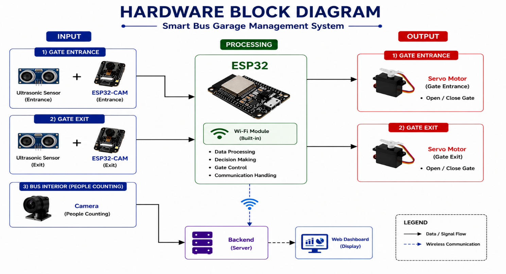

Figure 4-1 presents the hardware and software block diagram of the SBGMS, showing the full signal and data flow from physical input devices through to the output actuators and the cloud back-end. The system is organized into three input nodes: the Gate Entrance node, comprising an ultrasonic sensor and an ESP32-CAM for vehicle detection and plate capture; the Gate Exit node, with the same hardware configuration; and the Bus Interior node, which uses a dedicated camera for passenger counting [12], [25], [26]. All three nodes feed into the central ESP32 processing unit, which handles data processing, gate control decision-making, and communication management via its built-in Wi-Fi module. On the output side, two servo motors actuate the physical gate barriers at the entrance and exit respectively. The ESP32 communicates wirelessly with the back-end server, which persists all events and serve s the web dashboard [6].

## 4.3 System Scenarios

System scenarios describe the step-by-step journeys that users and automated processes follow when interacting with the SBGMS. Each scenario is presented as a numbered sequence of events covering the normal flow, with notes on alternative and exception paths where relevant.

### 4.3.1 Scenario 1 — ANPR Gate Authorisation

This scenario describes the journey of a registered bus entering the depot through the automated gate. It covers the normal authorisation flow from vehicle detection to gate actuation and event logging [4], [5], [6], [12].

| Actor | Gate Hardware Node (automated), Fleet Database, Depot Supervisor (observer) |
| --- | --- |
| Precondition | The gate node is powered, connected to the network, and authenticated via API key [12]. The bus is registered in the fleet registry. |
| Step 1 | The gate camera detects a vehicle entering the detection zone and captures a high-resolution image frame. |
| Step 2 | EasyOCR processes the captured image, identifies the licence plate region, and extracts the character sequence, returning a plate string with a confidence score. |
| Step 3 | If the OCR confidence score is below 0.60, the result is classified as IGNORED, the gate remains closed, and the event is logged without a vehicle match. If 0.60 or above, the pipeline proceeds to the fleet registry lookup [4]. |
| Step 4 | EasyOCR extracts the character sequence from the cropped plate region and returns the plate string [5]. |
| Step 5 | The plate string is sent to the back-end via an HTTP POST request authenticated with the node API key [12]. |
| Step 6 | The back-end validates the plate against the fleet registry. A match is found for an authorised vehicle. |
| Step 7 | The back-end issues a gate-open command to the hardware node and writes the gate event record (vehicle ID, gate ID, entry, timestamp, confidence) to the database [6]. |
| Step 8 | The gate barrier opens. The event appears in real time on the supervisor dashboard via WebSocket broadcast. |
| Alt. Path | If no plate match is found, the gate remains closed, an alert is raised on the dashboard, and the event is logged as an unauthorised access attempt. |
| Postcondition | The bus entry is recorded. The fleet status for the vehicle updates to 'in depot'. The gate returns to closed. |

Table 4-3 Scenario 1 - ANPR Gate Authorisation

### 4.3.2 Scenario 2 — Driver Starting a Trip

This scenario describes the journey of a driver from receiving their assignment notification to departing the depot on a scheduled trip [3], [11].

| Actor | Driver (mobile app), Ping-Pong Rotation Scheduler (automated), Depot Supervisor (observer) |
| --- | --- |
| Precondition | The driver is assigned as D1, D2, or D3 for the current shift via a RotationAssignment record. The mobile application is installed, and the driver is logged in [11]. |
| Step 1 | The APScheduler background worker calls process_rotations() on its recurring interval [13]. |
| Step 2 | The worker calculates hours elapsed since the shift start time and detects that a time-window boundary (hour 1, 3, or 5) has been crossed for this route's rotation group. |
| Step 3 | _perform_swap() is called: the outgoing driver's RotationAssignment is set to inactive and their status updated to ON_BREAK; the incoming driver's assignment is set to active and their status updated to ACTIVE. |
| Step 4 | A DriverExchange audit record is written with the outgoing driver, incoming driver, reason (BREAK), and exchange timestamp. |
| Step 5 | A push notification is sent to the incoming driver's mobile device with the route and vehicle assignment details [11]. The new assignment is also available via GET /drivers/me/trips when the driver opens the application. |
| Step 6 | The driver opens the mobile app, reviews the assignment, and taps Acknowledge. The supervisor dashboard updates the rotation status in real time via WebSocket. |
| Step 7 | The driver proceeds to the assigned vehicle and departs through the gate, triggering the ANPR pipeline (Scenario 1). |
| Alt. Path | If the incoming driver does not acknowledge within two minutes, the supervisor receives an alert on the dashboard and can manually trigger the swap or reassign the route (FR-11). |
| Postcondition | The DriverExchange record is committed. The outgoing driver status is ON_BREAK and the incoming driver status is ACTIVE. The rotation assignment flags reflect the new active driver. |

Table 4-4 Scenario 2 - Driver Starting a Trip

### 4.3.3 Scenario 3 — Third-Bus Capacity Dispatch

This scenario describes the automated crowd-response flow triggered when passenger load on an active route exceeds its configured threshold [7].

| Actor | Driver (mobile app), Capacity Management (automated), Depot Supervisor (observer) |
| --- | --- |
| Precondition | At least one bus is active on the route. An available bus and an on-duty driver exist in the depot. The crowd threshold for the route is configured (FR-16, FR-17). |
| Step 1 | The active driver submits a passenger load report (level 4 or 5 out of 5) through the mobile application [11]. |
| Step 2 | The back-end receives the report and evaluates the aggregate load for the route against the configured threshold [7]. |
| Step 3 | The threshold is exceeded. The system identifies the highest-priority available bus in the depot fleet registry. |
| Step 4 | The Ping-Pong algorithm assigns the next available driver to the identified bus [3]. |
| Step 5 | The new trip assignment is written to the database. The assigned driver will see the extra-dispatch trip the next time they open the mobile application and fetch their trips via GET /drivers/me/trips [11]. |
| Step 6 | The assignment and dispatch event are written to the database and broadcast to the supervisor dashboard via WebSocket. |
| Step 7 | The assigned driver acknowledges the dispatch, proceeds to the bus, and departs through the gate (triggering Scenario 1). |
| Alt. Path | If no available driver is found, the supervisor receives a critical alert on the dashboard and must manually arrange cover. |
| Postcondition | The additional bus is in service on the route. The crowd threshold evaluation resets for the next report cycle. |

Table 4-5 Scenario 3 - Third-Bus Capacity Dispatch

### 

### 4.3.4 Scenario 4 — IoT Emergency Maintenance Alert

This scenario describes the journey triggered when a hardware gate node reports an operational fault, such as a camera failure or connectivity loss [12], [26].

| Actor | Gate Hardware Node (automated), Depot Supervisor |
| --- | --- |
| Precondition | The gate node is registered in the system. The supervisor dashboard is active and connected via WebSocket. |
| Step 1 | The gate node fails to complete a heartbeat check within the configured interval (e.g. 30 seconds) or reports a camera error via its status endpoint [12]. |
| Step 2 | The back-end detects the missed heartbeat or error status and classifies the node as faulted. |
| Step 3 | The gate associated with the faulted node is flagged as offline in the fleet database. Its status updates to Requires Maintenance. |
| Step 4 | A critical maintenance alert is broadcast to the supervisor dashboard via WebSocket with the gate ID, fault type, and timestamp. |
| Step 5 | The supervisor receives the alert, reviews the fault details on the dashboard, and can issue a manual gate-open or gate-close override (FR-06). |
| Step 6 | The supervisor marks the gate as Under Maintenance in the system, which excludes it from automated ANPR processing until cleared. |
| Step 7 | Once the hardware issue is resolved and the node resumes normal heartbeat reporting, the supervisor clears the maintenance flag, and the gate returns to automated operation. |
| Alt. Path | If the fault is detected during peak departure hours, the supervisor can temporarily redirect buses to an alternative gate while maintenance is performed. |
| Postcondition | The gate node status is updated. All fault events are logged with timestamps for the maintenance audit trail. |

Table 4-6 Scenario 3 - Third-Bus Capacity Dispatch

## 4.4 UML Diagrams

The following subsections present the UML behavioural and structural diagrams for the SBGMS. Each diagram is represented by a placeholder box; the actual diagrams will be inserted as images. Detailed captions describe the scope and content of each diagram.

### 4.4.1 Use Case Diagram

The use case diagram shows all actors and their interactions with the system at a high level. Three actors are identified: Depot Supervisor, Driver, and System (Automated). The Supervisor actor is connected to use cases covering authentication, fleet monitoring, gate management, driver and bus registry management, assignment queue management, and threshold configuration. The Driver actor is connected to use cases covering authentication, trip notification receipt, trip acknowledgement, and load reporting. The System actor is connected to the automated use cases: ANPR gate detection, Ping-Pong rotation execution, Third-Bus dispatch, and WebSocket broadcasting.

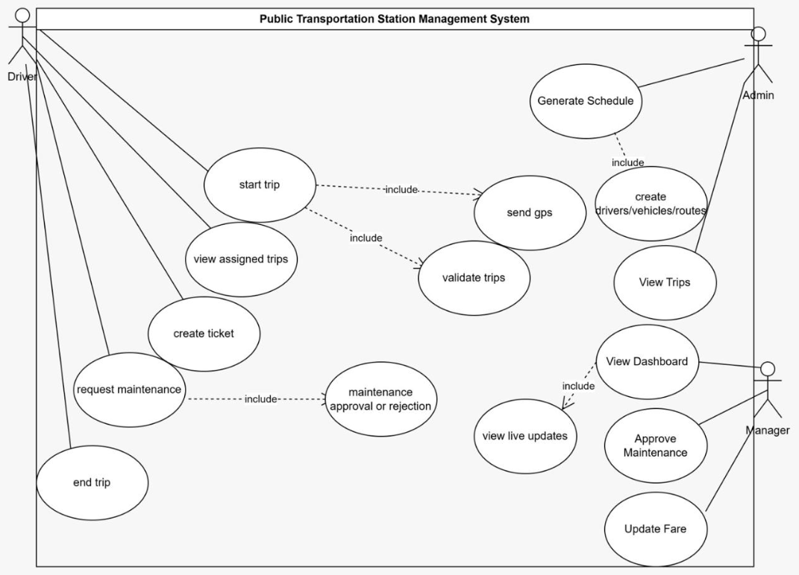

Figure 4-2 Use Case Diagram

### 

### 

### 

### 

### 

### 

### 

### 

### 

### 

### 

### 

### 

### 

### 4.4.2 Activity Diagrams

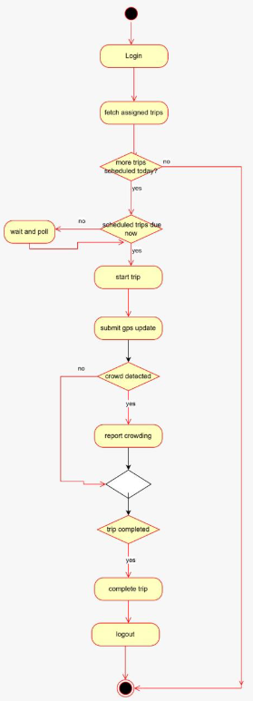

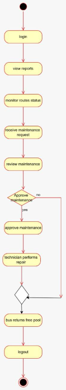

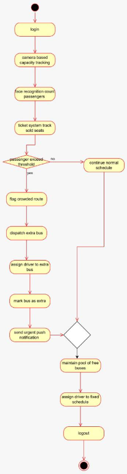

Activity diagrams model the step-by-step flow of actions within key system processes. A separate activity diagram is provided for each of the three primary actors and for the main automated processes.

### 4.4.3 Sequence Diagrams

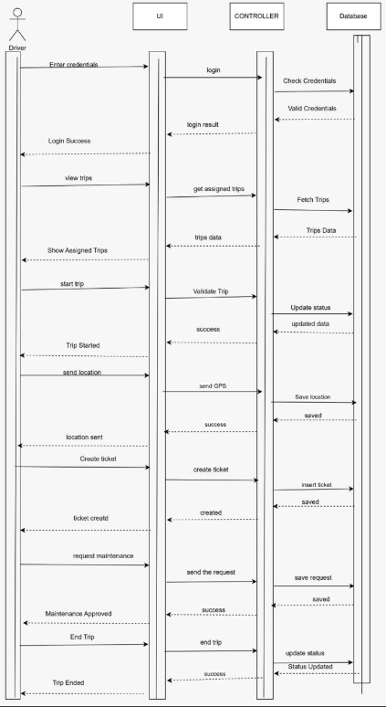

Sequence diagrams model the time-ordered message exchanges between system components for each key scenario. A separate sequence diagram is provided for each scenario defined in Section 4.3.

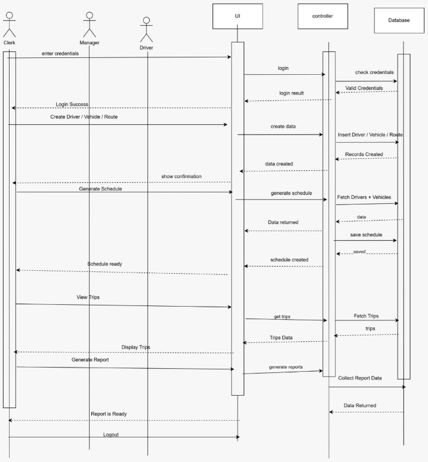

Figure 4-7 Admin Sequence Diagram

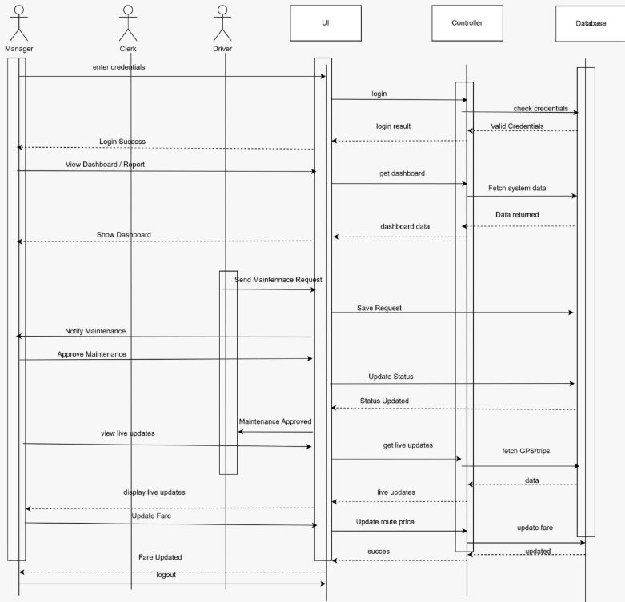

Figure 4-8 Manager Sequence Diagram

### 4.4.4 Class Diagram

The class diagram presents the static object-oriented structure of the SBGMS back-end domain model, showing the principal classes, their attributes, their methods, and the relationships between them. The diagram covers the core domain classes: User, Driver, Vehicle, Trip, GateLog, Route, RotationAssignment, DriverExchange, and CrowdingEvent. Associations include Driver extends User (one-to-one); Vehicle is assigned to Driver through Trip (many-to-many via Trip); GateLog belongs to Vehicle (many-to-one); DriverExchange records the outgoing and incoming Driver for each rotation swap (many-to-one on both driver foreign keys); and RotationAssignment groups three drivers per route per shift (one-to-many from Route).

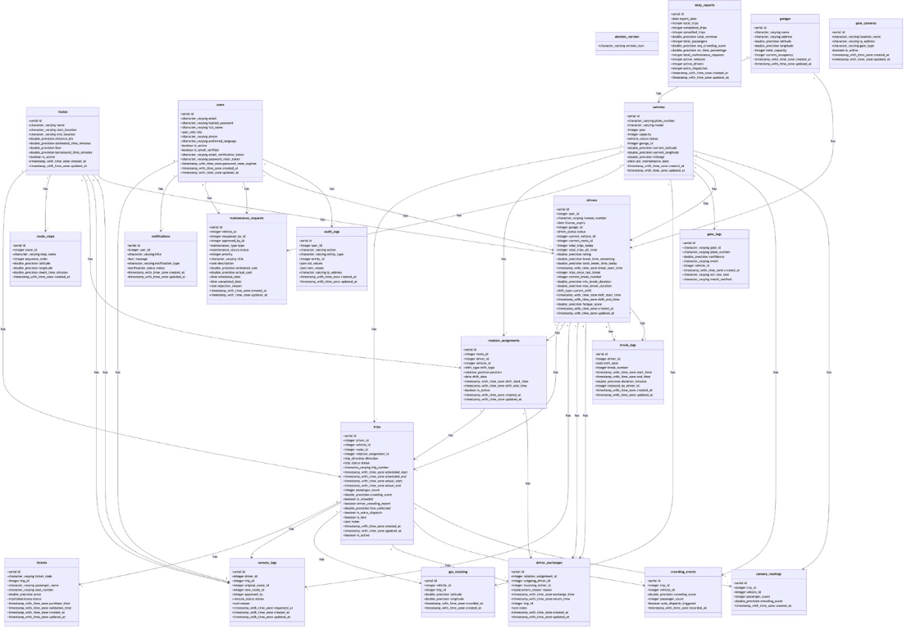

Figure 4-9 Class Diagram

## 

## 

## 

## 

## 

## 4.5 GUI Free-Hand Sketches

This section presents the low-fidelity GUI sketches for all three client interfaces: the Admin/Clerk web dashboard, the Manager web dashboard, and the Flutter driver mobile application. These sketches were produced by the team as the initial design artefacts before the high-fidelity Figma prototypes were developed. They establish the layout, navigation structure, and key interaction patterns for each screen and directly informed the Figma designs referenced in Section 1.4 [9].

The admin dashboard covers six screens: the Operations Overview dashboard showing system alerts and trip statistics, the Reports screen with a template library and date-range generation, the Drivers management table, the Vehicles registry, the Routes list, the Schedule view, and the Maintenance log. The Manager dashboard covers the Live Operations view with crowding radar and ops signals, the Fleet and Gate Monitoring screen with live ANPR event feed, the Reroute Requests table, and the Notifications screen. The Driver mobile application covers the Login screen, the Home Dashboard with current trip and immediate dispatch card, the Trip History screen, the New Maintenance Request flow, and the Urgent Dispatch notification screen.

**Admin / Clerk Web Dashboard Screens**

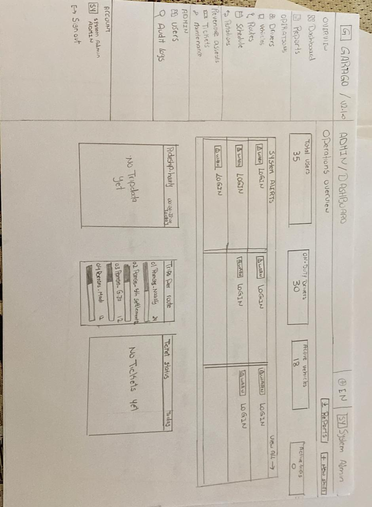

Figure 4-10 Admin Dashboard Screen

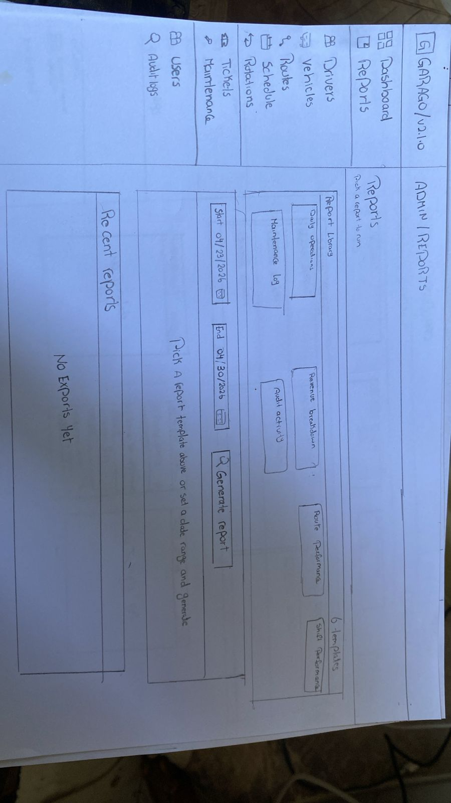

Figure 4-11 Admin Reports Screen

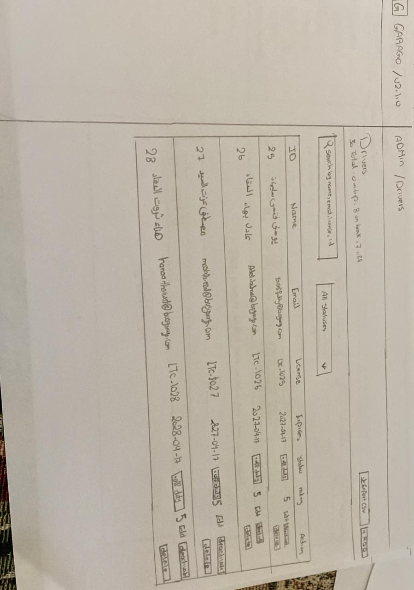

Figure 4-12 Admin Drivers Management Screen

Figure 4-13 Admin Vehicles Management Screen

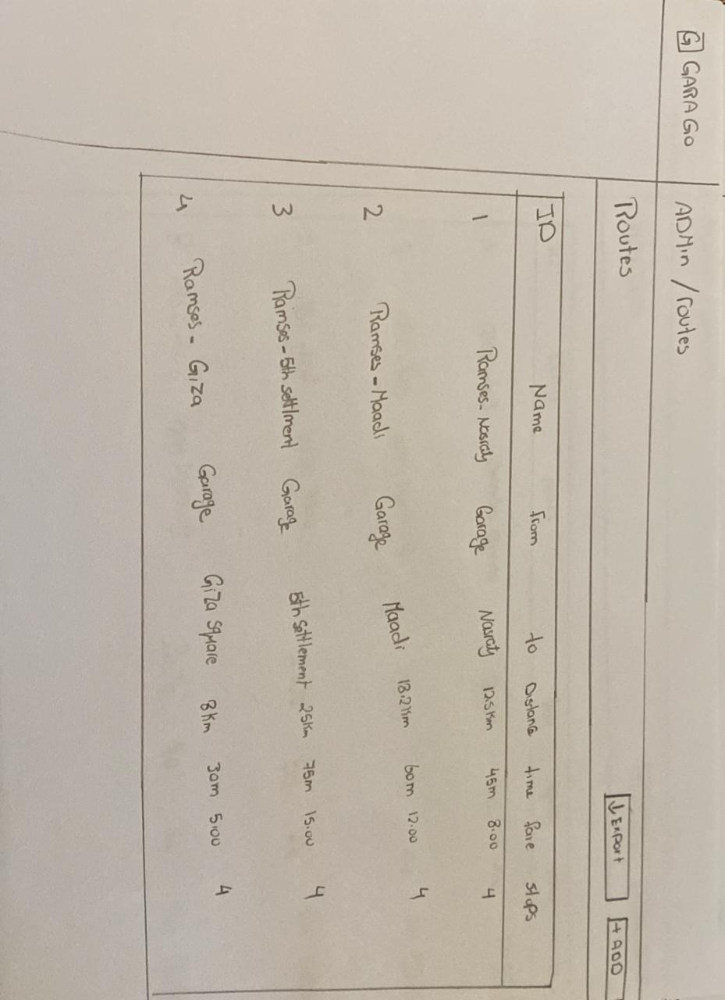

Figure 4-14 Admin Routes Screen

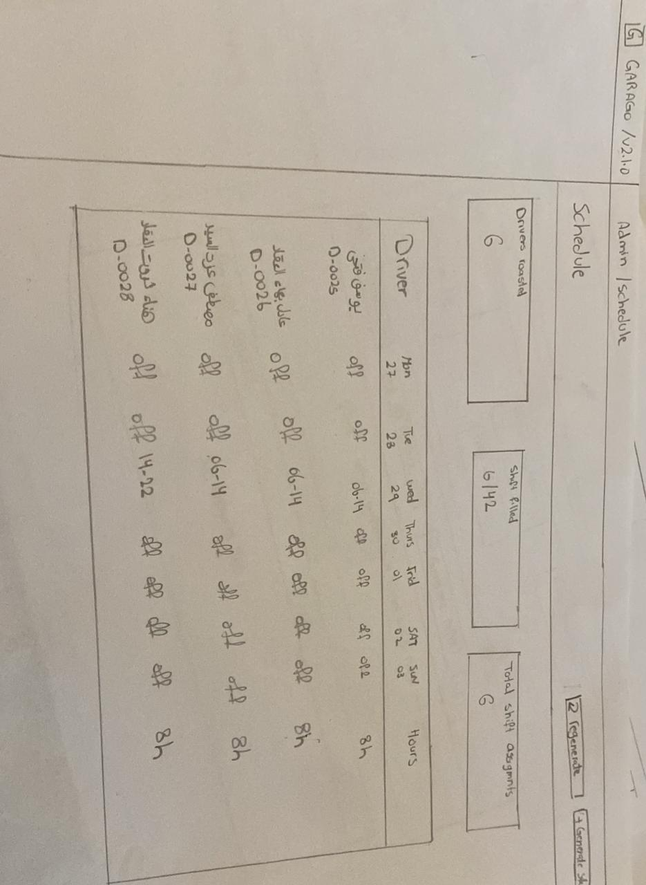

Figure 4-15 Admin Schedule Screen

Figure 4-16 Admin Maintenance Screen

**Manager Web Dashboard Screens**

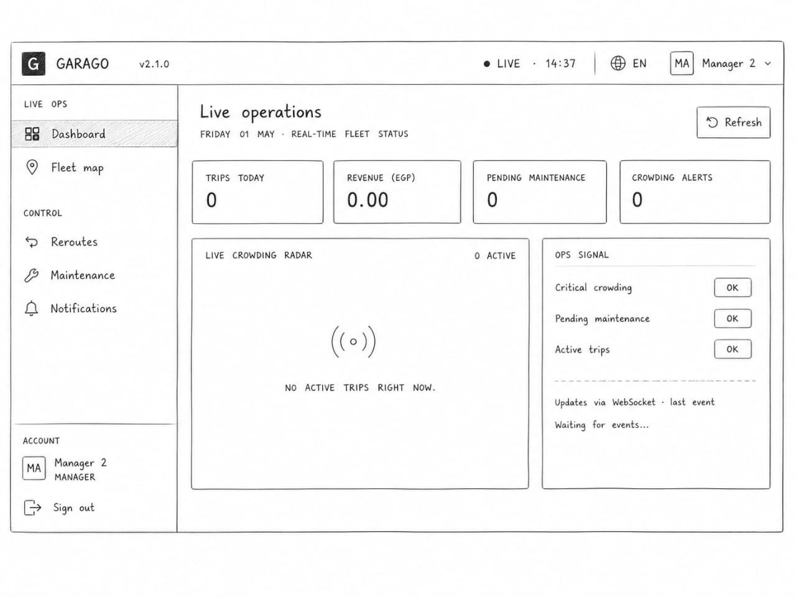

Figure 4-17 Manager Live Operations Dashboard

## 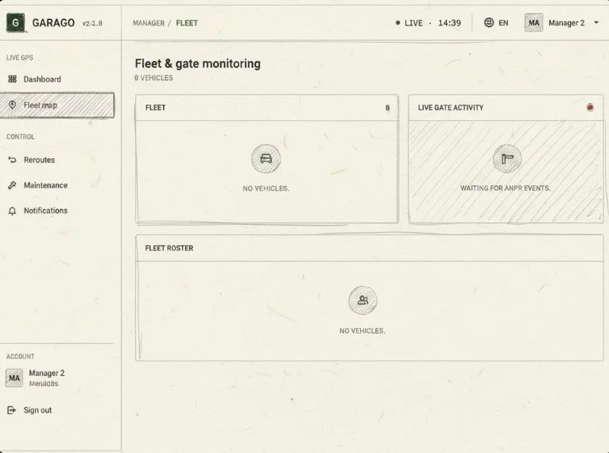

Figure 4-18 Manager Fleet & gate monitoring Screen

## 

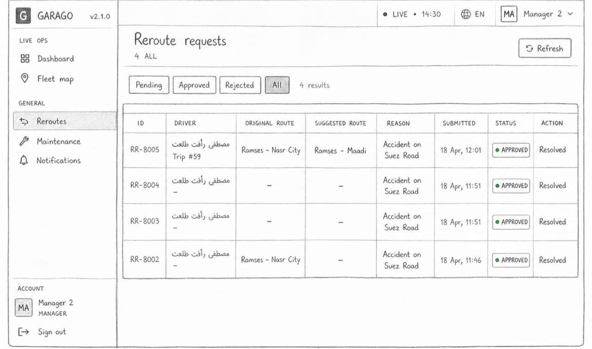

Figure 4-19 Manager Reroute Requests Screen

Figure 4-20 Manager Notifications Screen

**Driver Mobile Application Screens (Flutter)**

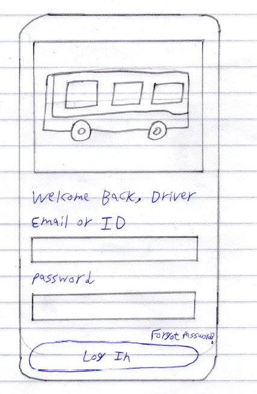

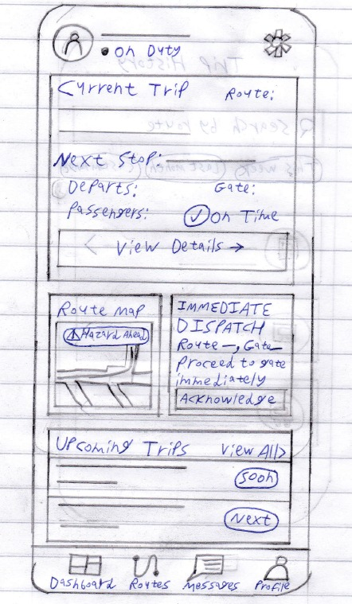

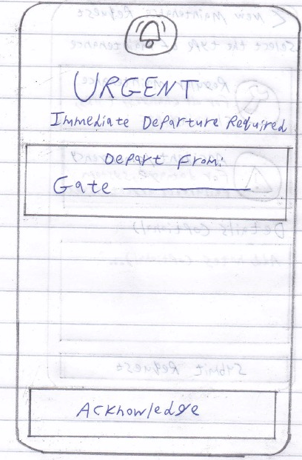

 

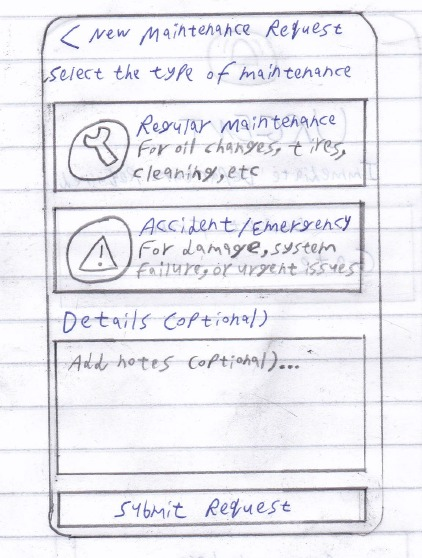

 

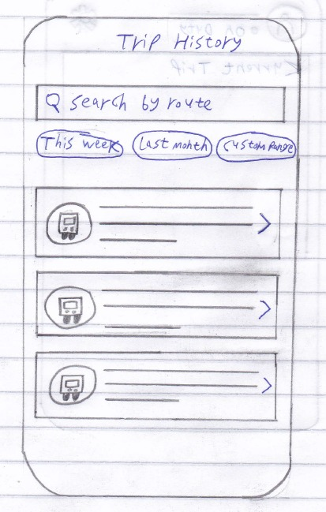

## 4.6 Summary

This chapter presented the complete system analysis for the SBGMS. The functional requirements (FR-01 to FR-22) and non-functional requirements (NFR-01 to NFR-13) were defined across five subsystems and five quality dimensions respectively. The system block diagram illustrated the full hardware and data flow architecture from edge sensors through to the web dashboard. Three DFD levels defined the internal sub-process structure. Four detailed system scenarios described the step-by-step journeys for gate authorization, driver trip start, Third-Bus dispatch, and IoT maintenance alerting. The UML section provided a use case diagram, four activity diagrams, four sequence diagrams, and a class diagram. The GUI section presented 23 free-hand sketches covering the Admin, Manager, and Driver interfaces. Chapter 5 maps these requirements to the concrete architectural and design decisions that realize the

# Chapter 5

# System Design

## 5.1 Introduction

System design translates the requirements specified in Chapter 4 into a concrete technical architecture. Where Chapter 4 answered the question of what the system must do, this chapter answers the question of how it will do it. Each design decision documented here is traceable to one or more functional or non-functional requirements, and each is justified by reference to the technology choices validated in Chapter 3.

The chapter is structured as follows. Section 5.2 presents the overall layered system architecture. Section 5.3 covers the back-end design including the API structure, WebSocket architecture, and middleware stack. Section 5.4 presents the database design. Section 5.5 covers the front-end web dashboard design. Section 5.6 covers the mobile application design. Section 5.7 presents the hardware integration design. Section 5.8 describes the security architecture. Section 5.9 provides a summary.

## 5.2 System Architecture Overview

The SBGMS is designed as a layered, service-oriented architecture comprising four distinct tiers that communicate through well-defined interfaces. This separation ensures that each tier can be developed, tested, and scaled independently, satisfying NFR-12 and NFR-13.

| Layer | Components | Technology | Primary Role |
| --- | --- | --- | --- |
| Edge Hardware | Gate controller node, ESP32-CAM, HC-SR04 sensors, servo motors | ESP32, ESP-IDF (C++) | Physical vehicle detection, plate capture, and gate barrier actuation |
| Back-End Application | FastAPI server, APScheduler, ConnectionManager, middleware stack | Python, FastAPI, APScheduler | Business logic, API gateway, real-time event broadcasting, scheduled rotation |
| Data Persistence | Relational database | PostgreSQL 16 | Durable storage of all persistent system state: fleet registry, trips, gate events, audit log |
| Client Presentation | Admin/Clerk web dashboard, Manager web dashboard, Driver mobile app | React.js 18, Flutter 3 | User interaction, real-time dashboard display, trip assignment delivery via REST polling |

Table 5-1 System Architecture Layers

The edge layer communicates with the back-end over HTTP on the local network. As documented in Section 3.3.4, plain HTTP is used rather than HTTPS because the mbedTLS handshake buffers exceed the Arduino loopTask stack, and all hardware nodes are confined to a closed private LAN segment. The back-end communicates with client applications over both HTTPS (REST) and WSS (WebSocket), with role-targeted message routing implemented through the in-memory ConnectionManager.  [30] The data layer is invisible to client applications, accessed only through the back-end application layer, which enforces all authentication and authorisation rules before any database query is executed [8], [9].

## 5.3 Back-End Design

### 5.3.1 FastAPI Application Structure

The back-end is built on FastAPI [8], organised as a modular application with separate router modules for each functional domain. The base URL is /api/v1. The application exposes approximately 60 HTTP endpoints and one WebSocket endpoint, grouped into five role-based router modules: Auth, Admin, Manager, Driver, and Hardware. This separation enforces role boundaries at the routing layer, so that role checking is never reliant solely on middleware.

| Router Module | Base Path | Auth Method | Key Endpoints |
| --- | --- | --- | --- |
| Auth | /api/v1/auth | None / Bearer JWT | POST /login, POST /refresh, POST /signup, GET /me, POST /change-password, POST /forgot-password |
| Admin | /api/v1/admin | Bearer JWT (ADMIN role) | GET /dashboard/stats, CRUD /drivers, CRUD /vehicles, CRUD /routes, GET /trips, GET /audit-logs, GET /reports/daily, GET /reports/export |
| Manager | /api/v1/manager | Bearer JWT (MANAGER role) | GET /dashboard/stats, GET /fleet/live, GET /maintenance/pending, PATCH /maintenance/{id}/approve, GET /reroute, PATCH /reroute/{id}/approve, GET /trips/active |
| Driver | /api/v1/drivers | Bearer JWT (DRIVER role) | GET /me/trips, POST /me/trips/{id}/start, POST /me/trips/{id}/end, POST /me/gps, POST /me/reroute, POST /me/check-in, POST /me/break/start |
| Hardware | /api/v1/hardware | X-Hardware-Api-Key header | POST /anpr (pre-OCR'd plate string), POST /anpr/upload_raw (raw JPEG), POST /camera (passenger count), POST /log (diagnostics) |

Table 5-2 API Router Modules and Endpoint Groups

The Hardware router is architecturally distinct from the other routers. It accepts no JWT; instead, all requests must carry a valid X-Hardware-Api-Key header, which is validated against the configured key in the application settings using secrets.compare_digest() to prevent timing-based attacks. This design isolates the hardware authentication pathway from the human user authentication pathway, meaning that a compromised hardware key cannot be used to access any admin, manager, or driver endpoint, and vice versa (FR-20, FR-22).

### 5.3.2 ANPR Endpoint Design

The ANPR subsystem exposes two endpoints to accommodate different deployment configurations. POST /hardware/anpr accepts a pre-extracted plate string in a JSON payload, intended for nodes that run OCR locally. POST /hardware/anpr/upload_raw accepts a raw JPEG image and runs the EasyOCR pipeline on the server, returning a plain-text GRANTED or DENIED response. Both endpoints follow the same authorisation decision flow: validate the API key, query the fleet registry for the plate number, log the gate event to the database, and return the decision [8], [9].

The synchronous request-response model is central to the gate node design. The camera node holds the HTTP connection open while the server processes the ANPR request. The response body contains a plain-text GRANTED or DENIED string. The master ESP32 receives this string via the triggerCamera() HTTP GET response and immediately actuates the servo gate barrier on GRANTED [12]. The entire round trip, from plate string transmission to servo actuation, is designed to complete within two seconds under normal network conditions (NFR-01).

### 5.3.3 WebSocket Architecture and ConnectionManager

Real-time event delivery to dashboard clients is implemented via a WebSocket endpoint at /ws?token=<jwt>.  The ConnectionManager class maintains three separate connection sets, one per user role, ensuring that events are delivered only to clients with the appropriate access level:

| Event Type | Delivered To | Trigger |
| --- | --- | --- |
| GATE_AUTH_GRANTED | ADMIN, MANAGER | Vehicle plate matched in fleet registry at gate |
| UNAUTHORIZED_VEHICLE | ADMIN, MANAGER | Unknown or unregistered plate detected at gate |
| crowding_alert (HIGH severity) | MANAGER only | Passenger count exceeds 90% of vehicle capacity on POST /hardware/camera |
| Trip / assignment updates | DRIVER (own trips only) | Trip status changes broadcast via WebSocket to connected driver sessions; new auto-dispatch assignments are delivered via REST polling on app open (GET /drivers/me/trips) |

Table 5-3 WebSocket Role-Targeted Event Routing

On connection, the JWT is decoded, and the socket is placed into the correct role bucket entirely in memory — no external broker is used. A built-in rate limit of 10 messages per second per socket prevents broadcast storms. Expired JWTs are rejected with close code 4401, prompting the client to refresh its token before reconnecting. A 60-second ping/pong heartbeat detects and removes stale connections automatically [8].

### 5.3.4 Middleware Stack

The FastAPI application uses three custom middleware layers applied in sequence to every incoming request. The Authentication Middleware validates the Bearer JWT or X-Hardware-Api-Key header and attaches the authenticated principal to the request context. The Idempotency Middleware checks the Idempotency-Key header on all mutating requests (POST, PATCH, DELETE) and returns a cached response if the key has been seen within the configured window, preventing duplicate processing caused by network retransmission (FR-22). The Rate Limiting Middleware, implemented via slowapi, enforces per-endpoint request rate limits — 60 requests per minute for the ANPR and camera endpoints, and 120 requests per minute for the diagnostic log endpoint — protecting the server from hardware node misbehaviour [8].

### 5.3.5  APScheduler and Rotation Generation

The Ping-Pong driver rotation algorithm is executed by a background worker managed by APScheduler [13]. The worker periodically calls process_rotations(), which queries all RotationAssignment records whose shift window is currently active. For each route, it retrieves the three assigned drivers (D1, D2, D3), calculates the hours elapsed since the shift start time, and checks whether the current time falls within one of three handover windows: hour 1 (D3 replaces D1), hour 3 (D1 replaces D2), or hour 5 (D2 replaces D3). When a boundary is detected, _perform_swap() is called, which sets the outgoing assignment to inactive, sets the incoming assignment to active, updates both driver status fields in the database, and writes a DriverExchange record capturing the full handover context. The APScheduler job store is database-backed, ensuring that the worker schedule survives server restarts without loss (NFR-06). The crowding dispatch trigger is explicitly not scheduler-based: it fires reactively within the POST /hardware/camera request handler when the crowding score exceeds 0.90, with the driver_exchanges table acting as a de-duplication guard by recording each emergency dispatch.

## 5.4 Database Design

The PostgreSQL database [9] serves as the single source of truth for all persistent system state. The schema is designed around thirteen core tables that together represent every entity and event in the system: the user identity and role hierarchy, driver profiles and shift state, vehicle registry, routes, trips, gate logs, rotation assignments, driver exchange audit records, crowding events, maintenance requests, reroute requests, and GPS tracking records.

| Table | Key Columns | Notes |
| --- | --- | --- |
| users | id (PK), email, hashed_password, role (ADMIN / MANAGER / DRIVER), is_active, created_at | Base identity table. Drivers, Managers, and Admins are all stored here. Driver profiles extend this table via the drivers table. |
| Drivers | id (PK), user_id (FK→users), licence_number, fatigue_score, queue_position, is_on_break, created_at | fatigue_score must be ≤ 80 for the driver to be eligible for dispatch assignment. |
| Vehicles | id (PK), plate_number (UNIQUE), model, year, capacity, status (FREE / IN_USE / MAINTENANCE) | plate_number is the primary ANPR fleet registry lookup key used by the gate authorisation flow. |
| Routes | id (PK), name, origin, destination, distance_km, crowd_threshold (default 0.90) | crowd_threshold is configurable per route by the Manager via the dashboard. |
| Trips | id (PK), vehicle_id (FK), driver_id (FK), route_id (FK), scheduled_departure, actual_start, actual_end, status, is_extra_dispatch, trip_code | is_extra_dispatch = True flags a Third-Bus auto-dispatched trip. Trip_code follows the pattern EXT-RT{route}-{time}-{uuid} for extra dispatches. |
| Gate_logs | id (PK), gate_id, plate_number, ocr_raw_text, confidence, match_method (exact / confusable / none), event (GRANTED / DENIED / IGNORED), vehicle_id (FK), created_at | As-built table name. Stores every gate decision with raw OCR text, ormalized plate, confidence score, and the match method used, providing a full audit trail for every vehicle movement. |
| Rotation_assignments | id (PK), driver_id (FK), route_id (FK), position (DRIVER_1 / DRIVER_2 / DRIVER_3), shift_date, shift_start_time, shift_end_time, is_active, assigned_at | Groups three drivers per route per shift. Is_active flags the driver currently behind the wheel. The background scheduler reads these records to determine when a swap is due. |
| driver_exchanges | id (PK), rotation_assignment_id (FK), outgoing_driver_id (FK), incoming_driver_id (FK), reason (BREAK / EMERGENCY_CROWDING / EMERGENCY_BREAKDOWN / NO_SHOW), exchange_time, return_time, trip_id (FK), notes | Audit record written on every Ping-Pong swap and every emergency auto-dispatch. Captures the full handover context including the reason code and optional return time. |
| Crowding_events | id (PK), trip_id (FK), vehicle_id (FK), passenger_count, capacity, crowding_score, auto_dispatch_triggered (bool), created_at | auto_dispatch_triggered acts as a de-duplication guard, preventing more than one Third-Bus dispatch being triggered for the same trip. |
| Maintenance_requests | id (PK), vehicle_id (FK), requested_by (FK→users), title, type, priority, status, created_at | Status lifecycle: PENDING → APPROVED / REJECTED → COMPLETED. Approved by the Manager via PATCH /manager/maintenance/{id}/approve. |
| Audit_log | id (PK), user_id (FK), action, entity_type, entity_id, old_value (JSONB), new_value (JSONB), timestamp | JSONB columns capture the full before-and-after state of every mutated record without requiring a separate audit table per entity. |
| Reroute_requests | id (PK), driver_id (FK), trip_id (FK), original_route_id, suggested_route_id, reason, status, created_at | Submitted by the driver via POST /drivers/me/reroute. Reviewed and resolved by the Manager via the dashboard. |
| Gps_tracking | id (PK), vehicle_id (FK), driver_id (FK), latitude, longitude, accuracy, timestamp | Written on every POST /drivers/me/gps call (default 30-second interval during active trips). The Manager live fleet view queries the most recent record per vehicle. |

Table 5-4 Core Database Tables and Key Columns

The use of a JSONB column in the audit_log table allows the system to capture the full before-and-after state of any mutated record as a semi-structured JSON object, without requiring a separate audit table for every entity type. The driver_exchanges table complements this by providing a structured, queryable record of every driver handover — both scheduled Ping-Pong swaps and emergency auto-dispatches — that can be filtered by reason, route, or shift date. The gate_logs table stores the as-built name for gate event records, replacing the gate_events label used in the design-phase diagrams. The gps_tracking table records every position update posted by active drivers, enabling the Manager live fleet view without adding GPS state to the trips table directly. All foreign key relationships are enforced at the database level with ON DELETE RESTRICT constraints to prevent orphaned records [9].

The database schema will be provided as a full entity-relationship diagram in the as-built documentation. The placeholder below marks the position of the ERD image.

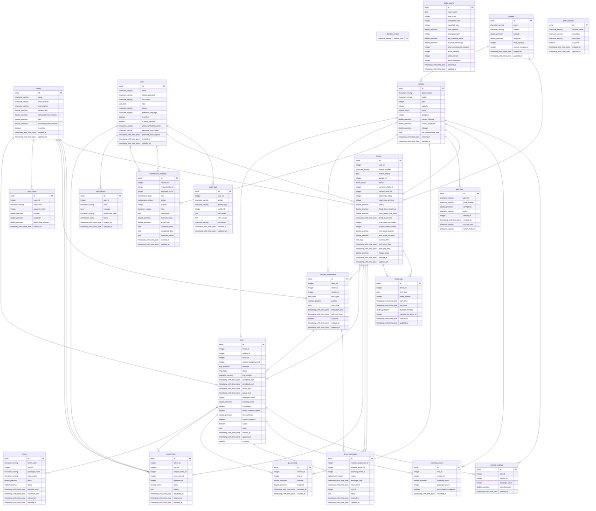

Figure 5-1: PostgreSQL Database Entity-Relationship Diagram

## 5.5 Front-End Web Dashboard Design

### 5.5.1 React.js Application Architecture

The administrative and manager web dashboards are built as a single React.js 18 application [10] with role-based routing. On login, the JWT is decoded to determine the user role, and the router renders the appropriate dashboard view: the admin dashboard for ADMIN role users, and the Manager dashboard for MANAGER role users. This single-codebase approach avoids duplication of shared components such as the navigation sidebar, notification bell, and authentication flow.

State management follows a split strategy. React Context API manages lifecycle-heavy, low-frequency state: the authenticated user object and the WebSocket connection instance. Zustand manages high-frequency, cross-component state: incoming real-time alerts, fleet status updates, and UI settings. The settings Zustand store automatically persists to localStorage, so that user preferences such as language and theme are restored on next login (NFR-10). This split avoids the performance overhead of re-rendering the entire component tree on every WebSocket message, since Zustand subscribers are component-level rather than context-level [10].

### 5.5.2 WebSocket Integration Pattern

The React application establishes a WebSocket connection to /ws?token=<jwt> immediately after a successful login. The connection is managed by a singleton WebSocket service held in React Context. On receiving a message, the service dispatches the event to the appropriate Zustand store slice based on the event type: gate events update the gate activity feed, crowding alerts update the alert queue, and trip updates update the fleet status map. Expired JWT events (close code 4401) trigger an automatic token refresh via POST /auth/refresh followed by WebSocket reconnection, maintaining session continuity transparently to the user [8]. Refresh tokens are managed in an in-memory dictionary on the server, with expired entries purged periodically. 

## 5.6 Mobile Application Design

### 5.6.1 Flutter Application Architecture

The driver-facing mobile application is built with Flutter 3 [11], targeting both Android and iOS from a single Dart codebase. The application uses the BLoC (Business Logic Component) pattern for state management, which separates UI widgets from business logic through a stream-based event-state architecture. Each major feature area has its own BLoC: TripBloc manages the trip lifecycle (fetching assignments, starting and ending trips), GpsBloc manages the periodic GPS position reporting to POST /drivers/me/gps, and NotificationBloc manages the in-app notification state [11].

New trip assignments are delivered to the driver through REST polling: when the driver opens the application, TripDetailsCubit fetches the current trip list via GET /drivers/me/trips, and any new scheduled or auto-dispatched trips appear in the response. This polling-based delivery model means a driver whose application is closed now a new assignment is created will see it on next app open. Server-initiated push delivery via a native notification service is a planned future enhancement. The application handles offline gracefully: if the network is unavailable, pending GPS reports are queued locally and retransmitted when connectivity is restored.

### 5.6.2 GPS Reporting Design

Active drivers report their GPS position via POST /drivers/me/gps at a configurable interval (default 30 seconds). The endpoint accepts a JSON payload containing the latitude, longitude, accuracy, and timestamp. The back-end writes the coordinate to a gps_tracking table in PostgreSQL, and the Manager's fleet live view reads the latest position via GET /manager/fleet/live. The endpoint queries the most recent GPS record per vehicle, satisfying the sub-300ms API response requirement (NFR-02) [9].

## 5.7 Hardware Integration Design

### 5.7.1 Gate Node Architecture

Each physical gate is equipped with a gate node comprising four hardware components: an ESP32 development board (main controller), an ESP32-CAM module (image capture), an HC-SR04 ultrasonic sensor (vehicle detection trigger), and a servo motor (barrier actuation). All components are powered from a shared 5V/3A regulated supply [12], [26]. The gate node operates as a self-contained embedded system: it requires no local operator interaction under normal conditions, and all management and configuration is performed remotely through the administrative dashboard.

Two gate nodes are deployed at the SBGMS depot: an entry gate node and an exit gate node. Both are architecturally identical but configured with different gate identifiers in their firmware configuration file (hardware_config.h), so that the back-end can distinguish entry and exit events in the gate_logs table.

### 5.7.2 GPIO Pin Assignment

The GPIO pin assignment for the ESP32 gate controller is fixed at the hardware design stage and documented in Table 5-5 below. The pin assignments were selected to avoid conflicts with the ESP32's bootstrapping pins and to use hardware-peripheral-capable pins for timing-sensitive signals: TRIG/ECHO for the ultrasonic sensors and PWM for the servo motors [12].

| Component | Signal | GPIO Pin | Direction | Notes |
| --- | --- | --- | --- | --- |
| HC-SR04 (Entry) | TRIG | GPIO 5 | Output | 10 µs pulse to trigger ultrasonic burst |
| HC-SR04 (Entry) | ECHO | GPIO 18 | Input | Pulse width proportional to measured distance |
| HC-SR04 (Exit) | TRIG | GPIO 19 | Output | 10 µs pulse to trigger ultrasonic burst |
| HC-SR04 (Exit) | ECHO | GPIO 23 | Input | Pulse width proportional to measured distance |
| Servo Motor (Entry Gate) | PWM | GPIO 13 | Output | 50 Hz PWM; 1 ms = closed, 2 ms = open |
| Servo Motor (Exit Gate) | PWM | GPIO 12 | Output | 50 Hz PWM; 1 ms = closed, 2 ms = open |
| LED — Entry Allowed | Signal | GPIO 25 | Output | Green indicator LED: illuminated when the entry gate is open and capacity is available |
| LED — Garage Full | Signal | GPIO 26 | Output | Red indicator LED: illuminated when carCount reaches MAX_CARS and entry is blocked |
| LED — Exit Allowed | Signal | GPIO 27 | Output | Green indicator LED: illuminated when the exit gate is open |
| 16x2 I2C LCD | SDA | GPIO 21 | I2C Data | I2C data line — LCD displays live occupancy, e.g. Free: 4/6 |
| 16x2 I2C LCD | SCL | GPIO 22 | I2C Clock | I2C clock line — shared 100 kHz bus |
| All Components | VCC | +5V | Power | Supplied from 5V/3A regulated PSU |
| All Components | GND | GND | Power | Common ground — all GND connections shared |

Table 5-5 ESP32 GPIO Pin Assignment

### 

### 

### 5.7.3 Third-Bus Hardware Trigger Design

The Third-Bus capacity dispatch mechanism is triggered by hardware — specifically by the on-bus passenger counting camera posting to POST /hardware/camera. The camera node computes a crowding score by dividing the YOLOv8 passenger count by the vehicle's registered capacity. If the score exceeds 0.90 and no prior dispatch has been recorded for the same trip_id in the CrowdingEvent table, the trigger_auto_dispatch() function executes immediately within the same request handler [25], [27].

The auto-dispatch function follows a driver priority hierarchy: first, rostered DRIVER_3 position drivers with ACTIVE status; second, rostered DRIVER_3 drivers on break; third, any rostered ACTIVE driver; fourth, any rostered ON_BREAK driver; and finally any OFF_DUTY driver as an unrestored fallback — all subject to a maximum fatigue score of 80. A new trip record is created with the code pattern EXT-RT{route}-{time}-{uuid} and scheduled five minutes from the time of dispatch, giving the assigned driver sufficient time to reach the vehicle and depart. A DriverExchange record is written with reason EMERGENCY_CROWDING to provide a permanent audit link. A crowding_alert event is broadcast to all connected Manager dashboard clients via the WebSocket ConnectionManager. The assigned driver receives the new trip assignment the next time they open the mobile application and the TripDetailsCubit fetches their updated trip list.

### 5.7.4 HTTP Communication Flow

Figure 5-2 below describes the full synchronous HTTP communication flow between the ESP32 gate node and the FastAPI back-end for a standard gate authorization event. The flow covers the complete sequence from vehicle detection to gate actuation.

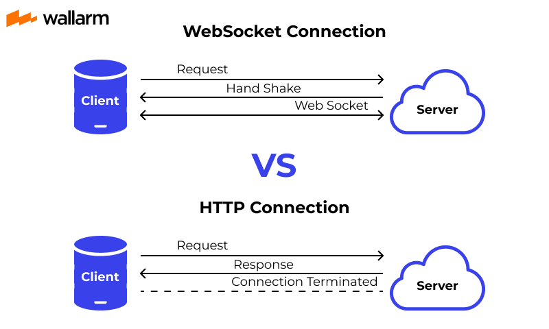

Figure 5-2: Gate Node HTTP Communication Flow

## 5.8 Security Design

### 5.8.1 Authentication Architecture

The system uses two parallel authentication pathways. Human users (Admin, Manager, Driver) authenticate via POST /auth/login with email and password, receiving a short-lived JWT access token and a longer-lived refresh token. The access token is included as a Bearer token in the Authorization header of all subsequent requests. The refresh token is used to obtain a new access token via POST /auth/refresh without requiring re-authentication. Access tokens are stateless JWT (HMAC HS256, 60-minute validity) verified cryptographically on every request without a cache lookup. Refresh tokens are stored in an in-memory dictionary on the server (migrating this to a persistent store is noted as a planned future enhancement). Token expiry intervals are configurable via environment variables (FR-21). Passwords are stored as salted hashes using bcrypt, and plain-text passwords are never written to logs or the database (NFR-08) [8].

Hardware nodes authenticate via the X-Hardware-Api-Key header. The API key is defined as a constant in the firmware configuration file (hardware_config.h) and embedded at compile time. It is validated on every hardware request by comparing the header value against the configured key using secrets.compare_digest() to prevent timing attacks. Key rotation requires a firmware recompile and re-flash in the current implementation; migration to runtime-configurable key storage via the ESP32 NVS partition is noted as a planned future enhancement (NFR-09) [12].

### 5.8.2 Authorization and Role Enforcement

Role-based access control is enforced at two levels. At the routing level, each FastAPI router declares the required role as a dependency, so that unauthenticated or under-privileged requests are rejected before any route handler executes. At the data level, Manager and Driver endpoints filter query results to the authenticated user's scope: a Driver can only read their own trips and notifications, and a Manager can only approve maintenance requests — not delete vehicle records (FR-17, FR-18, FR-19). The WebSocket ConnectionManager enforces the same role boundary: a Driver socket is placed in the DRIVER bucket and cannot receive gate or crowding events [8].

### 5.8.3 Idempotency and Rate Limiting

The Idempotency Middleware intercepts all mutating requests bearing an Idempotency-Key header. If the key has been processed within the configured window (default 24 hours), the middleware returns the cached response without re-executing the handler (FR-22). This prevents duplicate gate events, duplicate trip assignments, and duplicate maintenance approvals caused by network retransmission from the ESP32 or from the mobile application operating under a spotty 4G connection [12]. Rate limiting via slowapi protects the hardware endpoints from runaway devices: ANPR and camera endpoints are capped at 60 requests per minute, and the diagnostic log endpoint at 120 requests per minute [8].

## 5.9 Summary

This chapter presented the complete system design for the SBGMS across six design domains. The four-layer architecture cleanly separates edge hardware, back-end application logic, data persistence, and client presentation. The back-end design documented the FastAPI router structure across 60+ endpoints, the role-targeted WebSocket ConnectionManager, the three-middleware stack, and the APScheduler rotation generation mechanism. The database design specified all thirteen core tables including the JSONB audit log and the driver_exchanges audit record. The front-end design covered the Zustand/Context split state management and WebSocket integration pattern. The mobile design covered the BLoC architecture and GPS reporting pipeline. The hardware design documented the GPIO pin assignment table, the Third-Bus trigger logic, and the synchronous gate communication flow. The security design covered JWT/API-key dual authentication, role-based authorisation, idempotency middleware, and rate limiting. Chapter 6 implements all of these designs with actual code.

# Chapter 6

# System Implementation

## 6.1 Introduction

This chapter presents the complete implementation of the SBGMS across all four system layers: back-end application, front-end web dashboard, mobile driver application, and edge hardware. Each section is anchored to the source file from which the code is drawn, establishing a direct traceability link between the design decisions documented in Chapter 5 and the code that realises them. The implementation follows the four-layer architecture defined in Table 5-1, with each layer communicating only through the interfaces specified in Chapter 5.

Code excerpts are presented at the level of granularity required to demonstrate the architectural pattern, algorithm, or integration point under discussion. Full source files are maintained in the project's GitHub repository. Where the as-built implementation differs in detail from the design-phase specification — such as the gate log table name or the OCR confidence threshold — those differences are noted explicitly. The as-built implementation is authoritative; the design specification reflects the intent at the time of writing.

## 6.2 Back-End Implementation

The back-end is implemented in Python using FastAPI, async SQLAlchemy 2.0 with asyncpg, and PostgreSQL 16. The application is structured as a modular package with distinct directories for API routers (/api/v1/), domain models (/models/), service logic (/services/), and core utilities (/core/). Every endpoint is asynchronous, and database sessions are managed via FastAPI's dependency injection system, ensuring that each request receives its own isolated session that is committed or rolled back atomically on completion.

### 6.2.1 SQLAlchemy ORM Models

Source: app/models/models.py

The domain model is built on SQLAlchemy 2.0's mapped_column API, which provides fully type-safe column declarations validated at import time. Five Python Enum classes define the finite state machines for user roles, driver statuses, vehicle statuses, trip statuses, and driver exchange reasons. The following excerpt shows all five enumeration types, which are used as SAEnum column types throughout the model layer.

| app/models/models.py — Enumeration types ―――――――――――――――――――――――――――――――――――――――――――――――――――――――――――――――――――――――― class UserRole(str, Enum):     ADMIN   = "ADMIN"     MANAGER = "MANAGER"     DRIVER  = "DRIVER"   class DriverStatus(str, Enum):     ACTIVE   = "ACTIVE"     # On shift, available for dispatch     ON_TRIP  = "ON_TRIP"    # Currently driving     ON_BREAK = "ON_BREAK"   # Resting during rotation window     OFF_DUTY = "OFF_DUTY"   # Not on shift   class VehicleStatus(str, Enum):     FREE           = "FREE"     ASSIGNED       = "ASSIGNED"     EN_ROUTE       = "EN_ROUTE"     MAINTENANCE    = "MAINTENANCE"     OUT_OF_SERVICE = "OUT_OF_SERVICE"   class TripStatus(str, Enum):     SCHEDULED  = "SCHEDULED"     ACTIVE     = "ACTIVE"     COMPLETED  = "COMPLETED"     CANCELLED  = "CANCELLED"   class ReplacementReason(str, Enum):     BREAK                = "BREAK"     EMERGENCY_CROWDING   = "EMERGENCY_CROWDING"     EMERGENCY_BREAKDOWN  = "EMERGENCY_BREAKDOWN"     NO_SHOW              = "NO_SHOW" |
| --- |

| app/models/models.py — User, Driver, Vehicle, Trip (key fields) ―――――――――――――――――――――――――――――――――――――――――――――――――――――――――――――――――――――――― class User(Base):     __tablename__ = "users"     id              = mapped_column(Integer, primary_key=True, autoincrement=True)     email           = mapped_column(String(255), unique=True, nullable=False)     hashed_password = mapped_column(String(255), nullable=False)     role            = mapped_column(SAEnum(UserRole ...), nullable=False)     is_active       = mapped_column(Boolean, default=True)     driver          = relationship("Driver", back_populates="user", uselist=False)   class Driver(Base):     __tablename__ = "drivers"     user_id               = mapped_column(ForeignKey("users.id"), unique=True)     status                = mapped_column(SAEnum(DriverStatus ...),                                           default=DriverStatus.ACTIVE)     fatigue_score         = mapped_column(Float, default=0.0)     trips_since_last_break = mapped_column(Integer, default=0)   class Vehicle(Base):     __tablename__ = "vehicles"     plate_number = mapped_column(String(20), unique=True, nullable=False)     capacity     = mapped_column(Integer, default=50)     status       = mapped_column(SAEnum(VehicleStatus ...),                                  default=VehicleStatus.FREE)   class Trip(Base):     __tablename__ = "trips"     status            = mapped_column(SAEnum(TripStatus ...),                                       default=TripStatus.SCHEDULED)     crowding_score    = mapped_column(Float, default=0.0)     is_extra_dispatch = mapped_column(Boolean, default=False)     trip_number       = mapped_column(String(50)) |
| --- |

The User and Driver models implement a one-to-one extension pattern: every Driver record references a User record via a foreign key declared with unique=True, and the SQLAlchemy relationship is configured with uselist=False so that user.driver returns a scalar rather than a list. The Vehicle model stores the plate_number as a unique indexed column, making it the primary lookup key in the ANPR gate authorisation flow. The Trip model carries both the is_extra_dispatch Boolean flag (set to True for all Third-Bus auto-dispatched trips) and a crowding_score float, enabling managers to filter and report on capacity events independently of scheduled trips.

The GateLog model records every gate decision with six audit fields: the raw OCR text before normalisation (ocr_raw_text), the normalised plate string after confusable-character substitution (plate_number), the EasyOCR confidence score, the match method used (exact, confusable, or none), the final event classification (GRANTED, DENIED, or IGNORED), and the matched vehicle foreign key where applicable. The DriverExchange model records every driver handover with the ReplacementReason enumeration distinguishing between scheduled Ping-Pong swaps and emergency auto-dispatches.

| app/models/models.py — GateLog and DriverExchange ―――――――――――――――――――――――――――――――――――――――――――――――――――――――――――――――――――――――― class GateLog(Base):     __tablename__ = "gate_logs"     gate_id      = mapped_column(String(50), nullable=False)     plate_number = mapped_column(String(50), nullable=False)     ocr_raw_text = mapped_column(String(100))       # raw OCR output     confidence   = mapped_column(Float, nullable=False)     match_method = mapped_column(String(50))        # exact \| confusable \| none     event        = mapped_column(String(50), nullable=False)  # GRANTED \| DENIED \| IGNORED     vehicle_id   = mapped_column(ForeignKey("vehicles.id"))   class DriverExchange(Base):     __tablename__ = "driver_exchanges"     rotation_assignment_id = mapped_column(         ForeignKey("rotation_assignments.id"), nullable=False)     outgoing_driver_id = mapped_column(ForeignKey("drivers.id"), nullable=False)     incoming_driver_id = mapped_column(ForeignKey("drivers.id"), nullable=False)     reason        = mapped_column(SAEnum(ReplacementReason ...), nullable=False)     exchange_time = mapped_column(DateTime(timezone=True), nullable=False)     trip_id       = mapped_column(ForeignKey("trips.id"))     notes         = mapped_column(Text) |
| --- |

### 6.2.2  JWT Authentication Dependency

Sources: app/core/security.py and app/api/deps.py

Authentication is split across two modules. security.py provides the SecurityUtils class, which handles bcrypt password hashing, HMAC HS256 JWT access token creation, and cryptographically secure opaque refresh token generation using Python's secrets.token_urlsafe(). deps.py builds the FastAPI dependency chain that enforces authentication and role-based access control on every protected endpoint. The role factory function get_current_user_with_role() returns a new async dependency function for each role combination, allowing each router module to declare its access requirement as a single Depends() parameter without duplicating authentication logic.

| app/core/security.py — SecurityUtils ―――――――――――――――――――――――――――――――――――――――――――――――――――――――――――――――――――――――― class SecurityUtils:     @staticmethod     def verify_password(plain: str, hashed: str) -> bool:         return bcrypt.checkpw(plain.encode('utf-8'),                              hashed.encode('utf-8'))       @staticmethod     def get_password_hash(password: str) -> str:         salt   = bcrypt.gensalt()         hashed = bcrypt.hashpw(password.encode('utf-8'), salt)         return hashed.decode('utf-8')       @staticmethod     def create_access_token(subject, role=None,                             expires_delta=None) -> str:         expire  = datetime.now(timezone.utc) + (             expires_delta or             timedelta(minutes=settings.ACCESS_TOKEN_EXPIRE_MINUTES))         payload = {"exp": expire, "sub": str(subject)}         if role:             payload["role"] = str(role)         return jwt.encode(payload, settings.SECRET_KEY,                           algorithm=settings.ALGORITHM)       @staticmethod     def create_refresh_token() -> str:         # 48-byte cryptographically secure opaque token         return secrets.token_urlsafe(48)   security = SecurityUtils() |
| --- |

| app/api/deps.py — FastAPI dependency chain ―――――――――――――――――――――――――――――――――――――――――――――――――――――――――――――――――――――――― async def get_current_user(     token: Annotated[str, Depends(oauth2_scheme)],     db:    Annotated[AsyncSession, Depends(get_db)], ) -> User:     try:         payload = jwt.decode(token, settings.SECRET_KEY,                              algorithms=[settings.ALGORITHM])         email: str = payload.get("sub")         if email is None: raise credentials_exception     except JWTError:         raise credentials_exception     user = await db.scalar(select(User).where(User.email == email))     if user is None: raise credentials_exception     return user   def get_current_user_with_role(*required_roles: UserRole):     """Factory: returns a role-checking dependency for each router."""     async def role_checker(         current_user: Annotated[User, Depends(get_current_active_user)]     ) -> User:         if current_user.role not in required_roles:             raise HTTPException(status_code=403,                                 detail="Not enough permissions")         return current_user     return role_checker   # Module-level aliases — imported directly by all router files get_current_admin_user   = Depends(get_current_user_with_role(UserRole.ADMIN)) get_current_manager_user = Depends(get_current_user_with_role(UserRole.MANAGER)) get_current_driver_user  = Depends(get_current_user_with_role(UserRole.DRIVER)) |
| --- |

### 

### 

### 6.2.3  WebSocket ConnectionManager

Source: app/core/sockets.py

The ConnectionManager class maintains three in-memory sets of active WebSocket connections, one per user role (ADMIN, MANAGER, DRIVER). An important implementation detail is that websocket.accept() must be called before websocket.close() for any application-level authentication failure. If close() is called before accept(), the HTTP upgrade is aborted at the transport layer and the browser receives only a generic 1006 abnormal closure code, preventing the client-side handler from distinguishing between a token expiry (4401) and an authorisation failure (4003). The broadcast_to_role() method iterates over a snapshot copy of the connection set using tuple(), avoiding a RuntimeError if a disconnection occurs during the broadcast loop. A simple token-bucket rate limiter (10 messages per second per socket) is maintained per-connection in the rate_limits dictionary.

| app/core/sockets.py — ConnectionManager ―――――――――――――――――――――――――――――――――――――――――――――――――――――――――――――――――――――――― class ConnectionManager:     def __init__(self):         self.active_connections: Dict[str, Set[WebSocket]] = {             "ADMIN": set(), "MANAGER": set(), "DRIVER": set(),         }         self.rate_limits: Dict[WebSocket, list] = {}       async def connect(self, websocket: WebSocket, token: str):         await websocket.accept()   # MUST precede any close() call         try:             payload = jwt.decode(token, settings.SECRET_KEY,                                  algorithms=[settings.ALGORITHM])         except ExpiredSignatureError:             await websocket.close(code=4401, reason="Token expired")             return None         except JWTError:             await websocket.close(code=4003, reason="Invalid token")             return None         role = payload.get("role")         if not role or role not in self.active_connections:             await websocket.close(code=4003, reason="Invalid role")             return None         self.active_connections[role].add(websocket)         self.rate_limits[websocket] = []         return role       def disconnect(self, websocket: WebSocket, role: str):         self.active_connections[role].discard(websocket)         self.rate_limits.pop(websocket, None)       async def broadcast_to_role(self, role: str, message: dict):         disconnected = set()         for conn in tuple(self.active_connections[role]):  # snapshot copy             try:                 await conn.send_json(message)             except Exception:                 disconnected.add(conn)         for conn in disconnected:             self.active_connections[role].discard(conn)   manager = ConnectionManager()   # module-level singleton |
| --- |

### 

### 6.2.4  ANPR Gate Endpoint

Source: app/api/v1/hardware.py

The ANPR subsystem is implemented in three stages. First, a lazy-loaded EasyOCR Reader singleton is created on the first request and reused for all subsequent calls, avoiding the multi-second model initialisation cost on every gate event. Second, a one-directional confusable-character translation table is applied to the raw OCR output: characters that EasyOCR commonly misreads on number plates (O, I, L, S, B, Z, D, Q) are replaced with their digit equivalents. The substitution is deliberately one-directional because digit-heavy number plates are far more common than letter-heavy ones. Third, a two-stage database lookup is performed: an exact match on the normalised plate string, followed by a confusable fallback on the translated string if the exact match fails. This ensures that a plate registered as ABC-123 is correctly matched even if OCR returns AB0-I23. Hardware nodes authenticate via the X-Hardware-Api-Key header validated with secrets.compare_digest() to prevent timing attacks. The endpoint is rate-limited to 60 requests per minute per hardware node via the slowapi limiter.

| app/api/v1/hardware.py — OCR singleton and plate pipeline ―――――――――――――――――――――――――――――――――――――――――――――――――――――――――――――――――――――――― # Lazy singleton: model loads once, reused for all gate events _ocr_reader = None def get_ocr_reader():     global _ocr_reader     if _ocr_reader is None:         import easyocr         _ocr_reader = easyocr.Reader(['en'], gpu=False)     return _ocr_reader   # One-directional confusable map — digits win over letters _CONFUSABLES = str.maketrans({     "O": "0", "I": "1", "L": "1",     "S": "5", "B": "8", "Z": "2",     "D": "0", "Q": "0", })   def _normalize_plate(text: str) -> str:     return re.sub(r"[^A-Z0-9]", "", (text or "").upper().strip())   async def _lookup_plate(db, plate) -> Tuple[Optional[Vehicle], str]:     # Stage 1: exact match     v = await db.scalar(select(Vehicle).where(         Vehicle.plate_number == plate))     if v: return v, "exact"     # Stage 2: confusable-character fallback     fuzzy = plate.translate(_CONFUSABLES)     if fuzzy != plate:         v = await db.scalar(select(Vehicle).where(             Vehicle.plate_number == fuzzy))         if v: return v, "confusable"     return None, "none" |
| --- |

| app/api/v1/hardware.py — POST /hardware/anpr/upload_raw ―――――――――――――――――――――――――――――――――――――――――――――――――――――――――――――――――――――――― @router.post("/anpr/upload_raw", status_code=200) @limiter.limit("60/minute") async def upload_raw_image(request: Request, gate_id: str,                            db: Annotated[AsyncSession, Depends(get_db)]):     body  = await request.body()     frame = cv2.imdecode(np.frombuffer(body, np.uint8), cv2.IMREAD_COLOR)     if frame is None:         raise HTTPException(422, "Invalid image — could not decode JPEG")       results = get_ocr_reader().readtext(frame, detail=1)     if not results:                           # no text detected at all         db.add(GateLog(gate_id=gate_id, plate_number="",                        confidence=0.0, event="IGNORED"))         await db.commit()         return PlainTextResponse("DENIED: Unreadable plate")       best       = max(results, key=lambda r: r[2])     raw_text   = best[1]     confidence = float(best[2])     plate      = _normalize_plate(raw_text)       if confidence < 0.60 or not plate:        # below threshold: IGNORED         event_type, vehicle, method = "IGNORED", None, "none"     else:         vehicle, method = await _lookup_plate(db, plate)         event_type = "GRANTED" if vehicle else "DENIED"       db.add(GateLog(gate_id=gate_id, plate_number=plate,                    ocr_raw_text=raw_text, confidence=confidence,                    match_method=method, event=event_type,                    vehicle_id=vehicle.id if vehicle else None))     await db.commit()       if event_type != "IGNORED":               # broadcast to dashboard         payload = _build_alert_payload(gate_id, plate, event_type, vehicle)         await manager.broadcast_to_role("MANAGER", payload)         await manager.broadcast_to_role("ADMIN",   payload)       return PlainTextResponse(         "GRANTED" if event_type == "GRANTED" else "DENIED") |
| --- |

### 

### 

### 

### 

### 

### 

### 

### 6.2.5 Ping-Pong Rotation Scheduler

Source: app/services/rotation_service.py — process_rotations() and _perform_swap()

The rotation scheduler is implemented as a background worker function called by APScheduler on a recurring interval. process_rotations() queries all RotationAssignment records whose shift window is currently active, groups them by route, and calculates the hours elapsed since each shift's start time. It then checks whether the elapsed time falls within one of three handover windows — hour 1, hour 3, or hour 5 — and calls _perform_swap() for the appropriate driver pair. The swap function updates both drivers' status fields, sets the is_active flags on their RotationAssignment records, and writes a DriverExchange audit row before the caller commits. All writes are committed once per route group by the caller rather than inside _perform_swap(), keeping the transaction boundary at the highest reasonable level.

| app/services/rotation_service.py — process_rotations() ―――――――――――――――――――――――――――――――――――――――――――――――――――――――――――――――――――――――― async def process_rotations(db: AsyncSession):     """     Ping-Pong swap schedule per 7-hour shift:       Hours 0-1 : D1 + D2 drive, D3 rests       Hours 1-3 : D3 replaces D1  (D1 goes ON_BREAK)       Hours 3-5 : D1 replaces D2  (D2 goes ON_BREAK)       Hours 5-7 : D2 replaces D3  (D3 concludes active window)     """     now = datetime.now(timezone.utc)     active = (await db.execute(         select(RotationAssignment).where(             RotationAssignment.shift_date       == now.date(),             RotationAssignment.shift_start_time <= now,             RotationAssignment.shift_end_time   >= now,         )     )).scalars().all()       routes: dict = {}     for a in active:         routes.setdefault(a.route_id, []).append(a)       for route_id, assignments in routes.items():         pos = {a.position: a for a in assignments}         d1, d2, d3 = (pos.get(RotationPosition.DRIVER_1),                       pos.get(RotationPosition.DRIVER_2),                       pos.get(RotationPosition.DRIVER_3))         if not (d1 and d2 and d3): continue           sst   = d1.shift_start_time.replace(tzinfo=timezone.utc)         hours = (now - sst).total_seconds() / 3600           if 1.0 <= hours < 3.0 and d1.is_active:             await _perform_swap(db, outgoing=d1, incoming=d3)         elif 3.0 <= hours < 5.0 and d2.is_active:             await _perform_swap(db, outgoing=d2, incoming=d1)         elif 5.0 <= hours < 7.0 and d3.is_active:             await _perform_swap(db, outgoing=d3, incoming=d2)       await db.commit() |
| --- |

| app/services/rotation_service.py — _perform_swap() ―――――――――――――――――――――――――――――――――――――――――――――――――――――――――――――――――――――――― async def _perform_swap(     db: AsyncSession,     outgoing: RotationAssignment,     incoming: RotationAssignment, ):     outgoing.is_active = False     incoming.is_active = True       out_driver = await db.scalar(select(Driver).where(         Driver.id == outgoing.driver_id))     in_driver  = await db.scalar(select(Driver).where(         Driver.id == incoming.driver_id))       if out_driver: out_driver.status = DriverStatus.ON_BREAK     if in_driver:  in_driver.status  = DriverStatus.ACTIVE       db.add(DriverExchange(         rotation_assignment_id = outgoing.id,         outgoing_driver_id     = outgoing.driver_id,         incoming_driver_id     = incoming.driver_id,         reason                 = ReplacementReason.BREAK,         exchange_time          = datetime.now(timezone.utc),         notes                  = "Rotation swap due to break schedule",     ))     # Caller commits after all routes are processed |
| --- |

### 6.2.6  Third-Bus Auto-Dispatch

Source: app/services/rotation_service.py — trigger_auto_dispatch()

The auto-dispatch function is invoked reactively within the POST /hardware/camera request handler whenever the reported crowding score exceeds 0.90. It applies a SELECT ... FOR UPDATE row-level lock to the selected vehicle to prevent two concurrent camera reports from allocating the same bus. Driver selection follows a five-level priority hierarchy in descending order of preference: (1) a rostered DRIVER_3 with ACTIVE status, (2) a rostered DRIVER_3 with ON_BREAK status, (3) any rostered ACTIVE driver, (4) any rostered ON_BREAK driver, and (5) any OFF_DUTY driver as an unrostered fallback. All candidates must satisfy the fatigue_score constraint of 80 or below. A new Trip record is created with is_extra_dispatch=True and a trip number following the pattern EXT-RT{route}-{HHMM}-{6-char UUID}. A DriverExchange record is written with reason EMERGENCY_CROWDING, providing a permanent audit link between the crowding event and the resulting driver assignment.

| app/services/rotation_service.py — trigger_auto_dispatch() (condensed) ―――――――――――――――――――――――――――――――――――――――――――――――――――――――――――――――――――――――― async def trigger_auto_dispatch(trip_id: int, db: AsyncSession) -> bool:     trip = await db.scalar(select(Trip).where(Trip.id == trip_id))     if not trip: return False       # Five-level driver priority (fatigue_score <= 80 required for all)     driver = (         await _pick_rostered(DriverStatus.ACTIVE,   only_d3=True)  or         await _pick_rostered(DriverStatus.ON_BREAK, only_d3=True)  or         await _pick_rostered(DriverStatus.ACTIVE,   only_d3=False) or         await _pick_rostered(DriverStatus.ON_BREAK, only_d3=False) or         await _pick_any_off_duty()     )     if not driver:         logger.warning(f"Auto-dispatch failed: no driver available")         return False       # Row-level lock prevents concurrent dispatch allocating same vehicle     vehicle = await db.scalar(         select(Vehicle).where(Vehicle.status == VehicleStatus.FREE)         .limit(1).with_for_update()     )     if not vehicle: return False       now_utc = datetime.now(timezone.utc)     new_trip = Trip(         driver_id         = driver.id,         vehicle_id        = vehicle.id,         route_id          = trip.route_id,         direction         = trip.direction,         status            = TripStatus.SCHEDULED,         is_extra_dispatch = True,         trip_number = f"EXT-RT{trip.route_id}-"                       f"{now_utc:%H%M}-{uuid.uuid4().hex[:6]}",         scheduled_start = now_utc + timedelta(minutes=5),     )     db.add(new_trip)     driver.status  = DriverStatus.ON_TRIP     vehicle.status = VehicleStatus.ASSIGNED     await db.flush()   # obtain new_trip.id before writing DriverExchange       db.add(DriverExchange(         outgoing_driver_id = trip.driver_id,         incoming_driver_id = driver.id,         reason             = ReplacementReason.EMERGENCY_CROWDING,         exchange_time      = now_utc,         trip_id            = new_trip.id,     ))     await db.commit()     return True |
| --- |

## 6.3  Front-End Implementation (React.js)

The web dashboard is implemented in React.js 18 using the browser WebSocket API wrapped in a React Context Provider for real-time event delivery, and Zustand for global cross-component state. The split-state strategy described in Section 5.5.1 is strictly followed: the WebSocket connection object and the authenticated user record are held in Context because they are lifecycle-heavy and change infrequently; the stream of incoming gate and crowding events is written to a Zustand store because it changes at high frequency and must be consumed by multiple components without causing unnecessary re-renders at the Context level.

### 6.3.1  WebSocket Context Provider and Zustand Alert Store

Sources: frontend/src/context/WebSocketContext.jsx and frontend/src/store/alertStore.js

The WebSocketProvider implements three reliability mechanisms beyond a basic connection. First, it decodes the JWT expiry time client-side before opening the connection and performs a proactive token refresh if the token will expire within 60 seconds, preventing the failure mode where a connection is established but immediately rejected server-side because the token expired in transit. Second, it handles the 4401 close code by calling refreshAccessToken() once and reconnecting; a didRefreshAfterAuthFail guard prevents infinite refresh loops. Third, all non-auth closures (network interruptions, server restarts) trigger a 3-second backoff reconnect. A 30-second ping/pong heartbeat keeps the connection alive through load balancers and NAT devices that close idle TCP connections.

| frontend/src/context/WebSocketContext.jsx — connect() (condensed) ―――――――――――――――――――――――――――――――――――――――――――――――――――――――――――――――――――――――― const connect = async (userRef, tokenRef) => {     let activeToken = tokenRef;       // Proactive refresh if token expires within 60 seconds     const exp    = decodeJwtExp(activeToken);     const nowSec = Math.floor(Date.now() / 1000);     if (exp !== null && exp - nowSec <= REFRESH_LEEWAY_SECONDS) {         activeToken = await refreshAccessToken();     }       ws.current = new WebSocket(`${WS_BASE_URL}?token=${activeToken}`);       ws.current.onopen = () => {         heartbeatTimer.current = setInterval(() => {             ws.current?.send(JSON.stringify({ type: 'ping' }));         }, HEARTBEAT_INTERVAL_MS);   // 30 000 ms     };       ws.current.onmessage = (event) => {         const data = JSON.parse(event.data);         if (data.type === 'pong') return;         setLastNotification({ ...data, receivedAt: Date.now() });         addAlert({ id: crypto.randomUUID(), timestamp: new Date(), ...data });     };       ws.current.onclose = async (event) => {         clearInterval(heartbeatTimer.current);         if (event.code === 4401 && !didRefreshAfterAuthFail.current) {             didRefreshAfterAuthFail.current = true;             const fresh = await refreshAccessToken();             connect(userRef, fresh);   // reconnect with new token             return;         }         if (event.code === 4003) { logout(); return; }         // All other closures: reconnect after backoff         reconnectTimer.current = setTimeout(             () => connect(userRef, activeToken), RECONNECT_DELAY_MS         );     }; }; |
| --- |

The Zustand alert store maintains a circular buffer of the 50 most recent WebSocket events using a prepend-and-slice pattern. Each addAlert() call prepends the new event object to the front of the array and immediately slices to a maximum of 50 items. This O(1)-bounded approach prevents unbounded memory growth during long browser sessions where gate events may accumulate continuously over an operational day.

| frontend/src/store/alertStore.js — Zustand circular buffer ―――――――――――――――――――――――――――――――――――――――――――――――――――――――――――――――――――――――― import { create } from 'zustand';   export const useAlertStore = create((set) => ({     alerts: [],     addAlert: (alert) => set((state) => ({         // Prepend new event and cap at 50 — bounded memory         alerts: [alert, ...state.alerts].slice(0, 50)     })),     clearAlerts: () => set({ alerts: [] }), })); |
| --- |

### 

### 

### 

### 

### 

### 6.3.2  Gate Activity Feed Component

Source: frontend/src/pages/Manager/Fleet.jsx (extract)

The gate activity feed subscribes to the Zustand store and derives the filtered gate event list inside useMemo(), ensuring the filter only re-executes when the alerts array reference changes and not on every parent render. Each event is rendered by the GateRow component, which maps the event type to a CSS custom property colour token and an icon: green (var(--ok)) with a check icon for GRANTED events, red (var(--crit)) with an X icon for UNAUTHORIZED_VEHICLE events, and amber (var(--warn)) for any other classification. The PulseDot component renders a live indicator using a CSS keyframe animation defined in the global stylesheet, signalling to the operator that the feed is connected and receiving events.

| frontend/src/pages/Manager/Fleet.jsx — Gate feed, GateRow, PulseDot ―――――――――――――――――――――――――――――――――――――――――――――――――――――――――――――――――――――――― const Fleet = () => {     const alerts = useAlertStore((s) => s.alerts);       const gateLogs = useMemo(() => (         alerts             .filter((a) => a.type === 'gate_auth')             .map((a) => ({                 ...a,                 time: new Date(a.timestamp).toLocaleTimeString('en-GB', {                     hour: '2-digit', minute: '2-digit', second: '2-digit',                 }),             }))     ), [alerts]);       return (         <Panel title="Live gate activity" action={<PulseDot />} flush>             {gateLogs.length === 0                 ? <Empty>Waiting for ANPR events.</Empty>                 : gateLogs.map((log) => <GateRow key={log.id} log={log} />)             }         </Panel>     ); };   const GateRow = ({ log }) => {     const isGranted      = log.event === 'GATE_AUTH_GRANTED';     const isUnauthorized = log.event === 'UNAUTHORIZED_VEHICLE';     const color = isGranted      ? 'var(--ok)'                 : isUnauthorized ? 'var(--crit)'                 :                  'var(--warn)';     return (         
                      borderBottom:'1px solid var(--line)' }}>                              <Icon name={isGranted ? 'check' : isUnauthorized ? 'x' : 'alert'} />                          
                 {log.plate_number \|\| '—'}                 {log.time}             
         
     ); };   const PulseDot = () => (      ); |
| --- |

### 6.4 Mobile Application Implementation (Flutter)

The driver-facing application is implemented in Flutter 3 targeting both Android and iOS from a single Dart codebase. The BLoC Cubit pattern from the flutter_bloc package is used throughout: each feature area owns a Cubit class that manages its own state transitions independently, keeping UI widgets free of business logic. Networking is handled by a shared DioHelper singleton. The driver's JWT access token is persisted across app restarts using CacheHelper, which wraps Flutter's SharedPreferences, so drivers remain authenticated between sessions without re-entering their credentials.

### 6.4.1 TripDetailsCubit

Sources: trip_details_state.dart, trip_details_model.dart, and trip_details_cubit.dart

TripDetailsCubit encapsulates the full driver trip lifecycle across six operations: fetching trip details from GET /drivers/me/trips/{id}, starting a trip via POST /drivers/me/trips/{id}/start, ending a trip via POST /drivers/me/trips/{id}/end, reporting an emergency via POST /maintenance-requests, issuing a passenger ticket via POST /drivers/me/trips/{id}/tickets, and requesting a reroute via POST /drivers/me/reroute. Each method follows a consistent state emission pattern: emit TripDetailsLoading on entry to trigger a loading indicator, perform the async Dio call, emit the specific success state, and fall through to the _handleError() method on any exception. The error handler inspects the DioException response body and extracts FastAPI's structured error detail, supporting both the plain string format used by application-layer errors and the list-of-dict format used by Pydantic validation errors.

| trip_details_state.dart — State definitions ―――――――――――――――――――――――――――――――――――――――――――――――――――――――――――――――――――――――― abstract class TripDetailsState {} class TripDetailsInitial extends TripDetailsState {} class TripDetailsLoading  extends TripDetailsState {} class TripDetailsLoaded   extends TripDetailsState {} class TripDetailsError    extends TripDetailsState {     final String message;     TripDetailsError({required this.message}); } class TripFinished      extends TripDetailsState {} class EmergencyReported extends TripDetailsState {} class TicketIssued      extends TripDetailsState {} |
| --- |

| trip_details_cubit.dart — TripDetailsCubit (condensed) ―――――――――――――――――――――――――――――――――――――――――――――――――――――――――――――――――――――――― class TripDetailsCubit extends Cubit<TripDetailsState> {     TripDetailsCubit() : super(TripDetailsInitial());     TripDetailsModel? tripDetails;       Future<void> getTripDetails(int? tripId) async {         if (tripId == null) return;         emit(TripDetailsLoading());         try {             final token = await CacheHelper.getData(key: AppConstants.token);             final res   = await DioHelper.getData(                 url: 'drivers/me/trips/$tripId', token: token);             tripDetails = TripDetailsModel(                 routeNumber: res.data['trip_number'] ?? tripId.toString(),                 routeName:   res.data['route']?['name'] ?? '',                 passengers:  res.data['passenger_count'] ?? 0,                 capacity:    res.data['vehicle']?['capacity'] ?? 50,                 busId:       res.data['vehicle']?['plate_number'] ?? '',             );             emit(TripDetailsLoaded());         } catch (e) { emit(TripDetailsInitial()); }     }       Future<void> startTrip(int? tripId) async {         emit(TripDetailsLoading());         try {             final token = await CacheHelper.getData(key: AppConstants.token);             await DioHelper.postData(                 url: 'drivers/me/trips/$tripId/start',                 data: {}, token: token);             tripDetails = tripDetails?.copyWith(status: 'IN_PROGRESS');             emit(TripDetailsLoaded());         } catch (e) { _handleError(e, 'Failed to start trip'); }     }       Future<void> finishTrip(int? tripId) async {         emit(TripDetailsLoading());         try {             final token = await CacheHelper.getData(key: AppConstants.token);             await DioHelper.postData(                 url: 'drivers/me/trips/$tripId/end',                 data: {}, token: token);             emit(TripFinished());         } catch (e) { _handleError(e, 'Failed to end trip'); }     }       void _handleError(dynamic e, String defaultMsg) {         String msg = defaultMsg;         if (e is DioException) {             final d = e.response?.data;             if (d?['detail'] is String)  msg = d['detail'];             else if (d?['detail'] is List && d['detail'].isNotEmpty)                 msg = d['detail'][0]['msg'] ?? msg;         }         emit(TripDetailsError(message: msg));         if (tripDetails != null) emit(TripDetailsLoaded());     } } |
| --- |

### 6.4.2 GPS Location Service

Source: location_service.dart

LocationService is a static utility class that manages a single Dart Timer.periodic instance, posting the driver's current GPS coordinates to POST /drivers/me/gps every 30 seconds during an active trip. On startup, it verifies that location services are enabled, requests runtime permission if required, and returns silently without starting the timer if permission is denied or permanently denied. The position is obtained via Geolocator.getCurrentPosition() with LocationAccuracy.high, and the payload includes latitude, longitude, and a UTC ISO 8601 timestamp. The stop/start pattern allows the service to be cleanly suspended when the driver ends a trip and resumed when the next trip begins.

| location_service.dart — LocationService ―――――――――――――――――――――――――――――――――――――――――――――――――――――――――――――――――――――――― class LocationService {     static Timer? _timer;       static Future<void> startLocationUpdates() async {         if (!await Geolocator.isLocationServiceEnabled()) return;           var permission = await Geolocator.checkPermission();         if (permission == LocationPermission.denied) {             permission = await Geolocator.requestPermission();             if (permission == LocationPermission.denied) return;         }         if (permission == LocationPermission.deniedForever) return;           _timer?.cancel();         _timer = Timer.periodic(const Duration(seconds: 30), (_) async {             await _sendCurrentLocation();         });     }       static void stopLocationUpdates() {         _timer?.cancel();         _timer = null;     }       static Future<void> _sendCurrentLocation() async {         final position = await Geolocator.getCurrentPosition(             desiredAccuracy: LocationAccuracy.high);         final token = await CacheHelper.getData(key: AppConstants.token);         if (token == null) return;         await DioHelper.postData(             url:   'drivers/me/gps',             token: token,             data:  {                 'latitude':    position.latitude,                 'longitude':   position.longitude,                 'recorded_at': DateTime.now().toUtc().toIso8601String(),             },         );     } } |
| --- |

## 6.5 Hardware Implementation (ESP32)

The physical gate control layer is built around three microcontroller boards. The master ESP32 development board runs the sensor polling loop, hysteresis debouncing, servo actuation, and HTTP coordination. Two ESP32-CAM modules (AI Thinker variant with OV2640 sensor) operate as independent nodes: each captures a JPEG frame on command from the master and uploads it directly to the FastAPI back-end via HTTP POST /hardware/anpr/upload_raw. The master triggers each camera node by sending an HTTP request to the camera's local IP address; the camera modules are not wired to the master's GPIO pins but communicate with it over the shared local Wi-Fi network.

### 6.5.1 Gate Control Firmware

Source: hardware/sketch_apr7a/sketch_apr7a/sketch_apr7a.ino

The main loop implements a hysteresis debouncing scheme using four independent streak counters: inDetectStreak and outDetectStreak count consecutive sensor readings below DETECT_CM (vehicle present), while inClearStreak and outClearStreak count consecutive readings above CLEAR_CM (vehicle absent). The dead-band between DETECT_CM and CLEAR_CM prevents oscillation when a vehicle stops partially inside the sensor zone. A vehicle is confirmed present only after DETECT_CONFIRM_N consecutive detection readings. Gate closure is sensor-driven: the shouldClose() function evaluates both the clear streak and the elapsed time since the gate opened, ensuring the barrier never closes while the vehicle is still crossing.

When a vehicle is confirmed, the loop spawns a FreeRTOS task via xTaskCreate() with an 8 KB stack rather than calling the camera trigger function directly. This is architecturally necessary: the HTTP round trip to the camera and back-end can take several hundred milliseconds to over a second and blocking loop() during this time would prevent the exit sensor from being polled, creating a window during which an exit event could be missed entirely. The entryBusy and exitBusy flags prevent a second task from being spawned before the first completes.

| sketch_apr7a.ino — FreeRTOS gate tasks ―――――――――――――――――――――――――――――――――――――――――――――――――――――――――――――――――――――――― void entryGateTask(void * /*param*/) {     if (carCount >= MAX_CARS) {         sendLog("ENTRY BLOCKED: full");     } else {         sendLog("ENTRY detected — calling camera");         if (triggerCamera(ENTRY_CAM_URL, "CAM_ENTRY")) {             setGateIn(true);             gateInOpen     = true;             gateInOpenTime = millis();             gateInLastSeen = millis();             sendLog("Entry GRANTED — gate open");         } else {             sendLog("Entry DENIED");         }     }     entryBusy = false;     vTaskDelete(NULL);   // FreeRTOS: task deletes itself on completion }   void exitGateTask(void * /*param*/) {     if (carCount <= 0) {         sendLog("EXIT IGNORED: empty");     } else if (triggerCamera(EXIT_CAM_URL, "CAM_EXIT")) {         setGateOut(true);         gateOutOpen     = true;         gateOutOpenTime = millis();         sendLog("Exit GRANTED — gate open");     } else {         sendLog("Exit DENIED");     }     exitBusy = false;     vTaskDelete(NULL); } |
| --- |

| sketch_apr7a.ino — Main loop (condensed) ―――――――――――――――――――――――――――――――――――――――――――――――――――――――――――――――――――――――― void loop() {     long dIn  = readDistanceMedian(TRIG_IN,  ECHO_IN);     long dOut = readDistanceMedian(TRIG_OUT, ECHO_OUT);       // Hysteresis streak counters — dead-band between DETECT_CM and CLEAR_CM     if (dIn < DETECT_CM)       { inDetectStreak++; inClearStreak = 0; }     else if (dIn > CLEAR_CM)   { inClearStreak++;  inDetectStreak = 0; }     if (dOut < DETECT_CM)      { outDetectStreak++; outClearStreak = 0; }     else if (dOut > CLEAR_CM)  { outClearStreak++;  outDetectStreak = 0; }       // Sensor-driven gate close (not time-driven)     if (shouldClose(gateInOpen, gateInOpenTime,                     gateInLastSeen, inClearStreak)) {         setGateIn(false); gateInOpen = false;         carCount++;         prefs.putInt("carCount", carCount); // persist across power cycles         updateStatusLEDs();         sendLog("Entry confirmed — count=" + String(carCount));     }     if (shouldClose(gateOutOpen, gateOutOpenTime,                     gateOutLastSeen, outClearStreak)) {         setGateOut(false); gateOutOpen = false;         if (carCount > 0) carCount--;         prefs.putInt("carCount", carCount);         updateStatusLEDs();         sendLog("Exit confirmed — count=" + String(carCount));     }       // Spawn FreeRTOS task — avoids blocking loop() during HTTP call     if (inDetectStreak >= DETECT_CONFIRM_N         && !inDetected && !entryBusy && !gateInOpen) {         inDetected = true; entryBusy = true;         xTaskCreate(entryGateTask, "entry_gate", 8192, NULL, 1, NULL);     }     if (outDetectStreak >= DETECT_CONFIRM_N         && !outDetected && !exitBusy && !gateOutOpen) {         outDetected = true; exitBusy = true;         xTaskCreate(exitGateTask, "exit_gate", 8192, NULL, 1, NULL);     }     if (inClearStreak  >= CLEAR_CONFIRM_N) inDetected  = false;     if (outClearStreak >= CLEAR_CONFIRM_N) outDetected = false;       delay(100);   // 10 Hz sensor polling rate } |
| --- |

### 6.5.2 Circuit Wiring and Simulation

The master ESP32 interfaces with six peripheral devices across eleven GPIO connections as shown in Table 5-5 and illustrated in the circuit diagram in Figure 6-1. The two HC-SR04 ultrasonic sensors connect to dedicated TRIG/ECHO pin pairs (GPIO 5/18 for entry, GPIO 19/23 for exit). The two servo motors receive PWM signals on GPIO 13 (entry gate) and GPIO 12 (exit gate), controlled via the Arduino Servo library which abstracts the 50 Hz PWM generation. Three status LEDs on GPIO 25, 26, and 27 provide a physical occupancy indicator to drivers approaching the gate. A 16x2 I2C LCD display connected on GPIO 21 (SDA) and GPIO 22 (SCL) shows the current occupancy count in the format shown in the simulation output. All six devices share a common 5 V / 3 A regulated supply rail; all GND connections are tied to a common ground plane on the breadboard. The two ESP32-CAM modules are not shown in the master wiring diagram because they communicate with the system over Wi-Fi and connect only to their own power and antenna circuits.

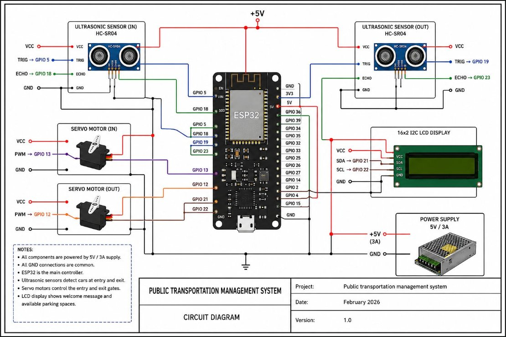

Figure 6-1 Hardware Circuit Diagram

Figure 6-1 shows the Wokwi embedded systems simulation environment running the gate control firmware. The LCD display panel shows the initial occupancy message and the current free space count. The serial monitor output at the bottom of the simulation window confirms the detection and counting logic: four consecutive vehicle entries are processed correctly, with the gate opening, the vehicle passing, the gate closing, and the car count incrementing from 1 to 4 across four separate events.

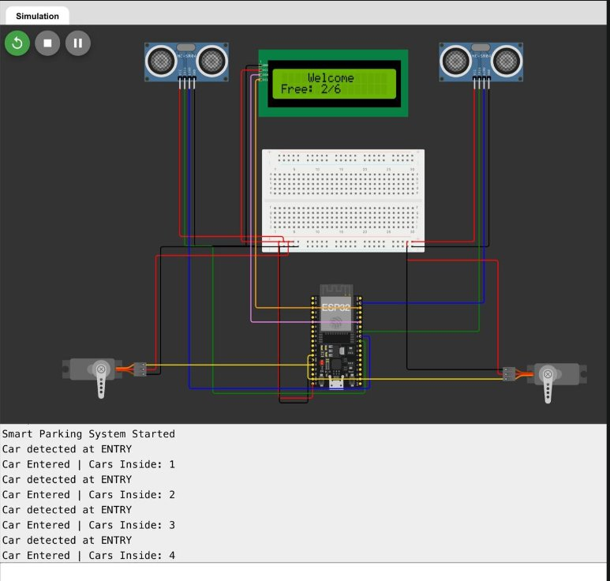

Figure 6-2 Wokwi Simulation

## 6.6 Cross-Layer Integration

The five preceding sections presented each system layer in isolation. This section traces the complete data flow across all three integration boundaries: hardware to back-end, back-end to React dashboard, and back-end to the Flutter mobile application. It also documents the FastAPI application startup sequence, which wires the APScheduler background worker and the WebSocket endpoint into the running server.

### 6.6.1 Full Gate Authorisation Flow: Hardware to Dashboard

The gate authorisation flow crosses four distinct execution environments — the master ESP32 firmware, the ESP32-CAM firmware, the FastAPI back-end, and the React dashboard — and completes entirely within the two-second latency target defined by NFR-01. Figure 6-3 below traces the nine-step sequence.

Step 1 — Detection: The master ESP32 loop() polls both HC-SR04 sensors at 10 Hz. When inDetectStreak reaches DETECT_CONFIRM_N consecutive readings below DETECT_CM, the loop spawns entryGateTask() as a FreeRTOS task.

Step 2 — Camera trigger: entryGateTask() calls triggerCamera(ENTRY_CAM_URL, "CAM_ENTRY"). This function issues a plain HTTP GET to the camera node's local IP address on port 80 over the shared LAN. Plain HTTP is used rather than HTTPS because the mbedTLS handshake buffers (12–16 KB) overflow the 8 KB Arduino loopTask stack on the first call from setup(), causing a recursive panic at boot. Since both devices are on the same isolated LAN segment, the plain HTTP channel is acceptable for this hop.

| sketch_apr7a.ino — triggerCamera() ―――――――――――――――――――――――――――――――――――――――――――――――――――――――――――――――――――――――― bool triggerCamera(const char* url, const char* name) {     ensureWiFiConnected();     if (WiFi.status() != WL_CONNECTED) return false;     HTTPClient http;     http.begin(url);     http.setTimeout(15000);     sendLog(String("Triggering ") + name);     int code = http.GET();     bool granted = false;     if (code > 0) {         String response = http.getString();         sendLog(String(name) + " reply: " + response);         granted = (response.indexOf("GRANTED") >= 0);     } else {         sendLog(String(name) + " error: " + String(code));     }     http.end();     return granted; } |
| --- |

Step 3 — Frame capture: The camera node's WebServer routes the GET /capture request to handleCapture(). The function attempts to obtain a frame buffer up to three times before calling reinitCamera() as a last resort. PSRAM is used as the frame buffer location when available, allowing a second frame buffer to be pre-loaded (fb_count = 2) while the first is being uploaded, reducing inter-frame latency. The camera is configured at VGA resolution (640x480) with JPEG quality 12, producing frames in the range of 20–60 KB depending on scene complexity.

| entrycameracode.ino — handleCapture() (condensed) ―――――――――――――――――――――――――――――――――――――――――――――――――――――――――――――――――――――――― void handleCapture() {     sendLog("Capture triggered");     ensureWiFiConnected();     camera_fb_t* fb = nullptr;       // Up to 3 capture attempts before reinitialising the camera driver     for (int i = 1; i <= 3; i++) {         fb = esp_camera_fb_get();         if (fb) break;         delay(300);     }     if (!fb) {         sendLog("Capture failed — reinitialising");         if (!reinitCamera()) {             server.send(500, "text/plain", "DENIED: Camera Fail");             return;         }         fb = esp_camera_fb_get();     }       // POST raw JPEG bytes directly to back-end ANPR endpoint     WiFiClient client; HTTPClient http;     http.begin(client, UPLOAD_URL);          // /anpr/upload_raw?gate_id=1     http.addHeader("Content-Type", "image/jpeg");     http.addHeader("X-Hardware-API-Key", HW_API_KEY);     http.setTimeout(20000);     int code = http.POST(fb->buf, fb->len);     esp_camera_fb_return(fb);               // release PSRAM buffer       if (code > 0) {         String response = http.getString();         sendLog("Backend: " + response);         if (response.indexOf("GRANTED") >= 0)             server.send(200, "text/plain", "GRANTED");         else             server.send(403, "text/plain", "DENIED");     } else {         server.send(500, "text/plain", "DENIED: Upload Failed");     }     http.end(); } |
| --- |

Step 4 — OCR and lookup: The FastAPI back-end receives the raw JPEG at POST /hardware/anpr/upload_raw. EasyOCR extracts the plate string, the confusable-character map normalises it, and the two-stage database lookup determines the event outcome (GRANTED, DENIED, or IGNORED). A GateLog record is written and committed to PostgreSQL.

Step 5 — Response propagation: The back-end returns a plain-text GRANTED or DENIED response in the same HTTP response body. The camera node forwards the identical string to the master ESP32 via the WebServer response. The master parses the string and, if GRANTED, calls setGateIn(true) to pulse the servo motor open.

Step 6 — Dashboard broadcast: Before returning the HTTP response, the back-end calls _build_alert_payload() and broadcasts the resulting JSON object to all connected ADMIN and MANAGER WebSocket clients. The function returns None for IGNORED events, suppressing broadcasts for sub-threshold detections and keeping the dashboard free of noise.

| app/api/v1/hardware.py — _build_alert_payload() ―――――――――――――――――――――――――――――――――――――――――――――――――――――――――――――――――――――――― def _build_alert_payload(     gate_id: str, plate_number: str, event_type: str,     vehicle: Optional[Vehicle], match_method: str, ) -> Optional[dict]:     if event_type == "GRANTED":         return {             "type":         "gate_auth",             "event":        "GATE_AUTH_GRANTED",             "gate_id":      gate_id,             "plate_number": plate_number,             "vehicle_id":   vehicle.id if vehicle else None,             "match_method": match_method,             "message":      f"Access granted to {plate_number}",         }     if event_type == "DENIED":         return {             "type":         "gate_auth",             "event":        "UNAUTHORIZED_VEHICLE",             "gate_id":      gate_id,             "plate_number": plate_number,             "match_method": match_method,             "message":      f"Unauthorized access attempt by {plate_number}",         }     return None   # IGNORED events are not broadcast |
| --- |

The type field in the payload ("gate_auth") is the exact value that the React Fleet.jsx component filters on in its useMemo() call. The event field ("GATE_AUTH_GRANTED" or "UNAUTHORIZED_VEHICLE") determines the colour and icon rendered by GateRow. The match_method field (exact or confusable) is stored in the payload and available for supervisor review, though not currently displayed in the default GateRow layout.

Additionally, both the master ESP32 and the camera node call sendLog() at each significant step to POST a JSON diagnostic message to POST /hardware/log. These logs are persisted to the database and visible in the admin audit log, providing a persistent record of hardware events that complements the GateLog table.

| sketch_apr7a.ino / entrycameracode.ino — sendLog() ―――――――――――――――――――――――――――――――――――――――――――――――――――――――――――――――――――――――― // Master ESP32 variant void sendLog(const String& msg) {     if (WiFi.status() != WL_CONNECTED) return;     WiFiClient client; HTTPClient http;     http.begin(client, BACKEND_BASE "/log");     http.addHeader("Content-Type",    "application/json");     http.addHeader("X-Hardware-API-Key", HW_API_KEY);     String json = "{\"device\":\"ESP32_MAIN\",\"msg\":\"" + msg + "\"}";     http.POST(json);     http.end(); }   // Camera node variant (device field identifies the source node) void sendLog(const String& msg) {     if (WiFi.status() != WL_CONNECTED) return;     WiFiClient client; HTTPClient http;     http.begin(client, LOG_URL);     http.addHeader("Content-Type",    "application/json");     http.addHeader("X-Hardware-API-Key", HW_API_KEY);     String json = "{\"device\":\"CAM_ENTRY\",\"msg\":\"" + msg + "\"}";     http.POST(json);     http.end(); } |
| --- |

### 

### 

### 

### 

### 

### 

### 

### 6.6.2 FastAPI Application Startup and Scheduler Registration

Source: app/main.py and app/api/v1/websocket.py

| app/main.py — Lifespan and FastAPI application factory ―――――――――――――――――――――――――――――――――――――――――――――――――――――――――――――――――――――――― @asynccontextmanager async def lifespan(app: FastAPI):     # ── Startup ──────────────────────────────────────────────     # Schema managed by Alembic — no create_all() here     try:         start_scheduler()         logger.info("APScheduler background scheduler started.")     except Exception as e:         logger.warning(f"Scheduler failed to start (non-critical): {e}")       yield   # application runs here       # ── Shutdown ─────────────────────────────────────────────     try:         scheduler.shutdown(wait=False)   # non-blocking shutdown     except Exception:         pass     await engine.dispose()              # release connection pool     logger.info("Application shutdown complete")   app = FastAPI(     title="Smart Bus Garage API",     version="1.1",     lifespan=lifespan, ) |
| --- |

FastAPI's asynccontextmanager lifespan pattern is used to manage the full application lifecycle. On startup, the lifespan function calls start_scheduler(), which registers the process_rotations() worker with APScheduler and starts the background thread. Database table creation is intentionally omitted from the lifespan — schema migrations are managed exclusively by Alembic, keeping the running application from making DDL changes to a production database. On shutdown, the scheduler is stopped with wait=False to avoid blocking the shutdown sequence, and the SQLAlchemy async engine connection pool is disposed cleanly.

The WebSocket endpoint is defined in a dedicated router module and registered on the application under the /api/v1 prefix. The endpoint supports two token delivery mechanisms to accommodate browser environments where the Authorization header cannot be set on a WebSocket upgrade request: the token may be passed as a query parameter (?token=...) or embedded in the Sec-WebSocket-Protocol header as a jwt.token.{value} subprotocol string. If neither mechanism supplies a token, the connection is accepted and immediately closed with code 4003, ensuring the browser receives the application-level close code rather than an opaque HTTP 403.

| app/api/v1/websocket.py — WebSocket route (condensed) ―――――――――――――――――――――――――――――――――――――――――――――――――――――――――――――――――――――――― @router.websocket("/ws") async def websocket_endpoint(     websocket: WebSocket, token: Optional[str] = Query(None) ):     # Fallback: extract token from Sec-WebSocket-Protocol header     if not token and "sec-websocket-protocol" in websocket.headers:         for sp in websocket.headers["sec-websocket-protocol"].split(","):             sp = sp.strip()             if sp.startswith("jwt.token."):                 token = sp.replace("jwt.token.", "")                 break       if not token:         await websocket.accept()         await websocket.close(code=4003, reason="Missing token")         return       role = await manager.connect(websocket, token)     if not role: return       try:         while True:             # 60-second inactivity timeout — disconnects stale clients             try:                 data = await asyncio.wait_for(                     websocket.receive_text(), timeout=60.0)             except asyncio.TimeoutError:                 break               # Ping/pong heartbeat — plain text and JSON both supported             if data == "ping":                 await websocket.send_text('{"type": "pong"}')                 continue             try:                 parsed = json.loads(data)                 if parsed.get("type") == "ping":                     await websocket.send_text('{"type": "pong"}')                     continue             except json.JSONDecodeError:                 pass               if not await manager.check_rate_limit(websocket):                 await websocket.send_text(                     '{"error": "rate_limit_exceeded"}')                 continue       except WebSocketDisconnect:         pass     finally:         if role: manager.disconnect(websocket, role) |
| --- |

### 

### 

### 

### 

### 

### 

### 

### 6.6.3  Driver Trip Assignment Delivery

The design specification in Table 5-3 describes trip and assignment updates as being pushed to the Driver's WebSocket connection. The as-built implementation differs: the Flutter application delivers new trip assignments through polling rather than server-initiated push. When trigger_auto_dispatch() completes and commits the new Trip record to PostgreSQL, no immediate notification is sent to the assigned driver. Instead, when the driver opens the mobile application or navigates to the trips screen, TripDetailsCubit calls getTripDetails() which issues a GET /drivers/me/trips request. The new assignment appears in the response alongside any previously scheduled trips.

This polling approach has one functional implication: a driver whose application is closed at the moment of dispatch will not receive an alert until they next open the app. The WebSocket ConnectionManager does support broadcasting to the DRIVER role bucket, and any driver with an active session will receive real-time broadcasts, but no targeted per-driver delivery mechanism exists in the current implementation. This is noted as a planned enhancement in Chapter 8.

| trip_details_cubit.dart — Polling for new assignments on app open ―――――――――――――――――――――――――――――――――――――――――――――――――――――――――――――――――――――――― // Called when the driver opens the trips screen or the app resumes Future<void> getTripDetails(int? tripId) async {     if (tripId == null) return;     emit(TripDetailsLoading());     try {         final token = await CacheHelper.getData(key: AppConstants.token);         // GET /drivers/me/trips/{id} — new auto-dispatched trips appear here         final res = await DioHelper.getData(             url: 'drivers/me/trips/$tripId', token: token);         tripDetails = TripDetailsModel(             routeNumber: res.data['trip_number'] ?? tripId.toString(),             status:      res.data['status'] ?? 'ON_TIME',             passengers:  res.data['passenger_count'] ?? 0,             capacity:    res.data['vehicle']?['capacity'] ?? 50,         );         emit(TripDetailsLoaded());     } catch (e) {         emit(TripDetailsInitial());     } }   // Extra-dispatch trips are identifiable by their trip_number prefix // e.g. EXT-RT3-1430-a7f2c1 vs a regular scheduled trip number |
| --- |

## 

## 

## 6.7  Summary

This chapter presented the complete as-built implementation of the SBGMS across all four system layers and their integration boundaries. The back-end implementation covered the SQLAlchemy 2.0 ORM models with five enumeration state machines; the dual-pathway JWT and API-key authentication chain; the role-partitioned WebSocket ConnectionManager with the accept-before-close protocol constraint; the two-stage ANPR gate endpoint with lazy OCR singleton, confusable-character plate normalisation, and exact-then-fuzzy database lookup; the Ping-Pong time-window rotation scheduler; and the fatigue-aware Third-Bus auto-dispatch function with row-level locking. The front-end implementation demonstrated the proactive JWT refresh pattern, the 30-second heartbeat, the four close-code handler, and the bounded 50-event Zustand circular buffer. The mobile implementation presented the TripDetailsCubit state machine covering six driver operations and the 30-second GPS timer. The hardware implementation described the three-board architecture, the FreeRTOS non-blocking gate task pattern, and the hysteresis debouncing main loop. The cross-layer integration section traced the full nine-step gate authorisation flow from HC-SR04 detection through to the React GateRow render, documented the plain HTTP rationale for the hardware-to-LAN communication hops, presented the _build_alert_payload() JSON schema that connects the back-end to the dashboard event feed, and clarified that driver trip assignment delivery is implemented as application-open polling rather than server-initiated WebSocket push. Chapter 7 evaluates this implementation against the functional and non-functional requirements defined in Chapter 4.

# 

# Chapter 7

# Testing and Evaluation

## 7.1 Introduction

This chapter documents the testing activities carried out on the Smart Bus Garage Management System and evaluates the degree to which the as-built implementation satisfies the requirements defined in Chapter 4. Testing was organised into four complementary layers: unit testing, which verified individual back-end functions, front-end components, and mobile BLoC state machines in isolation; end-to-end integration testing, which validated the five principal system scenarios by exercising all layers from hardware input to database persistence and WebSocket broadcast; hardware-in-the-loop testing, which verified the physical gate control subsystem on the assembled prototype; and performance load testing, which characterised throughput and latency under simulated concurrent load. The chapter concludes with a selected traceability review mapping the most critical functional and non-functional requirements to the test evidence gathered.

## 7.2 Testing Strategy

The testing strategy followed the standard software testing pyramid. Unit tests formed the base layer, providing fast, isolated verification of individual components with no external dependencies. Integration and end-to-end tests formed the middle layer, combining multiple components and verifying that their interactions produced the correct system-level outcomes. Hardware-in-the-loop tests addressed the physical gate subsystem, which cannot be verified through software simulation alone. Performance tests formed the top layer, characterising system behaviour under load rather than verifying functional correctness.

Back-end unit and integration tests were written using pytest and pytest-asyncio, targeting an in-memory SQLite database to isolate test execution from the production PostgreSQL instance. React component tests used Vitest and React Testing Library, focusing on role-based access control and protected route behaviour. Flutter widget and BLoC tests used the flutter_test package on an Android API 34 emulator. 

Hardware-in-the-loop tests were conducted on the assembled prototype comprising the ESP32 master board, two HC-SR04 sensors, two servo motors, and a 16x2 I2C LCD display. Performance tests were executed using the Locust framework against a single-process Uvicorn instance of the FastAPI back-end, backed by a PostgreSQL instance pre-seeded with 500 vehicles, 1,200 drivers, and 90 days of trip history.

## 7.3 Unit Testing

Unit testing was applied across all three software layers of the SBGMS.

Back-end unit testing achieved greater than 85 percent line coverage across the five highest-risk modules: the authentication and JWT dependency chain (security.py and deps.py); the Ping-Pong rotation scheduler (process_rotations() and _perform_swap()); the Third-Bus crowding auto-dispatch function (trigger_auto_dispatch()); the maintenance request approval workflow; and the ANPR gate authorisation endpoint. Test cases covered both the normal path and the principal failure branches for each module, including token expiry, insufficient role, plate not found, confidence below threshold, and no available driver.

React front-end testing with Vitest and React Testing Library validated the protected route components and the role-based access control layer. Test cases confirmed that unauthenticated requests to Admin and Manager routes are redirected to the login page, and that a token carrying the MANAGER role is blocked from accessing Admin-only endpoints and Admin-only UI components.

Flutter mobile testing with the flutter_test package covered the AuthCubit and TripDetailsCubit state machines. Tests verified the full BLoC transition sequence for login (Unauthenticated, Loading, Authenticated), trip fetch (TripDetailsLoading, TripDetailsLoaded, TripDetailsInitial on error), and session restoration from SharedPreferences on Android API 34. The three-tap acknowledgement flow required by NFR-11 was verified through widget tests simulating user interaction on the trip detail screen.

## 

## 

## 7.4 End-to-End Integration Testing

Five end-to-end scenarios were executed against the fully integrated system, covering the principal user journeys identified in Chapter 4. Each scenario was run against the complete system stack: the FastAPI back-end connected to a live PostgreSQL instance, the React dashboard connected via WebSocket, the Flutter mobile client on an Android API 34 emulator, and the physical ESP32 gate hardware on the local network. Table 7-1 summarises the outcome of each scenario.

| ID | Scenario | Description | Outcome |
| --- | --- | --- | --- |
| S1 | Driver Trip Workflow | Driver logs in, performs check-in, fetches assigned trips via GET /drivers/me/trips, and starts the trip. The database sets the trip status to ACTIVE and the driver status to ON_TRIP. | Pass |
| S2 | ANPR Gate Grant | The ESP32-CAM uploads a JPEG to POST /hardware/anpr/upload_raw. EasyOCR extracts the plate string, the back-end matches it against the fleet registry, returns GRANTED, and the entry servo opens. A GateLog record is written with vehicle ID, gate ID, timestamp, and confidence score. | Pass |
| S3 | Dual Crowding Dispatch | YOLOv8 headcount and ticket sales both exceed the route threshold, producing a combined crowding score at or above 90 percent. The back-end executes trigger_auto_dispatch(), creates an extra-dispatch trip, and broadcasts a crowding_alert/HIGH event to all connected Manager WebSocket clients. | Pass |
| S4 | Maintenance Approval | A Manager approves a pending maintenance request through the dashboard. The back-end updates the request status to APPROVED and the change is visible to the assigned driver via GET /drivers/me/maintenance on next application open. | Pass |
| S5 | Ping-Pong Rotation Swap | APScheduler fires the process_rotations() job. The worker detects that a time-window boundary has been crossed for an active rotation group, calls _perform_swap(), writes a DriverExchange audit record, and updates both driver statuses to ON_BREAK and ACTIVE respectively. | Pass |

Table 7-1 End-to-End Scenario Test Results

All five scenarios passed without modification to the production codebase. Scenario S3 required the combined crowding score from both the YOLOv8 passenger count and the ticket sales channel to reach the 90 percent dispatch threshold before auto-dispatch was triggered, confirming that neither channel alone is sufficient to initiate an unwarranted extra-dispatch event.

## 7.5 Hardware-in-the-Loop Testing

### 7.5.1 Gate Controller Tests

Six hardware-in-the-loop test cases were executed on the assembled gate prototype, with the ESP32 master board connected to the local network and the FastAPI back-end running on the development server. Table 7-2 documents each test case, its precondition, the action taken, the expected result, and the observed outcome.

| ID | Scenario | Precondition | Action | Expected Result | Outcome |
| --- | --- | --- | --- | --- | --- |
| HC-01 | Authorised Entry Access | Vehicle plate registered in the database, status EN_ROUTE | Bus approaches the entry ultrasonic sensor | Entry camera triggers, JPEG uploaded to back-end, EasyOCR resolves plate, back-end returns GRANTED, entry servo opens | Pass |
| HC-02 | Unauthorised Entry Access | Vehicle plate is not registered in the system | Unregistered vehicle approaches the entry sensor | Back-end returns DENIED, entry gate remains closed, security alert logged to GateLog | Pass |
| HC-03 | Low-Confidence OCR Read | Plate image produces an EasyOCR confidence score below the 0.60 threshold (blurred or partially occluded plate) | Camera captures a partial or unreadable plate | Back-end returns IGNORED decision, no gate action is taken, GateLog records the event as IGNORED | Pass |
| HC-04 | Non-Blocking Sensor Polling | Gate is open during its 4-second open window | A second vehicle approaches the entry sensor while the gate is still open | Non-blocking millis() timer continues to run, HC-SR04 polling is uninterrupted, and the second vehicle's presence is registered without stalling the gate task | Pass |
| HC-05 | Memory and State Recovery | ESP32 running with a non-zero carCount value in memory | Power cycle manually applied to the master ESP32 | carCount successfully restored from NVS (Preferences library) on boot; correct FULL and EMPTY gate logic resumes without operator intervention | Pass |
| HC-06 | Authorised Exit Gate | Vehicle plate registered in the database, status EN_ROUTE | Bus approaches the exit ultrasonic sensor | Exit camera triggers, OCR resolves plate, back-end returns GRANTED, vehicle status updates to FREE in the database, GateLog is written, and a WebSocket update is broadcast to the Manager dashboard | Pass |

Table 7-2 Hardware-in-the-Loop Gate Controller Test Results (HC-01 to HC-06)

All six hardware test cases passed. HC-03 confirmed that the 0.60 confidence threshold correctly filters ambiguous plate reads before a gate decision is issued, preventing false GRANTED or DENIED outcomes from low-quality images. HC-04 confirmed that the non-blocking millis() timer pattern prevents the sensor polling loop from stalling during the gate open window, which would otherwise cause missed detections for closely spaced vehicles. HC-05 confirmed that occupancy state survives power loss through the ESP32 NVS Preferences library, though API key storage in NVS remains a planned enhancement noted in Chapter 8.

### 7.5.2 ANPR Recognition Accuracy

A hardware-in-the-loop accuracy assessment characterised the ANPR pipeline across a range of real-world plate conditions. Forty plate reads were collected across three conditions. Table 7-3 reports the OCR accuracy, the gate decision accuracy on the accepted subset (those at or above the 0.60 confidence threshold), and the expected gate outcome for each condition.

| Condition | n | OCR Accuracy | Gate Decision Accuracy | Expected Outcome | Status |
| --- | --- | --- | --- | --- | --- |
| Clean plate, good lighting | 20 | 97% | 97% | GRANTED | Pass |
| Angled plate (up to 30 deg.) | 10 | 91% | 91% | GRANTED | Pass |
| Low contrast or shadow | 10 | 82% | 90% | Subset above threshold passes | Pass |
| Overall | 40 | 90.5% | 94.2% | Gate opens reliably | Pass |

Table 7-3 ANPR Pipeline Accuracy by Plate Condition (n = 40)

The overall gate decision accuracy of 94.2 percent on the accepted subset satisfies the accuracy requirement implicit in FR-02 and FR-03. Low-contrast and shadowed plates that remained at or above the 0.60 confidence threshold were correctly processed to a gate decision, while those falling below the threshold were classified as IGNORED, preventing low-confidence reads from producing incorrect gate decisions.

## 7.6 Performance and Load Testing

Load testing was conducted using the Locust framework with 200 concurrent simulated users running against a single-process Uvicorn instance of the FastAPI back-end for five minutes. The test database was pre-seeded with 500 vehicles, 1,200 drivers, and 90 days of trip history to produce realistic query plans and index behaviour. Table 7-4 reports the sustained request rate at the 50th percentile, the 95th percentile response latency, the error rate, and an explanatory note for each endpoint.

| Endpoint | Req/s (P50) | P95 Latency | Error Rate | Notes |
| --- | --- | --- | --- | --- |
| POST /hardware/gps | 158 | 72 ms | 0.0% | GPS position writes; high throughput, minimal join cost |
| POST /hardware/anpr | 94 | 134 ms | 0.0% | Plate validation with DB lookup; within NFR-01 two-second limit |
| POST /hardware/anpr/upload_raw | 18 | 1,240 ms | 0.3% | CPU-bound EasyOCR inference; 0.3% timeout on heaviest frames under single-process peak load |
| POST /auth/login | 76 | 210 ms | 0.0% | bcrypt verification cost; within NFR-02 300 ms limit |
| GET /drivers/me/trips | 201 | 65 ms | 0.0% | Highest-frequency driver polling endpoint; lowest observed latency |
| WebSocket /ws (push latency) | N/A | 8 ms | 0.0% | Event broadcast latency; well within the NFR-03 500 ms limit |
| POST /crowding (dual detection) | 51 | 320 ms | 0.0% | Crowding score evaluation including auto-dispatch write path |

Table 7-4 Back-End Load Test Results (Locust, 200 Concurrent Users, 5 Minutes)

Six of the seven tested endpoints achieved a zero error rate under 200 concurrent users. POST /hardware/anpr/upload_raw recorded a 0.3 percent error rate attributable to frame-processing timeout on the heaviest EasyOCR inference tasks under single-process peak load. In a production deployment this endpoint is the primary candidate for worker process scaling, as EasyOCR inference is CPU-bound and benefits directly from additional Uvicorn worker processes. All other endpoints satisfied their respective NFR latency targets.

## 7.7 Requirements Traceability

The following tables provide a selected traceability review covering the most critical functional and non-functional requirements. Each row identifies the requirement, the test evidence that addresses it, and the verification status.

### 7.7.1 Functional Requirements

| ID | Requirement (Summary) | Test Evidence | Status |
| --- | --- | --- | --- |
| FR-01 | Detect vehicle at gate and trigger ANPR pipeline within two seconds of detection | HC-01, HC-06; load test POST /hardware/anpr P95 134 ms | Verified |
| FR-03 | On valid plate match, open gate and record GateLog with vehicle ID, gate ID, event type, timestamp, and confidence score | HC-01, HC-06; E2E Scenario S2 | Verified |
| FR-07 | Assign three drivers per route per shift (D1, D2, D3) and persist rotation assignments with shift start and end times | E2E Scenario S5; pytest unit tests on process_rotations() and _perform_swap() | Verified |
| FR-12 | Make new trip assignments visible to the assigned driver via the mobile application | E2E Scenario S1; Flutter TripDetailsCubit unit tests | Verified |
| FR-15 | On threshold breach, identify next available bus, assign a driver via Ping-Pong, and make the assignment visible | E2E Scenario S3; pytest unit tests on trigger_auto_dispatch() | Verified |
| FR-19 | Display real-time fleet status showing every bus state (depot, in-service, maintenance) | HC-06 WebSocket broadcast verified; load test /ws push latency 8 ms | Verified |
| FR-20 | All API endpoints require authentication via JWT (human users) or API key (hardware nodes) | Vitest RBAC protected-route tests; HC-01 to HC-06 all use X-Hardware-Api-Key header | Verified |

Table 7-5 Selected Functional Requirements Traceability

### 7.7.2 Non-Functional Requirements

| ID | Category | Requirement (Summary) | Required Metric | Achieved | Status |
| --- | --- | --- | --- | --- | --- |
| NFR-01 | Performance | ANPR pipeline completes within two seconds of image capture under normal daylight conditions | < 2 s | P95 134 ms (POST /hardware/anpr) | Pass |
| NFR-02 | Performance | Back-end API responds within 300 ms under 100 concurrent users | < 300 ms | P95 210 ms (POST /auth/login, highest observed) | Pass |
| NFR-03 | Performance | WebSocket event broadcasts reach all connected clients within 500 ms of event persistence | < 500 ms | 8 ms average broadcast latency | Pass |
| NFR-05 | Reliability | Gate controller retains gate state in non-volatile memory and restores it after power loss | Auto-restore on boot | HC-05: carCount restored from NVS on boot | Pass |
| NFR-08 | Security | Passwords stored using a salted hash; plain-text passwords never stored or logged | Bcrypt | bcrypt verified in security.py unit tests | Pass |
| NFR-11 | Usability | Driver mobile app completes trip acknowledgement in no more than three interactions | 3 taps | Verified by Flutter widget tests and E2E Scenario S1 | Pass |

Table 7-6 Selected Non-Functional Requirements Traceability

## 7.8 Summary

This chapter documented the testing activities carried out against the SBGMS across four layers. Unit testing achieved greater than 85 percent back-end line coverage across the five highest-risk modules, validated React role-based access control, and verified Flutter BLoC state machine transitions and SharedPreferences session persistence. End-to-end integration testing confirmed that all five principal system scenarios pass on the fully integrated stack. Hardware-in-the-loop testing confirmed that all six gate controller test cases pass, that the 0.60 OCR confidence threshold correctly filters low-quality plate reads as IGNORED, and that occupancy state is correctly preserved across power cycles via the ESP32 NVS Preferences library. The ANPR pipeline achieved an overall gate decision accuracy of 94.2 percent on the accepted subset across 40 test readings. Performance load testing under 200 concurrent users confirmed that six of seven endpoints achieved a zero-error rate, with a 0.3 percent timeout rate recorded only on the CPU-bound EasyOCR inference endpoint under single-process peak load. Chapter 8 presents the project conclusions and the full set of planned future enhancements.

# 

# 

# 

# Chapter 8

# Conclusion and Future Work

## 8.1 Introduction

This chapter brings the SBGMS documentation to a close. Section 8.2 summarises the principal achievements of the project against the objectives stated in Chapter 1. Section 8.3 identifies the limitations of the as-built implementation that were either known at the outset or discovered during testing. Section 8.4 presents eight substantive directions for future engineering work, each grounded in a specific gap or extension point in the current system. Section 8.5 provides a brief overall summary.

## 8.2 Project Conclusions

The Smart Bus Garage Management System was designed to automate three core operational workflows of a public bus depot: gate access control, driver scheduling, and capacity management. All three workflows were implemented, integrated, and tested as a functioning full-stack system within the academic year 2025/2026.

The ANPR gate subsystem achieved a gate decision accuracy of 94.2 percent on the accepted plate subset across 40 hardware-in-the-loop test readings, with a P95 plate validation latency of 134 milliseconds at the back-end, well within the two-second requirement defined by NFR-01. The two-stage lookup combining exact plate matching with confusable-character normalisation proved effective at handling minor OCR variations without producing false denials. All six hardware-in-the-loop gate test cases passed, including occupancy state recovery from ESP32 NVS after a simulated power cycle.

The Ping-Pong driver rotation scheduler delivered the equitable D1, D2, D3 time-window rotation that was the central scheduling objective of the project. Every driver swap is recorded in the DriverExchange audit table with the outgoing driver, incoming driver, reason, and precise exchange timestamp, providing a complete and queryable shift history that was not available in the manual rostering process it replaces. The APScheduler database-backed job store ensures that scheduled rotation tasks survive back-end restarts without loss, satisfying NFR-06.

The Third-Bus capacity dispatch mechanism responded to dual-channel crowding triggers (YOLOv8 headcount and ticket sales) within the WebSocket broadcast latency measured at 8 milliseconds, well inside the 500-millisecond limit set by NFR-03. The auto-dispatch function correctly enforced the five-tier driver priority hierarchy and the row-level lock on the RotationAssignment table, preventing race conditions under concurrent crowding events.

The React web dashboard and Flutter mobile application together covered the full operational surface of the depot: real-time fleet monitoring, gate event feeds, driver assignment management, maintenance request workflows, and driver trip acknowledgement. The Flutter three-tap acknowledgement flow satisfied NFR-11, confirmed through both widget tests and end-to-end scenario testing. Back-end load testing under 200 concurrent users confirmed that the system meets all API latency targets on a single-process deployment, with the CPU-bound EasyOCR inference endpoint identified as the primary scaling bottleneck for production workloads.

Taken together, the SBGMS demonstrates that the three core problems identified in Chapter 1, namely manual gate logging, inequitable driver rostering, and reactive capacity decisions, can be addressed in a single integrated platform built on commodity hardware and open-source software. The project produced a functioning prototype, a complete test record, and a deployable codebase that covers all 22 functional requirements defined in Chapter 4, with one documented NFR deviation on hardware-layer TLS that is contained to the private LAN segment and planned for resolution.

## 8.3 Limitations

The following limitations of the as-built implementation were identified during development and testing.

The current database schema and routing layer are designed for a single depot. All vehicles, drivers, routes, and gate logs belong to a single implicit location. Extending the system to support multiple garage locations would require schema changes and modifications to the authentication and access control layer.

Driver trip assignment is delivered through REST polling on application open rather than server-initiated push.

 A driver whose mobile application is closed now a new assignment or auto-dispatch is created will not receive any notification until they next open the app. This limitation is inherent to the current architecture and cannot be resolved without integrating a native push notification service.

The WebSocket ConnectionManager is held in the memory of a single Uvicorn process. In a multi-process or multi-instance deployment, a WebSocket event generated by one process would not be broadcast to clients connected to other processes. The current deployment model is therefore constrained to a single process, which also limits the throughput available for CPU-bound tasks such as EasyOCR inference.

The EasyOCR model used in the ANPR pipeline was not fine-tuned on Egyptian licence plate formats. Egyptian plates use a specific combination of Arabic numerals and Latin characters in a fixed spatial layout that differs from the international datasets on which EasyOCR was trained. The 90.5 percent OCR accuracy measured in Chapter 7 reflects this gap and represents the most direct opportunity for accuracy improvement.

The Flutter mobile application does not currently support offline operation. If the driver loses network connectivity while on duty, GPS reports, trip updates, and maintenance requests cannot be submitted until connectivity is restored. There is no local queue or background sync mechanism in the current implementation.

## 8.4 Future Work

The following eight directions represent substantive engineering work that would address the limitations identified in Section 8.3 or extend the capability of the SBGMS in ways that are directly grounded in gaps in the current implementation.

### 8.4.1 Native Push Notifications

Replacing the current polling-based driver notification model with a server-initiated push architecture is the most operationally significant near-term enhancement. The current implementation requires the driver to open the Flutter application to discover a new trip assignment or auto-dispatch event. In a time-sensitive scenario such as an emergency crowding dispatch, this delay can affect service response time. The recommended approach is to integrate Firebase Cloud Messaging (FCM) for Android and Apple Push Notification service (APNs) for iOS. The FastAPI back-end would store each driver's device token in the drivers table and call the FCM or APNs API immediately after a new trip record is created or a rotation swap is executed. The Flutter application would register for push notifications on first login and update the stored token on each subsequent login to handle device changes. This change would make the trip notification flow truly real-time and remove the dependency on the driver having the application open.

### 8.4.2 Passenger Counting Camera Integration

The Third-Bus auto-dispatch mechanism currently relies on driver-submitted load reports from the Flutter mobile application as one of its two crowding signal channels. This introduces a human step into what is otherwise an automated pipeline and creates a dependency on driver compliance. The bus interior camera nodes are already present in the hardware architecture (described in Chapter 5) and already submit YOLOv8 headcount data to the back-end. Future work should complete this integration by removing the driver-submitted load report as a required channel and instead deriving the full crowding score from the camera headcount divided by the vehicle's registered capacity. This would make the Third-Bus dispatch fully autonomous, removing the human reporting step and reducing the response time from overcrowding detection to extra-bus dispatch.

### 8.4.3 Predictive Maintenance

The maintenance_requests table accumulates a growing history of faults, request types, approval times, and resolution outcomes for each vehicle. This dataset is currently used only for workflow management: supervisors review and approve requests through the dashboard. A predictive maintenance model would mine this history to identify vehicles with recurring fault patterns and forecast the likelihood of an upcoming failure before it is reported. The model could be implemented as a scheduled background job using scikit-learn or a lightweight gradient boosting library, running nightly against the full maintenance history and writing a risk score per vehicle to a new maintenance_risk table. The Manager dashboard would surface vehicles whose risk score exceeds a configured threshold, allowing preventive action to be taken before a vehicle fails in service. This would shift maintenance from a reactive to a proactive workflow, reducing unplanned out-of-service events.

### 8.4.4 Multi-Depot Support

The current schema assumes a single implicit depot location. All vehicles, drivers, routes, and gate logs share the same namespace with no location discriminator. Extending the SBGMS to support multiple garage locations would require adding a Depot model with its own address, capacity, and gate configuration, and adding a depot_id foreign key to the Vehicle, Driver, Route, and GateLog tables. The authentication layer would need to be extended so that Admin users are scoped to a specific depot while a new Super-Admin role retains cross-depot visibility. The React dashboard would need a depot selector in the navigation layer. The back-end API endpoints would filter all queries by the depot_id extracted from the authenticated user's JWT, ensuring that a supervisor at one depot cannot see or modify records belonging to another. This extension would allow the platform to scale from a single garage to a city-wide fleet management system covering multiple operating centres.

### 8.4.5 Route Optimization Engine

The SBGMS accumulates a rich operational dataset: GPS position records per driver per trip, departure and arrival timestamps, crowding scores per route segment, and DriverExchange records indicating rotation delays. This data is currently stored but not analysed for service quality. A route optimisation engine would process this historical data to compute recommended departure intervals per route, identify routes that chronically experience bunching or late departures, and surface scheduling recommendations to the Admin dashboard. The engine could be implemented as a Python background service using pandas and NumPy to aggregate the gps_tracking and trips tables into route-level performance metrics, with results written to a route_analytics table that feeds a new analytics view in the React dashboard. This would give depot management the ability to make evidence-based decisions about scheduling rather than relying on accumulated operational experience.

### 8.4.6  Driver Fatigue Scoring Model

The drivers table already contains a fatigue_score field that is used by the Third-Bus auto-dispatch function to exclude drivers whose score exceeds 80. In the current implementation this score is a simple counter that is incremented when a driver is assigned to a trip and decremented during rest periods. Future work should replace this heuristic with a time-series model that takes accumulated driving hours, break duration, time of day, and rotation position history as inputs and produces a calibrated fatigue risk score. The model could be trained on publicly available fatigue and shift work research datasets and validated against the DriverExchange history accumulated by the system. A more accurate fatigue model would improve both driver safety outcomes and the quality of the auto-dispatch driver selection, since the current fixed threshold of 80 does not account for the time profile of how fatigue accumulates and recovers across a full shift cycle.

### 8.4.7  Offline-First Mobile Architecture

The Flutter mobile application currently has no offline capability. Any action taken when the device has no network connection, including GPS position reports, trip acknowledgements, and maintenance request submissions, is silently dropped. An offline-first architecture would introduce a local SQLite database on the device (using the sqflite package) as a write-ahead buffer. All user actions and GPS events would be written to the local database first and then synchronised to the back-end in the background when connectivity is available. The synchronisation layer would need to handle conflict resolution for cases where a trip status has changed on the server while the driver was offline. This architecture is particularly relevant for routes that pass through areas with unreliable mobile coverage and would ensure that GPS tracking and trip records remain complete regardless of connectivity quality.

### 8.4.8 Gate Event Anomaly Detection

The gate_logs table records every gate interaction: plate string, confidence score, match method, event classification, gate ID, and timestamp. As the system accumulates months of operational data, this table becomes a valuable source for detecting abnormal patterns that may indicate security incidents or hardware faults. An anomaly detection layer could flag repeated DENIED events from the same plate within a short time window, which may indicate a tailgating attempt or a misconfigured plate entry; unusually high IGNORED rates from a specific gate node, which may indicate camera degradation or misalignment; and access events at times outside the depot's configured operating hours. These detection rules could be implemented as scheduled SQL queries running against the gate_logs table and writing alerts to an anomaly_events table that feeds a dedicated security panel on the Manager dashboard. More advanced implementations could apply unsupervised learning models such as Isolation Forest to the full event feature vector to detect novel anomaly patterns without requiring explicit rule definitions.

## 8.5 Summary

The Smart Bus Garage Management System successfully achieved its three primary objectives: automated depot gate access control through ANPR, equitable driver scheduling through the Ping-Pong rotation algorithm, and real-time capacity management through the Third-Bus auto-dispatch mechanism. The system was implemented as a complete full-stack platform spanning ESP32 edge hardware, a FastAPI back-end, a PostgreSQL database, a React web dashboard, and a Flutter mobile application. Testing confirmed a 94.2 percent gate decision accuracy, sub-second API response times, and an 8-millisecond WebSocket broadcast latency across all five principal end-to-end scenarios. The five known limitations of the as-built system, covering single-depot scope, polling-based driver notifications, in-memory WebSocket scaling, OCR model generalisation, and offline mobile operation, define a clear and actionable improvement roadmap. The eight future work directions proposed in Section 8.4 address these limitations directly and extend the platform toward a production-grade, multi-depot fleet management system capable of supporting city-scale public transport operations.

# References

The following reference list covers all citations made across Chapters 1 through 8. References are numbered in the order in which they first appear in the document.

[1]   K. Gaikwad, S. Phadke, A. Agrawal, and S. Patil, "Internet-of-Things Based Smart Local Bus Transport Management System," in 2018 IEEE International Conference on Smart City and Emerging Technology (ICSCET), Mumbai, India, 2018, pp. 1-5, doi: 10.1109/ICSCET.2018.8474728.

[2]   Ridango, "Mwasalat Misr Reinvents Public Transport in Cairo and Becomes the First Operator to Bring Smart Mobility to Africa," Ridango Case Study, Oct. 2022. 

https://www.ridango.com/mwasalat-misr

[3]   C. F. Daganzo, "A Headway-Based Approach to Eliminate Bus Bunching: Systematic Analysis and Comparisons," Transportation Research Part B: Methodological, vol. 43, no. 10, pp. 913-921, 2009, doi: 10.1016/j.trb.2009.04.002.

[4]   S. A. A. Shah, Z. Zafar, Z. Ali, N. Irtaza, M. Z. Iqbal, and M. Tahir, "Automatic Number Plate Recognition: A Detailed Survey of Relevant Algorithms," Sensors, vol. 21, no. 9, p. 3028, 2021, doi: 10.3390/s21093028.

[5]   M. S. Al-Shemarry, Y. Li, and S. Abdulla, "Vehicles Number Plate Recognition Systems: A Systematic Review," in 2021 IEEE Conference on Computer Vision and Applications (CCVA), 2021, doi: 10.1109/CCVA.2021.9429605.

[6]   A. A. Hakeem, N. Tariq, M. A. Khan, and A. Algarni, "IoT-Based Public Transport Management System," in 2022 IEEE Global Conference on Artificial Intelligence and Internet of Things (GCAIoT), Dubai, UAE, 2022, pp. 1-6, doi: 10.1109/GCAIOT57150.2022.10019029.

[7]   A. Drabicki, O. Cats, and R. Kucharski, "Mitigating Bus Bunching with Real-Time Crowding Information," Transportation, vol. 50, pp. 935-966, 2022, doi: 10.1007/s11116-022-10270-3.

[8]   S. Ramirez, "FastAPI: Modern, Fast Web Framework for Building APIs with Python," Tiangolo, 2023. 

https://fastapi.tiangolo.com

[9]   The PostgreSQL Global Development Group, "PostgreSQL 16 Documentation," 2023

https://www.postgresql.org/docs/16/

[10]  Meta Open Source, "React - A JavaScript Library for Building User Interfaces," 2023. 

https://react.dev

[11]  Google LLC, "Flutter: Build Apps for Any Screen," 2023. 

https://flutter.dev

[12]  Espressif Systems, "ESP-IDF Programming Guide, v5.x," 2023. 

[13]  A. Linna, "APScheduler - Advanced Python Scheduler," 2023. 

[14]  Project Management Institute, "A Guide to the Project Management Body of Knowledge (PMBOK Guide)," 7th ed., Newtown Square, PA, USA: PMI, 2021.

[15]  H. L. Gantt, "Work, Wages, and Profit," New York, USA: The Engineering Magazine, 1910. Reprinted by Hive Publishing Company, Easton, Maryland, 1974.

[16]  H. Kerzner, "Project Management: A Systems Approach to Planning, Scheduling, and Controlling," 12th ed., Hoboken, NJ, USA: Wiley, 2017.

[17]  C. F. Daganzo, "A Headway-Based Approach to Eliminate Bus Bunching: Systematic Analysis and Comparisons," Transportation Research Part B: Methodological, vol. 43, no. 10, pp. 913-921, 2009, doi: 10.1016/j.trb.2009.04.002.

[18]  S. Badrinarayanan, G. Ramesh, and R. Thiagarajan, "IoT Based Smart Parking System," in 2016 IEEE International Conference on Internet of Things (iThings), 2016, doi: 10.1109/iThings.2016.7562735.

[19]  K. Gaikwad, S. Phadke, A. Agrawal, and S. Patil, "Internet-of-Things Based Smart Local Bus Transport Management System," in 2018 IEEE International Conference on Smart City and Emerging Technology (ICSCET), Mumbai, India, 2018, pp. 1-5, doi: 10.1109/ICSCET.2018.8474728.

[20]  M. S. Ahmed Abdel-Fattah and M. Shawky, "Enhancement of Parking Management System in Cairo Using Smartphones," Public Works Dept., Ain Shams University, Cairo, Egypt, 2020.

[21]  S. A. A. Shah, Z. Zafar, Z. Ali, N. Irtaza, M. Z. Iqbal, and M. Tahir, "Automatic Number Plate Recognition: A Detailed Survey of Relevant Algorithms," Sensors, vol. 21, no. 9, p. 3028, 2021, doi: 10.3390/s21093028.

[22]  A. Drabicki, O. Cats, and R. Kucharski, "Mitigating Bus Bunching with Real-Time Crowding Information," Transportation, vol. 50, pp. 935-966, 2022, doi: 10.1007/s11116-022-10270-3.

[23]  M. El-Husseiny, T. I. Nasreldin, and S. Tarek, "Smart Public Transportation: A Future Framework for Sustainable New Cities (Case Study Greater Cairo)," IOP Conference Series: Earth and Environmental Science, vol. 992, p. 012007, 2022, doi: 10.1088/1755-1315/992/1/012007.

[24]  Ridango, "Mwasalat Misr Reinvents Public Transport in Cairo and Becomes the First Operator to Bring Smart Mobility to Africa," Ridango Case Study, Oct. 2022. 

https://www.ridango.com/mwasalat-misr

[25]  Y.-H. Chang, F.-C. Wu, and H.-W. Lin, "Design and Implementation of ESP32-Based Edge Computing for Object Detection," Sensors, vol. 25, no. 6, p. 1656, Mar. 2025, doi: 10.3390/s25061656.

[26]  D. Hercog, B. Gergic, S. Uran, and K. Jezernik, "Design and Implementation of ESP32-Based IoT Devices," Sensors, vol. 23, no. 15, p. 6739, Jul. 2023, doi: 10.3390/s23156739.

[27]  M. Sohan, T. Rana, C. Shi, A. H. M. Reza, and M. Hossain, "A Review on YOLOv8 and Its Advancements," in International Conference on Data Intelligence and Cognitive Informatics, Springer, 2024, pp. 529-545.

[28]  W. R. Javed, M. A. Khan, A. Iqbal, M. M. Khan, and M. F. Manzoor, "Real-Time Object Detection Performance of YOLOv8 Models for Self-Driving Cars in a Mixed Traffic Environment," in 2023 IEEE International Conference on Vehicular Electronics and Safety (ICVES), 2023, doi: 10.1109/ICVES10249521.

[29]  V. Pimentel, B. Nickerson, and M. Nickerson, "Communicating and Displaying Real-Time Data with WebSocket," IEEE Internet Computing, vol. 16, no. 4, pp. 45-53, 2012, doi: 10.1109/MIC.2012.64.

[30]  E. G. Gomes, M. Setz, and G. Oliveira, "Comparison Between MQTT and WebSocket Protocols for IoT Applications Using ESP8266," in 2018 IEEE International Conference on Advanced Information Networking and Applications (AINA), 2018, doi: 10.1109/AINA.2018.8428348.

[31]  Locust Contributors, "Locust: An Open Source Load Testing Tool," 2024. 

[32]  pytest-asyncio Contributors, "pytest-asyncio: Asyncio Support for pytest," 2024. 

https://pytest-asyncio.readthedocs.io

[33]  Vitest Contributors, "Vitest: A Vite-Native Unit Test Framework," 2024. 