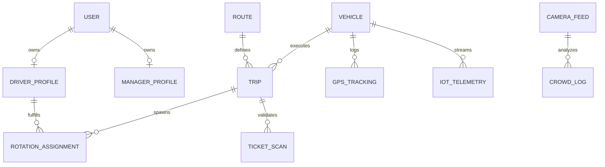

# Deep Database Entity Relationships
> **Cross-Reference**: See `PRD-v2.0.md` Section 5.9 (Database Schema).

## Granular Entity Definitions
The data model uses normalized structures enforcing 3NF to prevent orphaned states.

## Critical Table Roles
* `users`: Absolute base entity storing `hashed_password`, `role` enum, and boolean constraints (`is_active`, `is_suspended`).
* `driver_profiles`: Extension of Users. Tracks `license_expiry`, `cumulative_fatigue_score`, and `current_status` (FREE, DRIVING, ON_BREAK).
* `vehicles`: Stores `plate_number` (sanitized format strictly), `capacity` (for crowdedness divisions), and `current_lat_lng`.
* `trips`: Represents an active timeline instance. Must calculate `actual_start_time` and `actual_end_time` against the attached `route`.\n